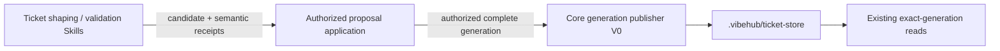

# Git Ticket Generation Publisher V0

Status: active storage-substrate design for
`decision-ticket-graph-lifecycle-001` and `decision-ticket-storage-001`.

## Boundary

The first writer is a Core-owned, worktree-scoped persistence primitive for
one complete outline-compatible Ticket generation. It remains deliberately
below the authorized mutation-application operation:

The publisher knows whether bytes, revisions, topology, scope, and the current
generation are mechanically admissible. It does not know whether an outcome
still means the same promise, whether a change is elaboration, decomposition,
or expansion, or whether a human gate has been satisfied. Consequently it is
not registered as a CLI/MCP operation in this slice.

## Input and result

The storage API accepts:

- one verified repository/worktree scope;
- `expectedSnapshotId`, either the exact current generation or `null` for an
  expected-empty bootstrap;
- a complete, non-empty inventory of strict
  `GitTicketDefinitionRevisionV0` documents.

It returns the previous and resulting snapshot IDs, whether the call published
or converged on an already-current identical generation, and deterministic
Ticket/relation counts.

Definitions are supplied with explicit revisions because revision allocation
belongs to the mutation applier that understands the accepted proposal.
The publisher enforces, rather than invents, revision progression.

## Mechanical admissibility

Before the visible pointer can move, Core verifies:

- strict schemas, byte/count bounds, sorted unique Ticket identities and
  dependencies, existing endpoints, and acyclic containment/dependency graphs;
- every new Ticket begins at definition revision `1`;
- an unchanged existing Ticket reuses its exact current revision;
- a changed existing Ticket advances by exactly one revision and preserves its
  original creation provenance;
- an immutable revision path either does not exist or already contains exactly
  the same canonical bytes;
- the candidate does not silently omit a currently published Ticket.

The last rule is intentionally conservative. Removal, cancel, supersession,
merge, and prune semantics require an explicit graph-mutation decision and
cannot be smuggled in as omission from a complete generation.

## Compare-and-publish

Publication is serialized by one exclusive operational lock directory under
the worktree-specific Git administration path. It is not part of the tracked
worktree. Acquisition writes and syncs one complete token-named owner record in
a unique nonempty staging directory, then atomically renames that directory to
the canonical lock location. The publisher acquires the lock and then re-reads
`latest.yaml`; checking before the lock is never sufficient.

- If current equals `expectedSnapshotId`, publication may proceed.
- If current differs but already equals the exact candidate generation, the
  call returns `unchanged`; this is safe idempotent convergence.
- Otherwise the call fails with a CAS conflict and does not move `latest`.

The owner record carries a process/host descriptor for diagnosis. V0 never
steals an existing generic lock automatically: a live, dead, malformed,
unfenced, or foreign-host owner fails closed as writer-busy. The only adoption
path is the exact persisted application-intent fence described below.

Release claims a token-specific marker rather than unlinking a shared lock
file. The holder atomically renames exact `owner-T` to `releasing-T`, unlinks
only `releasing-T`, then removes the canonical lock directory only if it is
still empty. If a successor atomically installs nonempty `owner-U` first, the
stale `rmdir` fails harmlessly. If release crashes after removing its marker,
the empty canonical directory may be safely removed or atomically replaced by
a staged acquisition.

## Commit point and crash shape

Revision files and the generation manifest are written as immutable canonical
documents through same-directory temporary files, file sync, and no-replace
installation. A collision is accepted only when existing bytes are identical.
The first publication prepares the entire store in a sibling staging directory
and atomically renames that directory into place, so a concurrent reader sees
either no store or one complete store—never a protocol-less initialization.

The bootstrap store-directory rename is the first publication's visibility
commit point. For every later generation, only after all new immutable members
are durable does Core write and sync a temporary latest pointer, atomically
rename it over `latest.yaml`, and sync the store directory; that pointer rename
is the later publication's visibility commit point:

- a crash before it leaves the previous generation current and may leave
  unreachable immutable objects;
- a crash after it leaves the new complete generation current;
- an interrupted writer may leave a lock that blocks later publication until
  an explicit recovery mechanism removes it; reads remain safe and available.

After installation of any canonical immutable member succeeds, an error before
a confirmed visibility commit deliberately retains the writer lock. A
deterministic conflict discovered before anything new is installed releases
the lock. This prevents a different candidate from reusing an orphaned next
revision without an explicit recovery decision while avoiding a permanent
fence for a side-effect-free rejection.

If the visibility rename succeeds but its parent-directory sync fails, the
publisher reports `ticket_store_commit_uncertain`, identifies the previous and
candidate generations, and retains the lock. The caller must not interpret
that result as an ordinary failure or retry blindly: the new complete
generation may already be current and must first be reconciled through the
read surface. Identical immutable files accepted from an earlier attempt are
re-synced with their parent before they may support a new visibility commit.

Unreachable immutable-object retention and GC remain unresolved. They are safe
for reads but may consume disk until a later retention policy exists.

## Application-owned fenced extension

The trusted application layer now invokes a separate `publishFenced` path over
this same mechanical substrate. Before publication it persists an immutable
SQLite application intent containing the exact complete candidate, base and
candidate snapshot IDs, store identity, and counts. The Git writer lock carries
an application-intent ID, intent digest, and candidate snapshot fence and
remains held after visibility advances.

The application service records and commits the matching immutable SQLite
application receipt before releasing that exact fence. If Git became visible
but receipt persistence failed, retry may adopt only a byte-identical intent
fence. Current candidate is re-verified and returned as `reconciled`; current
base may resume the same publication; every malformed or foreign fence or
third head fails closed. If the receipt already committed but release did not,
cleanup may claim only that exact fence and only after the canonical Git head
is verified equal to the candidate snapshot. This is narrower than generic
stale-lock stealing and does not expose the publisher as a public operation.
Full details are in
`2026-07-29-ticket-proposal-application-runtime.md`.

## Filesystem threat boundary

V0 rejects pre-existing symlinks and special files, confines Ticket-store paths
to the verified worktree and lock state to its worktree-specific Git
administration path, and coordinates conforming publishers through the
exclusive lock directory. It is not a security boundary against a hostile
same-UID process actively swapping parent paths between the publisher's
`lstat`, `open`, `link`, or `rename` calls. The host must prevent that form of
concurrent workspace mutation.

Hardening against an actively hostile local filesystem actor would require
directory-descriptor-relative primitives such as `openat`/`renameat`, or a
broker/daemon that exclusively owns the store. That stronger boundary is
outside this V0 storage substrate.

## Deferred above this primitive

- the trusted browser/desktop human decision surface and generic GateDecision
  authority (the proposal-specific host-provider contract is implemented);
- explicit removal, supersession, cancel, split, merge, and prune mutations;
- full Ticket Contract storage beyond the outline-compatible subset;
- generic fenced and auditable stale-lock recovery outside one exact persisted
  application intent;
- Git commit policy and remote/multi-host writer coordination.

These deferred concerns must compose over this publisher rather than bypassing
its scope, immutability, topology, and CAS checks.
