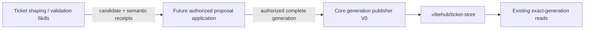

# Git Ticket Generation Publisher V0

Status: active storage-substrate design for
`decision-ticket-graph-lifecycle-001` and `decision-ticket-storage-001`.

## Boundary

The first writer is a Core-owned, worktree-scoped persistence primitive for
one complete outline-compatible Ticket generation. It is deliberately below
the future mutation-application operation:

The publisher knows whether bytes, revisions, topology, scope, and the current
generation are mechanically admissible. It does not know whether an outcome
still means the same promise, whether a change is elaboration, decomposition,
or expansion, or whether a human gate has been satisfied. Consequently it is
not registered as a CLI/MCP operation in this slice.

## Input and result

The storage API accepts:

- one verified repository/worktree scope;
- `expectedSnapshotId`, either the exact current generation or `null` for an
  expected-empty bootstrap;
- a complete, non-empty inventory of strict
  `GitTicketDefinitionRevisionV0` documents.

It returns the previous and resulting snapshot IDs, whether the call published
or converged on an already-current identical generation, and deterministic
Ticket/relation counts.

Definitions are supplied with explicit revisions because revision allocation
belongs to the future mutation applier that understands the accepted proposal.
The publisher enforces, rather than invents, revision progression.

## Mechanical admissibility

Before the visible pointer can move, Core verifies:

- strict schemas, byte/count bounds, sorted unique Ticket identities and
  dependencies, existing endpoints, and acyclic containment/dependency graphs;
- every new Ticket begins at definition revision `1`;
- an unchanged existing Ticket reuses its exact current revision;
- a changed existing Ticket advances by exactly one revision and preserves its
  original creation provenance;
- an immutable revision path either does not exist or already contains exactly
  the same canonical bytes;
- the candidate does not silently omit a currently published Ticket.

The last rule is intentionally conservative. Removal, cancel, supersession,
merge, and prune semantics require an explicit graph-mutation decision and
cannot be smuggled in as omission from a complete generation.

## Compare-and-publish

Publication is serialized by one exclusive, worktree-local writer lock. The
publisher acquires the lock and then re-reads `latest.yaml`; checking before
the lock is never sufficient.

- If current equals `expectedSnapshotId`, publication may proceed.
- If current differs but already equals the exact candidate generation, the
  call returns `unchanged`; this is safe idempotent convergence.
- Otherwise the call fails with a CAS conflict and does not move `latest`.

The lock records a process/host owner for diagnosis. V0 never steals an
existing lock automatically: a live, dead, malformed, or foreign-host owner
all fail closed as writer-busy. Explicit stale-lock recovery is deferred until
it has its own fencing and audit contract; this trades crash availability for
the absence of an unsafe automatic takeover race.

## Commit point and crash shape

Revision files and the generation manifest are written as immutable canonical
documents through same-directory temporary files, file sync, and no-replace
installation. A collision is accepted only when existing bytes are identical.
The first publication prepares the entire store in a sibling staging directory
and atomically renames that directory into place, so a concurrent reader sees
either no store or one complete store—never a protocol-less initialization.

The bootstrap store-directory rename is the first publication's visibility
commit point. For every later generation, only after all new immutable members
are durable does Core write and sync a temporary latest pointer, atomically
rename it over `latest.yaml`, and sync the store directory; that pointer rename
is the later publication's visibility commit point:

- a crash before it leaves the previous generation current and may leave
  unreachable immutable objects;
- a crash after it leaves the new complete generation current;
- an interrupted writer may leave a lock that blocks later publication until
  an explicit recovery mechanism removes it; reads remain safe and available.

After installation of any canonical immutable member succeeds, an error before
a confirmed visibility commit deliberately retains the writer lock. A
deterministic conflict discovered before anything new is installed releases
the lock. This prevents a different candidate from reusing an orphaned next
revision without an explicit recovery decision while avoiding a permanent
fence for a side-effect-free rejection.

If the visibility rename succeeds but its parent-directory sync fails, the
publisher reports `ticket_store_commit_uncertain`, identifies the previous and
candidate generations, and retains the lock. The caller must not interpret
that result as an ordinary failure or retry blindly: the new complete
generation may already be current and must first be reconciled through the
read surface. Identical immutable files accepted from an earlier attempt are
re-synced with their parent before they may support a new visibility commit.

Unreachable immutable-object retention and GC remain unresolved. They are safe
for reads but may consume disk until a later retention policy exists.

## Filesystem threat boundary

V0 rejects pre-existing symlinks and special files, confines resolved paths to
the verified worktree, and coordinates conforming publishers through the
exclusive writer lock. It is not a security boundary against a hostile
same-UID process actively swapping parent paths between the publisher's
`lstat`, `open`, `link`, or `rename` calls. The host must prevent that form of
concurrent workspace mutation.

Hardening against an actively hostile local filesystem actor would require
directory-descriptor-relative primitives such as `openat`/`renameat`, or a
broker/daemon that exclusively owns the store. That stronger boundary is
outside this V0 storage substrate.

## Deferred above this primitive

- proposal application (submit-only immutable review contributions are frozen
  separately in
  `2026-07-29-ticket-proposal-authority-contract.md`);
- trusted principal and human GateDecision authority;
- semantic promise-preservation and
  elaboration/decomposition/expansion validation receipts;
- explicit removal, supersession, cancel, split, merge, and prune mutations;
- full Ticket Contract storage beyond the outline-compatible subset;
- mutation receipt ordering with the SQLite request-receipt transaction;
- fenced and auditable stale-lock recovery;
- Git commit policy and remote/multi-host writer coordination.

These deferred concerns must compose over this publisher rather than bypassing
its scope, immutability, topology, and CAS checks.
