# Ticket Review Operation Surface V0

Status: active contract and implementation reference for
`contract-ticket-review-operations-001`.

`V0` is the product/contract maturity label. The executable wire DTOs use the
integer `schemaVersion: 1`; these are separate version axes and clients must not
derive either value from the other.

This artifact translates the accepted Ticket Review Surface into the smallest
Core surface that can be frozen while Context Binding, Closeout, complete
Ticket definitions, and the wider execution lifecycle remain unresolved.

It also preserves the two product-level write intents exposed by the prototype:
comment/suggest change and record an authorized direction. The first is now
frozen as the submit-only immutable contribution defined in
`2026-07-29-ticket-proposal-authority-contract.md`; proposal-specific trusted
authority and fenced application are implemented by
`2026-07-29-ticket-proposal-application-runtime.md`.

A red-team pass rejected an earlier five-operation draft because it assumed one
global graph revision, treated caller-selected `actor` as trusted authority,
promised durable commands without a storage decision, and moved semantic
judgment into Core. The V0 boundary below is the corrected read-first result.

## Boundary

```mermaid
flowchart LR
  Authority["Git Ticket store: immutable definitions + generations"]
  Provider["Canonical scoped filesystem provider"]
  Current["Snapshot facts + currentCapabilityProjections"]
  Service["Implemented stateless read service"]
  Projector["Pure Ticket review projector"]
  Dispatcher["Core OperationDispatcher"]
  Adapters["Ticket wrapper / CLI / MCP"]

  Authority --> Provider
  Provider --> Current
  Current --> Service
  Service --> Projector
  Projector --> Dispatcher
  Dispatcher --> Adapters
```



The definition/topology read bootstrap, provider, dispatcher registration,
generated operation contract, packaged Ticket wrapper, CLI, and MCP adapter
are implemented. A future App or local web host must remain thin and converge
on this same Core contract. The browser must never call persistence directly.

Skills and validators produce semantic judgments such as scenario-lens
membership, display language, elaboration/decomposition/expansion
classification, and whether a promise changed. Core validates receipt binding,
source, schema, and mechanical invariants; it does not recreate those judgments
as embedded heuristics.

## Normalize the prototype before it reaches Core

The v4 prototype deliberately compresses several dimensions for visual review.
Those shorthands must not become authored fields.

| Prototype shorthand | Review projection meaning |
|---|---|
| `human` | future attention payload supplied by a resolver-selected Skill/validator projection |
| `deviation` | future attention payload supplied by a resolver-selected Skill/validator projection over deviation/conflict evidence |
| `waiting` | future display payload supplied by a resolver-selected blocker projection |
| `running` | supplied by a resolver-selected Runtime active-Run projection |
| `done` | supplied by the eventual Outcome/closeout projection |
| `stale` | supplied by the eventual context-binding projection |
| `proof` | supplied by the eventual acceptance/closeout projection; never an authored float |
| `running` edge | supplied by a resolver-selected Runtime execution-spine projection |
| `reviewLens` | future Skill/validator projection, not a Scenario entity |
| `commit` | an Artifact/Evidence reference |
| `x`, `y`, bends, zoom | deterministic or ephemeral view state |

The fixture contains a useful warning: one hand-authored `proof` value can
disagree with its visible acceptance count. The Runtime must never accept both
as independent sources of truth.

## Three layers

### Resolver-selected snapshot inputs

- versioned Ticket definitions and stable Ticket identity;
- whatever dependency/containment representation Graph Lifecycle eventually
  ratifies;
- trace records already selected for the exact `snapshotRevision` and
  `projectionWatermark`;
- `currentCapabilityProjections` resolved for that same pair by a canonical
  provider; the Git bootstrap currently supplies an empty set rather than
  inventing currentness.

This surface does not decide whether the executable graph has one global
revision, separate Plan revisions, proposed diffs, or initial-versus-executed
graph identities.

The pure projector does **not** consume append-only receipt history and does
not decide which receipt is current, superseded, revoked, or preferred. That
selection belongs to a canonical provider once lifecycle rules and authority
exist. The projector accepts only the provider's current set, checks uniqueness
and exact binding, and fails closed on ambiguity.

### Mechanical Core projection

Core may expose only what the resolver-selected facts and current projections
justify:

- Ticket definition revision and outcome;
- operational/maturity/blocker summaries when their required facts exist;
- direct-unlock topology for the selected coherent snapshot;
- active Run, validation, context, acceptance, attention, and lens capability
  slots, plus independently selected trace records;
- deterministic counts and stable ordering.

Every Ticket projection binds `ticketId` and `definitionRevision`. Every
relation projection binds the full tuple `relationRef`,
`prerequisiteTicketId`, and `dependentTicketId`; `relationRef` alone is never
enough to transplant relation-scoped data. Each current capability projection
additionally binds the exact `snapshotRevision` and `projectionWatermark`.

Capability producer families are closed, not advisory:

- semantic judgments may be supplied only by a Skill or validator;
- validation judgments may be supplied only by a validator;
- active Run and execution-spine observations may be supplied only by the
  Runtime.

Producer eligibility is necessary but not sufficient. The capability name is
the discriminator, and every available slot uses the same frozen, bounded
presentation envelope: `label`, optional `detail`/`count`, and sorted unique
`references`. Deeper capability-specific machine data is not admitted by V0;
if the bounded envelope cannot honestly express the available projection, the
slot remains unavailable.

Semantic slots identify the selected receipt/producer that supplied them. An
unavailable domain is explicit:

```json
{ "availability": "unavailable" }
```

An available domain is revision-bound:

```json
{
  "availability": "available",
  "producerReceiptRef": "opaque",
  "summary": {
    "label": "Ready for verification",
    "references": []
  }
}
```

`summary` is a strict, bounded, capability-scoped presentation DTO with unknown
keys rejected. It is not arbitrary JSON. It cannot carry authored Scenario
data, layout coordinates/routes, progress/completion percentages, or another
generic state bag.

Core never invents a scenario lens, display title, classification, acceptance
adjudication, or context-drift result merely so the UI looks complete.

### View-only state

- sheet open/closed, selection, hover, filters, and causal focus;
- active lens selection, pan, zoom, fit, minimap viewport, and level of detail;
- node coordinates and edge routes;
- composition buffers, toasts, copied URLs, and temporary drag positions.

A layout may be cached by a snapshot topology digest and layout-algorithm
version. It is not canonical Ticket data.

## Frozen V0 reads

The first review slice freezes three operation names:

| Operation | Purpose |
|---|---|
| `ticket.graph.snapshot` | Load one coherent whole-project direct-unlock projection |
| `ticket.subject.inspect` | Inspect one snapshot Ticket or snapshot-scoped relation |
| `ticket.trace.list` | Read display-complete trace records as of the same projection watermark |

The strict executable schemas include nullability, enums, bounds, canonical
ordering, and validated output types. All three are registered with the shared
dispatcher and generated artifact, then exposed through the packaged Ticket
wrapper, CLI `ticket` group, and MCP `ticket_operation` tool.

### Package boundary

The public `/contracts` surface stays dependency-light: it exports TypeScript
DTO types, enums/constants, and version constants without importing Zod or the
Node Runtime. Strict Zod schemas are an explicit opt-in schema entry point, so
consumers do not acquire validation runtime dependencies merely by importing
contract types.

The canonical projector source schema is internal. It describes the seam
between a canonical provider and the pure projector; it is not an external
write API and is not re-exported from `/contracts`.

Core now exposes
`ResolvedTicketReviewProjectionSourceProviderV0` and
`TicketReviewReadServiceV0` around that internal source. The provider returns
one atomic, already-resolved source through strict `loadLatest` or
`loadSnapshot(snapshotId)` result envelopes. The read service validates
selectors before source access, chooses the exact source, and delegates all
projection and graph invariant checks to the projector. Malformed provider
envelopes fail as a source-boundary invariant.

The default production provider reads `.vibehub/ticket-store/`. It verifies a
stable store identity, immutable stable-path Ticket definition revisions,
immutable generation manifests and definition checksums, and one `latest.yaml`
pointer. Retained generations reconstruct exact snapshots after process
restart and after `latest` advances.

META Specs, legacy Task rows, the v4 HTML, and the test fixture cannot be used
as production fallbacks because they do not establish canonical Ticket
identity or reconstructible snapshot authority.

Every provider call receives a Core-resolved repository root and verified
worktree root. Latest and snapshot lookup are partitioned by that complete
scope, never by `snapshotId` alone. Reads reject symbolic links and special
files, bound bytes before parsing, verify canonical serialization and
checksums, and distinguish absent, expired, corrupt, and scope-mismatched
sources. Aggregate generation bytes are bounded, and an atomic latest-pointer
replacement returns a complete old or new source. Tests cover fresh-process
reconstruction, linked-worktree isolation, foreign-repository rejection,
same-path repository replacement, and replay binding. Filesystem projection
runs before the short SQLite receipt transaction.

## Shared transport envelope

The registered adapters reuse the existing dispatcher envelope:

```json
{
  "ok": true,
  "data": {},
  "meta": {
    "operation": "ticket.graph.snapshot",
    "repoId": 1,
    "requestId": "logical-idempotency-key",
    "at": "2026-07-28T12:00:00-07:00"
  }
}
```

Failure remains:

```json
{
  "ok": false,
  "error": {
    "code": "snapshot_expired",
    "message": "The bound projection can no longer be reconstructed.",
    "details": {},
    "nextSafeActions": ["Read a new Ticket graph snapshot."]
  }
}
```

The current `actor` value is a claimed attribution string. It may be shown for
attribution or used when auditing a read attempt, but it is not a trusted human
principal and cannot grant authority. An exact `requestId` replay returns the
original result; changed reuse returns `idempotency_conflict`. Ticket read
receipts bind verified repository/worktree scope before replay. Their large
outcome payloads are stored once by content digest; per-request receipt rows
retain the original operation, request, scope hash, result kind, timestamp, and
payload reference needed to reconstruct the exact envelope.

## `ticket.graph.snapshot`

The operation loads the complete supported project graph. Its input may contain
only bounded transport controls such as opaque `cursor` and `pageSize`; V0 does
not expose `rootTicketId` filtering or historical `atGraphRevision`.

Representative schema-valid output shape (digests are illustrative):

```json
{
  "schemaVersion": 1,
  "projectorVersion": "ticket-review-v0",
  "snapshotId": "tgs-aaaaaaaaaaaaaaaaaaaaaaaaaaaaaaaaaaaaaaaaaaaaaaaaaaaaaaaaaaaaaaaa",
  "snapshotRevision": "ticket-generation:ticket-store-0123456789abcdef0123456789abcdef:bbbbbbbbbbbbbbbbbbbbbbbbbbbbbbbbbbbbbbbbbbbbbbbbbbbbbbbbbbbbbbbb",
  "projectionWatermark": "ticket-generation:ticket-store-0123456789abcdef0123456789abcdef:bbbbbbbbbbbbbbbbbbbbbbbbbbbbbbbbbbbbbbbbbbbbbbbbbbbbbbbbbbbbbbbb",
  "topologyDigest": "sha256:cccccccccccccccccccccccccccccccccccccccccccccccccccccccccccccccc",
  "summary": {
    "ticketCount": 1,
    "directUnlockCount": 0,
    "activeRuns": { "availability": "unavailable" },
    "needsActor": { "availability": "unavailable" }
  },
  "tickets": [
    {
      "ticketId": "TKT-001",
      "definitionRevision": 1,
      "outcome": "Expose one coherent Ticket review graph",
      "provenanceRefs": [],
      "capabilities": {
        "display": { "availability": "unavailable" },
        "maturity": { "availability": "unavailable" },
        "operational": { "availability": "unavailable" },
        "blockers": { "availability": "unavailable" },
        "validation": { "availability": "unavailable" },
        "context": { "availability": "unavailable" },
        "active_run": { "availability": "unavailable" },
        "acceptance": { "availability": "unavailable" },
        "attention": { "availability": "unavailable" },
        "lens_membership": { "availability": "unavailable" }
      },
      "relationCounts": { "prerequisites": 0, "dependents": 0 },
      "traceCount": 0
    }
  ],
  "relations": [],
  "lenses": { "availability": "unavailable" },
  "page": { "offset": 0, "count": 1, "totalItems": 1 },
  "nextCursor": null
}
```

`snapshotRevision` is an opaque projection identity. It does not imply one
canonical graph-revision model. `projectionWatermark` means every snapshot-bound
read is evaluated against the same as-of fact boundary.

The first Runtime is in-process, so `snapshotId` and cursors must not depend on
process-local memory or daemon affinity. They may be stateless opaque tokens
bound to reconstructible facts or refer to an explicitly retained operational
snapshot. If reconstruction is no longer possible, Core returns
`snapshot_expired`.

Transport pagination may bound payload size, but the client buffers all pages
from one snapshot before presenting the graph as complete. A cursor never
advances into another snapshot or watermark. Above a declared V0 capacity
limit, Core fails explicitly rather than returning a partial graph. A
structurally valid provider source uses `projection_too_large`; an over-capacity
Git generation is invalid canonical storage and uses `ticket_store_corrupt`.

Each compact Ticket projection contains:

- `ticketId`, exact snapshot-visible `definitionRevision`, and canonical
  outcome;
- optional display language supplied by a bound semantic receipt;
- capability slots for maturity/operational state, blockers, validation,
  context, active Run, acceptance, attention, and `lens_membership`;
- deterministic relation counts and `traceCount` computed from available
  snapshot facts; trace records are read separately through
  `ticket.trace.list`.

Each direct-unlock relation contains:

- a `relationRef` unique inside the snapshot;
- explicit `prerequisiteTicketId` and `dependentTicketId`, which together with
  `relationRef` form the relation projection binding;
- rationale and provenance only when supplied by the underlying fact/receipt;
- capability slots for active-spine and attention projections.

`relationRef` is not declared to be a durable canonical relation ID. A relation
deep link therefore carries both `snapshotId` and `relationRef`. Durable
cross-snapshot relation identity, revision, comments, and mutation remain a
Graph Lifecycle decision.

Scenario lenses may be represented only through resolver-selected,
Skill/validator-produced bounded references in the snapshot `lenses` slot and
Ticket `lens_membership` slots. Core checks their snapshot binding and
structure but does not infer membership. Richer anchor/seed or membership
payloads are not part of V0. Selecting a lens is view state and never causes
graph mutation or reflow.

## `ticket.subject.inspect`

Input selects either:

```json
{
  "snapshotId": "tgs-aaaaaaaaaaaaaaaaaaaaaaaaaaaaaaaaaaaaaaaaaaaaaaaaaaaaaaaaaaaaaaaa",
  "subject": {
    "kind": "ticket",
    "ticketId": "TKT-124"
  }
}
```

or:

```json
{
  "snapshotId": "tgs-aaaaaaaaaaaaaaaaaaaaaaaaaaaaaaaaaaaaaaaaaaaaaaaaaaaaaaaaaaaaaaaa",
  "subject": {
    "kind": "relation",
    "relationRef": "snapshot-relation-17"
  }
}
```

The result is strictly as-of the bound snapshot and projection watermark. It
never mixes a live head revision into an older canvas. Refresh means reading a
new snapshot.

Ticket inspection returns the same snapshot-visible Ticket projection used by
the graph plus immediate prerequisite/dependent relation references. V0 does
not expose a richer definition or capability payload. An available capability
still cites the resolver-selected receipt that justifies it, and its Ticket
binding must match both `ticketId` and `definitionRevision`. An unavailable or
unfrozen capability remains visible as unavailable rather than being guessed.

Relation inspection returns its snapshot endpoints, visual direct-unlock
meaning, supplied rationale/provenance, and available capability slots. Causal
cones and immediate focus paths are derived client-side from the loaded
snapshot. A relation capability is accepted only when its relation binding
matches `relationRef` and both endpoints.

## `ticket.trace.list`

The operation is bound to `snapshotId`, a Ticket or snapshot relation subject,
optional trace kinds, and a bounded opaque cursor.

Every item is as-of `projectionWatermark` and display-complete for V0: stable
record reference, kind/subkind, producer or claimed actor, timestamp, exact
subject binding, bounded summary/body required by the Inspector, status,
cross-references, typed targets, and availability. This avoids pretending that
a fourth record-inspection operation already exists.

Ticket traces bind `ticketId` and the applicable `definitionRevision`.
Relation trace records bind the source revision, `relationRef`,
`prerequisiteTicketId`, and `dependentTicketId`; the containing source envelope
selects the complete trace set as of its exact `projectionWatermark`. A
matching `relationRef` without matching endpoints or source revision is
rejected rather than silently attached to a reused relation reference.

An available `gate_decision` trace must cite a verified authority receipt bound
to that decision and subject. A claimed actor may remain visible as attribution
but never satisfies or replaces the authority receipt. Without verified
authority evidence, the read model cannot present the record as an authorized
GateDecision.

Trace targets are typed and validated:

- `url` accepts only absolute `http:` or `https:` URLs;
- `repo_path` is a canonical repository-relative path, never an absolute path
  or a path containing traversal segments; the future host must resolve it
  against the repository root and verify real-path containment before opening
  it;
- `opaque` is a non-navigable reference. It may be displayed or copied, but is
  never rendered as an `href`.

Ordering is stable by a declared canonical key such as
`(occurred_at DESC, record_ref DESC)`. Wire timestamps may carry an explicit
UTC offset but are bounded to millisecond precision, so instant ordering never
silently discards accepted fractional precision.

A submitted immutable review contribution uses trace kind `proposal` when a
future current-trace resolver selects it, with contribution kind `comment` or
`graph_change`; comment is not simultaneously modeled as a second independent
fact kind.

## Submit-only proposal contribution

The prototype establishes two required actions:

1. add a comment or suggest a bounded change;
2. record a genuinely authorized human direction.

`ticket.proposal.submit` now enters the shared registry. It appends an immutable
comment or graph-change review contribution in SQLite and commits that payload
with its idempotent operation receipt. It binds an exact snapshot and exact
comment/revision targets, lets Core allocate identity/revision/time/provenance
fields, and mechanically validates a complete graph-change candidate. It never
invokes the internal Git publisher and always reports
`graphMutationApplied: false`.

The caller actor and authorAssessment are untrusted claims. Independent machine
validation and trusted human authority remain separate. Technical difficulty
alone is not a human gate.

`ticket.proposal.review.inspect`, `ticket.proposal.authority.decide`, and
`ticket.proposal.apply` now compose semantic validation, trusted
authority/delegation, target and publication CAS, immutable intent, and a
crash-reconcilable application receipt across SQLite and Git.

Proposal-specific authority now requires:

- a host-injected non-serializable provider supplying a trusted principal rather
  than caller-selected `actor`;
- a human-authority basis for bootstrap, expansion, introduced human gates, or
  protected signals, and a trusted delegation basis only for non-protected
  elaboration/decomposition;
- the exact proposal/candidate and complete validation-set digest;
- a passing, non-blocking accepted validation receipt;
- an immutable application intent plus fenced publication and terminal receipt.

Generic GateDecision recording for arbitrary gate subjects remains separate.

Neither action directly writes status, maturity, progress, or completion.

## Error boundary frozen for reads

Existing shared errors remain:

- `validation_error`, `actor_required`, `unsupported_operation`, `not_found`,
  `idempotency_conflict`, `internal_error`.

The read slice adds only:

- `invalid_snapshot`;
- `snapshot_expired`;
- `projection_too_large`;
- `projection_invariant_failed`;
- `ticket_store_corrupt`;
- `ticket_store_scope_mismatch`.

`projection_invariant_failed` includes a typed cause. A direct-unlock cycle is
one possible cause; layout must never conceal it. CLI exit classes are now
fixed by the shared operation contract. Proposal submission reuses the shared
validation, not-found, CAS/idempotency, and storage error boundary. Authority
and application add `trusted_authority_unavailable`,
`authority_proof_invalid`, `authority_required`, `authority_conflict`,
`application_in_progress`, and `application_recovery_required`. Explicit
removal/supersession stays unresolved.

## Explicit exclusions

The V0 surface does not expose:

- `setStatus`, `setMaturity`, `setProgress`, or generic `complete`;
- Scenario CRUD or persistent scenario lanes;
- node-position, edge-route, selection, zoom, or layout persistence;
- raw JSON Patch or direct relation create/delete;
- dashboard-specific counter/attention endpoints;
- direct database or file-store access;
- a GateDecision writer that trusts caller-selected `actor`;
- a graph writer that assumes one global graph revision.

## First implementation boundary

Safe and implemented now:

1. browser-safe review DTOs with explicit capability slots;
2. dependency-light public contract types/constants plus opt-in strict input
   and output schemas for the three reads;
3. a deterministic pure projector over the internal resolver-selected snapshot
   source, including `currentCapabilityProjections`;
4. a structured fixture extracted from the accepted 29-Ticket/35-relation
   prototype;
5. schema/projector tests for snapshot coherence, stable ordering, unsupported
   capabilities, and prohibited writable fields.
6. a repository-scoped, storage-agnostic provider interface with a Git-native
   production implementation;
7. a stateless read service that loads the default source only for an initial
   graph page and loads the exact bound source for later pages, inspection, and
   traces;
8. explicit `not_found` for no canonical Ticket graph and
   `snapshot_expired` when an exact source cannot be reconstructed;
9. immutable retained generations with canonical-byte, checksum, graph,
   symlink, special-file, aggregate-size, and atomic-pointer validation;
10. dispatcher registration with scope/incarnation-bound replay, out-of-
    transaction filesystem reads, and stable Ticket errors;
11. generated contracts, a packaged mechanical Ticket wrapper, and thin CLI
    and MCP read adapters;
12. browser-safe proposal DTOs, exact target preconditions, deterministic Core
    materialization, complete-candidate mechanical review, and immutable
    proposal persistence committed with the operation receipt;
13. packaged wrapper, CLI, and MCP parity for proposal submit/query/validation;
14. review packets bound to the complete validation-set
    digest/high-water/count;
15. host-injected trusted authority decisions with conservative protected-path
    routing and terminal validation-ledger closure;
16. immutable exact-candidate application intents, fenced Git publication, and
    terminal `published`/`reconciled` receipts;
17. recovery tests proving a Git-visible/SQLite-receipt failure retains the
    exact fence and an exact retry reconciles before releasing it, plus
    post-receipt cleanup that verifies the canonical head equals the candidate
    before claiming only that completed fence.

Not safe yet:

- a trusted browser/desktop human decision surface or generic GateDecision
  recording;
- explicit remove/supersede/cancel/split/merge/prune application;
- current capability/trace selection from durable receipts;
- App bridge and CLI/MCP/App parity;
- relation mutation/CAS, arbitrary historical enumeration, or reads by a
  caller-selected graph revision (exact retained snapshot continuation exists);
- context freshness and closeout semantics not backed by resolved receipts;
- quotas and retention/GC for request rows and distinct outcome blobs, plus
  remaining Plan/Run/Outcome/Event authority.

No App decision bridge, generic GateDecision authority, or
capability-currentness resolver is claimed by this contract slice. A trusted
principal is available only when a host explicitly injects the provider;
default CLI/MCP does not.

## Acceptance tests for the executable slice

- proposal submission records one immutable review contribution and its
  idempotent operation receipt without changing the Git Ticket snapshot;
- comments fail closed unless their exact Ticket revision or full relation
  subject is visible in the observed snapshot;
- graph-change proposals use Core-generated identity/revision/time/provenance,
  reject stale target preconditions, and mechanically validate the complete
  candidate;
- caller actor and authorAssessment never authorize application, and technical
  difficulty is not classified as a human gate;
- the three proposal review/authority/application operations are registered,
  while the low-level Git publisher remains internal;
- default CLI/MCP without a trusted provider fails authority resolution closed;
- bootstrap/protected proposals require a host-authenticated human authority
  basis, while delegated policy is limited to non-protected
  elaboration/decomposition;
- an authorized decision binds the complete validation set, cites one exact
  passing non-blocking receipt, and closes further validation;
- application persists the exact candidate intent before Git, retains the
  matching writer fence until the SQLite receipt commits, and reconciles a
  Git-visible/receipt-missing retry without accepting malformed or foreign
  lock state or a third head;
- completed-receipt cleanup verifies the canonical Git head equals the
  candidate, claims exact `owner-T` as `releasing-T`, unlinks only that marker,
  and removes the canonical directory only if it remains empty;

- the v4 fixture projects 29 Tickets and 35 direct-unlock relations;
- identical resolver-selected facts, `currentCapabilityProjections`, snapshot
  boundary, and projector version produce byte-stable ordering and topology
  digest;
- the projector never infers currentness or supersession from append-only
  receipt history;
- runtime, attention, or lens projection changes never mutate Ticket
  definitions or view layout state;
- no authored `proof`, state, maturity, scenario, or layout field is accepted;
- every available capability uses the bounded capability-scoped presentation
  envelope and an allowed producer family; deeper unfrozen payloads remain
  unavailable;
- arbitrary JSON, Scenario data, layout, and progress cannot enter capability
  summaries;
- Ticket capability bindings include `definitionRevision`; relation capability
  and trace bindings include `relationRef` and both endpoints;
- available `gate_decision` traces require verified authority receipts and
  cannot be authorized by claimed actors;
- trace URLs reject non-HTTP(S) schemes, repository paths are canonical
  repository-relative references subject to host containment checks, and
  opaque targets are never links;
- Ticket inspection and trace results remain as-of the graph snapshot;
- a graph cursor is decoded before source selection, so later pages reconstruct
  their exact snapshot instead of comparing against the latest graph;
- a second read-service instance and a fresh Node process can continue from the
  same retained source without sharing process-local projector state;
- unavailable historical sources return `snapshot_expired`, and a provider may
  not silently substitute its latest source;
- malformed provider result envelopes fail as
  `source_provider_contract_violation`;
- malformed selectors fail before Git scope/source access;
- retained checksum or canonical-byte damage returns `ticket_store_corrupt`
  rather than `snapshot_expired`;
- one worktree cannot replay another worktree's operation receipt, and a
  foreign or same-path replacement repository cannot replay an addressed
  repository's result;
- trace timestamps with offsets sort by instant, and sub-millisecond wire
  precision is rejected rather than truncated;
- relation deep links use `(snapshotId, relationRef)`, never array indexes;
- pagination never crosses snapshot/watermark boundaries;
- cycles or internally inconsistent projections fail closed;
- unsupported graph size fails explicitly instead of rendering a partial graph.
