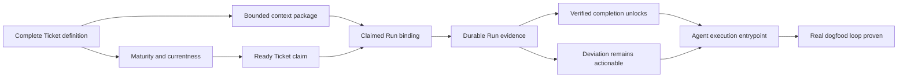

# First Ticket Dogfood Plan

Status: candidate planning artifact for the repository's first canonical
Ticket Graph. It is not an authority decision, canonical graph, or claim that
the Tickets are executable.

## Accepted deliverable

A fresh Agent with VibeHub but no access to the planning conversation can
discover exactly what work is eligible, claim one Ticket safely, receive the
bounded durable context needed to act, record a traceable result, and reach one
of two honest terminal paths:

- accepted verification completes the Ticket and unlocks only newly eligible
  downstream work;
- a deviation preserves the unresolved Ticket and raises the bounded planning
  or human-decision work required next.

The first dogfood proof must exercise this loop in this repository rather than
only demonstrating isolated APIs.

## Scenario lenses

These lenses help a human review the plan. They are not canonical Scenario
objects and do not create a second hierarchy beside Tickets.

1. **Understand the next work** — a fresh Agent can distinguish claimable work
   from blocked, immature, or already-running work.
2. **Enter with enough truth** — the Agent receives an exact bounded context
   package instead of depending on conversation memory.
3. **Act once against exact authority** — claim and Run facts prevent two
   authoritative executions and bind work to one Ticket revision and graph
   generation.
4. **Finish honestly** — durable evidence cannot self-declare success;
   accepted verification is what permits completion and downstream unlocks.
5. **Deviate visibly** — product, architecture, principle, permission, risk,
   and plan deviations remain attached to the work locus and route the needed
   review without false completion.
6. **Prove the whole loop** — one agent-facing entrypoint and a real repository
   dogfood run show that the parts compose for an Agent without the source
   discussion.

## Backchained and forward-normalized graph

The top-level `Real dogfood loop proven` Ticket is the aggregate
quality/composition boundary that proves the deliverable. The other Tickets
are its containment children; parentage is not execution order.

Direct dependencies preserve the two real joins:

- a Run needs both an exact claim and a compiled context package;
- the orchestration entrypoint is incomplete unless both the verified-success
  and deviation paths work.

No transitive convenience edges or standalone Tickets are added.

## Known frontier

The durable Feature Room decisions already fix Ticket identity, the complete
Ticket Contract v0 semantics, progressive maturity, machine-first validation,
derived Runtime state, bounded Agent self-expansion, scenario-as-lens, and the
graph review language.

The repository currently persists only outline-compatible Ticket definitions.
Exact context-binding representation, Run/Outcome/Evidence storage, closeout
mechanics, readiness currentness, claim arbitration, and interaction details
are still unresolved or unimplemented. The candidate therefore names stable
outcomes for those regions but does not invent their leaf Tickets or technical
designs. Agents may later propose bounded decompositions inside the reviewed
ancestor outcome; expansion or a protected deviation returns to explicit
authority.

The repository has no `.vibehub/ticket-store`, so publication of this proposal
would bootstrap its canonical graph. That bootstrap and its core experience
boundaries require human authority. Machine validation may establish semantic
quality but cannot grant it.

## Candidate payload

The exact operation input is preserved in
`2026-07-29-first-ticket-graph-proposal.json`. Its `observedSnapshotId` is
`null` because the canonical Ticket store is absent, not because a failed graph
read was interpreted as empty.

The next sequence is:

1. submit the exact proposal to the repository's operational proposal ledger;
2. validate that immutable proposal and candidate independently;
3. inspect the complete candidate and validation set in the local review host;
4. let the human authorize or reject that exact graph;
5. apply only a matching authorization receipt.
