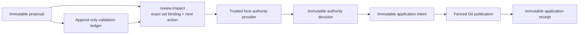

# Ticket Proposal Trusted Authority and Application Runtime V0

Status: implemented contract and recovery reference for
`contract-ticket-review-operations-001`,
`decision-ticket-graph-lifecycle-001`, and
`decision-ticket-storage-001`.

## Outcome

One immutable graph-change proposal can now move through independent semantic
validation, a trusted proposal-specific authority decision, and canonical Git
Ticket Graph publication without allowing a caller to claim its own authority.

The public operation surface is:

| Operation | Responsibility |
|---|---|
| `ticket.proposal.review.inspect` | Return the exact proposal, validation-set binding, any terminal decision/application receipt, eligibility, and one next action |
| `ticket.proposal.authority.decide` | Ask the host-injected trusted provider to decide the exact proposal/candidate/validation set and record one immutable result |
| `ticket.proposal.apply` | Bind the exact authorized decision, persist an immutable candidate intent, publish under a durable Git fence, and record one terminal receipt |

All three names are registered once in the Core dispatcher and exposed by the
thin CLI and MCP adapters. Registration does not grant authority.

## Review is derived, not workflow state

The review packet reads immutable facts and derives one of:

- `comment_only`;
- `validation_required`;
- `authority_required`;
- `application_ready`;
- `rejected`;
- `applied`;
- `stale`.

It also returns one next action such as `record_validation`,
`request_authority_decision`, or `apply_proposal`. No mutable proposal status,
approval flag, or latest/winning validation pointer is written.

The complete proposal-validation ledger is bound by:

- a deterministic set digest over each ledger sequence, validation receipt ID,
  and validation receipt digest;
- the through-sequence high-water mark;
- the complete receipt count.

The V0 authority boundary supports at most 200 validation receipts for one
decision and fails explicitly above that bound. Contrary assessments remain in
the set. An authority provider may name which exact passing receipts it accepts,
but cannot remove contrary evidence from the decision binding.

## Authority cannot come from caller JSON

The caller's operation input carries only:

- proposal ID and expected proposal digest;
- expected candidate digest;
- expected complete validation-set digest.

It cannot carry a principal, authentication proof, disposition, authority
basis, provider descriptor, or resolved assessment. The request `actor` remains
claimed attribution only.

The only authority entry point is a non-serializable
`TrustedTicketProposalAuthorityProviderV0` supplied when a trusted host
constructs the Core dispatcher. Core gives that provider the exact proposal,
candidate, complete validation set, scope, and Core-derived required authority
path. Core invokes the provider outside a SQLite write transaction, then
rechecks the exact complete validation-set digest inside the decision commit.
Evidence appended while the provider is resolving therefore produces a CAS
conflict rather than a stale decision. Core validates the provider response
before recording it.

The immutable decision binds:

- the proposal identity/digest, observed snapshot, and candidate digest;
- the complete validation-set digest, high-water sequence, and count;
- the exact accepted passing validation receipt IDs/digests;
- provider identity/version/artifact digest with `host_injected` trust;
- a host-authenticated human or service principal;
- a human-authority or delegation basis;
- the conservatively resolved change class and protected signals;
- authorized or rejected disposition and rationale.

Authorization requires at least one accepted validation whose conclusion is
`passed` and whose findings contain no blocking impact. A rejected decision may
preserve evidence without authorizing application.

## Human authority versus delegated policy

Core derives `human_authority` when any of these is true:

- the proposal bootstraps an absent Ticket Graph;
- the resolved change class is `expansion`;
- the author assessment introduces a human gate;
- proposal, validation, or trusted-provider assessment indicates any protected
  signal:
  - `initial_plan_authority`;
  - `experience_product`;
  - `principle_deviation`;
  - `permission_side_effect`;
  - `risk_policy`.

That path requires a host-authenticated human principal and a
`human_authority` basis. A service principal cannot satisfy it.

Only non-protected `elaboration` or `decomposition` may use
`delegated_policy`, and then only with a trusted delegation basis. Provider
assessment can strengthen the change class and add protected signals; it cannot
downgrade or erase the proposal/validation evidence.

Default CLI and MCP construction injects no trusted authority provider.
`ticket.proposal.authority.decide` therefore fails
`trusted_authority_unavailable` until a trusted host supplies one. In
particular, bootstrap remains blocked even if the caller labels itself human.

Recording a decision is terminal for that proposal. The validation ledger is
closed both in Core and by a SQLite trigger so later evidence cannot silently
change the set the decision authorized.

## Immutable application intent

`ticket.proposal.apply` accepts only immutable bindings:

- proposal ID plus expected proposal/candidate digests;
- authority decision ID plus expected decision digest.

Core requires an authorized decision for the same exact proposal and candidate
and re-verifies that the complete validation set still matches the decision.
It then prepares and persists one immutable application intent before touching
Git visibility. The intent retains:

- proposal/candidate and authority-decision bindings;
- repository incarnation and scope;
- base snapshot ID;
- deterministic bootstrap store ID;
- deterministic candidate snapshot ID;
- complete canonical candidate definition bytes;
- Ticket and direct-unlock counts.

Persisting the complete candidate in the intent is deliberate: recovery never
reconstructs a possibly different candidate from moving external state.

## Fenced Git-to-SQLite commit protocol

The internal Git publisher receives a fence containing:

- application intent ID;
- application intent digest;
- candidate snapshot ID.

Application runs publication while holding a SQLite immediate transaction. The
writer state is an untracked operational directory under the
worktree-specific Git administration path, separate from the tracked Ticket
store. Acquisition writes and syncs the complete owner record in a unique
nonempty staging directory, then atomically renames that directory to the
canonical lock location. The lock remains in place after Git visibility
advances. Core writes and verifies the immutable application receipt in that
transaction, commits SQLite, and only then releases the exact writer fence.

Release is itself fenced. It atomically renames the exact token's `owner`
record from `owner-T` to `releasing-T`, unlinks only `releasing-T`, then removes
the canonical directory only if it remains empty. A successor's atomically
installed nonempty `owner-U` makes a stale `rmdir` fail harmlessly. A
crash-empty canonical directory may be safely removed or atomically replaced by
the next staged acquisition.

The receipt binds the intent, authority decision, proposal/candidate, previous
snapshot, resulting snapshot, counts, and publication status:

- `published` — this invocation advanced Git visibility;
- `reconciled` — the exact candidate was already current under the same intent
  fence.

The low-level publisher stays internal. CLI, MCP, Skills, and callers cannot
invoke it as an authority bypass.

## Recovery matrix

| Observed state under the exact intent fence | Result |
|---|---|
| Git head equals the intent base | Resume the same complete candidate publication |
| Git head equals the intent candidate | Re-verify exact canonical bytes and record `reconciled` |
| Git head is any third generation | Fail closed; do not move the pointer |
| Writer lock has the same complete fence | Adopt it only while the matching SQLite application transaction serializes the retry |
| Writer lock is unfenced, malformed, or belongs to another intent | Fail closed as writer-busy/recovery-required |
| Matching application receipt already committed, exact fence remains | Verify the canonical Git head equals the receipt candidate, then claim and unlink only its exact owner/releasing marker |

If Git publication succeeds and application-receipt insertion fails, the fence
is intentionally retained. A later exact retry can reconcile without
double-publishing or accepting a foreign graph. If receipt persistence commits
but the process stops before fence release, an exact retry verifies the stored
intent and receipt, verifies that the canonical Git head still equals the
candidate, and then completes only that token's `owner-T`/`releasing-T` cleanup
before removing the canonical directory if it remains empty. A later proposal
application may perform the same exact completed-fence cleanup before creating
its own intent, but cannot clean a malformed, unfenced, or foreign lock. Thus
the post-commit crash window does not strand future graph writers and a
different valid owner's fence is never removed. If only the shared operation
request receipt is missing, replay reads the immutable domain receipt and
converges.

Failed authority and apply dispatcher outcomes are deliberately not persisted
as terminal operation receipts. This allows a later retry after a trusted host
provider becomes available or after an exact recovery condition changes.
Successful immutable decision, intent, and application facts still enforce
idempotency.

## What this does not settle

This slice does not implement:

- a generic GateDecision writer for arbitrary Ticket gates;
- a trusted browser/desktop human decision surface;
- Ticket-revision readiness or maturity currentness;
- explicit remove, cancel, merge, split, prune, or supersede application;
- complete Ticket Contract definition storage;
- Run, Outcome, Evidence, closeout, or capability-currentness authorities;
- generic stale-lock stealing, remote/multi-host arbitration, or Git commit
  policy.

It does settle the safe additive/revision bridge from one validated,
specifically authorized proposal to one canonical Git Ticket Graph generation.
