# Ticket Proposal Submission Authority Contract V0

Status: active foundational contract for the submit-only review contribution
slice, extended by
`2026-07-29-ticket-proposal-application-runtime.md` and governed by
`decision-ticket-graph-lifecycle-001`,
`contract-ticket-review-operations-001`, and
`decision-ticket-storage-001`.

## Boundary

`ticket.proposal.submit` records an immutable review contribution. It does not
change the canonical Ticket Graph, authorize a change, validate its meaning, or
publish a Git Ticket generation.

```mermaid
flowchart LR
  Caller["Human or Agent caller"]
  Submit["ticket.proposal.submit"]
  Mechanical["Core mechanical review"]
  Proposal["Immutable SQLite proposal + operation receipt"]
  Semantic["Independent proposal validation ledger"]
  Review["Derived review + complete set binding"]
  Authority["Host-injected trusted authority"]
  Apply["Fenced proposal application"]
  Publisher["Internal Git generation publisher"]

  Caller -->|"claimed attribution + candidate"| Submit
  Submit --> Mechanical
  Mechanical --> Proposal
  Proposal -->|"separate explicit review"| Semantic
  Proposal --> Review
  Semantic --> Review
  Review --> Authority
  Authority --> Apply
  Apply --> Publisher
```

Solid edges are executable across the submit and proposal-validation ledger
slices and the subsequent trusted-authority/application slice. Validation is a
separate explicit action rather than a submit-time side effect. This artifact
continues to define the submission boundary; the authority, intent, fencing,
and recovery details live in
`2026-07-29-ticket-proposal-application-runtime.md`.

The proposal has `effect: review_contribution_only` and
`graphMutationApplied: false`. It is not a Ticket state, draft, approval,
GateDecision, validation receipt, or authority grant. There is no mutable
proposal status.

## Two contribution kinds

### Comment

A comment binds to one exact published snapshot and either:

- one Ticket ID plus its exact definition revision; or
- one relation reference plus both prerequisite and dependent Ticket
  endpoints.

Core rejects a stale or mismatched subject. This preserves the meaning of the
comment without turning Comment into a second mutable domain object.

### Graph change

A graph-change proposal carries one or more complete create or revise
definitions. It does not accept raw JSON Patch, per-edge CRUD, whole-store
replacement, implicit deletion, or authored operational state.

- Creates use proposal-local references so one contribution can express a
  coherent new dependency path.
- Revisions identify the exact Ticket and expected definition revision, then
  provide a complete replacement body.
- The proposal binds the exact observed published snapshot; `null` means that
  the caller observed no Ticket store and is proposing a bootstrap.

Core allocates stable proposal identity, digest, scope binding, new Ticket IDs,
definition revisions, timestamps, and creation provenance. Callers cannot
author identity, revision, time, or proposal provenance fields. Proposal
creation attribution derived from caller actor/reason/source is explicitly
`claimed_unverified`; existing canonical provenance is preserved on revision,
and caller-supplied provenance references are not accepted.

Core resolves local references, verifies exact target preconditions, rejects
duplicate targets and identity collisions, and mechanically validates the
complete candidate graph for bounds, endpoints, containment/dependency
consistency, cycles, canonical ordering, and legal revision transitions. The
result includes a candidate digest, but the candidate is not published.
The decoded logical submission input has a 4 MiB aggregate JSON budget in
addition to per-field and per-collection bounds. CLI and the packaged Skill
reject raw proposal JSON above 4 MiB before parsing. MCP uses a bounded-slab
stdio reader: every raw JSON-RPC line is capped at 64 MiB, while an
identified `ticket.proposal.submit` call is capped at 5 MiB for the complete
tool envelope before it reaches the handler. The additional MCP MiB is
transport envelope allowance, not extra logical proposal capacity.

## Trust and authority

Any attributable human or Agent may submit a proposal. The request `actor` is a
claimed attribution string, never proof of identity or authority.

`authorAssessment` is also untrusted input. Its
`elaboration | decomposition | expansion` classification, rationale, declared
human gate, and authority signals are useful routing claims, but cannot validate
the proposal or grant permission to apply it.

The protected-boundary signals in V0 are deliberately few:

- `initial_plan_authority`;
- `experience_product`;
- `principle_deviation`;
- `permission_side_effect`;
- `risk_policy`.

Technical difficulty alone is not a human-authority signal. Lock design,
database schema mechanics, technical research, and similar decisions remain
delegated when objective criteria and the accepted experience, architecture,
permissions, and risk boundaries already constrain a good answer.

Machine validation and human authority are separate:

- an independent Skill/validator judges semantic promise preservation,
  truthful containment, elaboration/decomposition/expansion, Planning Fog, and
  whether the proposal remains inside delegated authority;
- a trusted human or policy authority grants a required preference, product,
  principle, permission, side-effect, or risk decision;
- Core only applies a proposal after it can verify the required receipts and
  their exact proposal, subject, policy, and scope bindings.

The submit result may route an apparently delegated application candidate or
indicate human authority, but neither hint is an application decision.
Bootstrap proposals always indicate `initial_plan_authority`; an untrusted
author assessment cannot classify the foundational plan as delegated.

## Storage and atomicity

The canonical Ticket definitions and published topology remain in the
Git-native `.vibehub/ticket-store/`. Proposal submission never invokes its
internal generation publisher.

The immutable proposal payload and the shared operation request receipt are
inserted in the same SQLite transaction. A successful submit therefore cannot
leave a proposal without its idempotency receipt or a success receipt without
its proposal. Repository, worktree, and repository-incarnation scope are bound
before replay. Core rechecks repository incarnation around graph-head loading,
and a task-attributed proposal must use that task's exact worktree.

Repeated use of the same request identity with the same canonical request
replays the same proposal. Reusing it for different input is a conflict.

The original submit ledger is inspectable through its submit result and exact
request replay. The follow-on contract now freezes bounded proposal
inspect/list and proposal-validation record/list/inspect operations through
Core; direct SQLite access remains forbidden. Proposal validation is immutable
claimed-unverified proposal/candidate evidence, not Ticket readiness,
authority, or application. See
`2026-07-29-proposal-query-validation-ledger.md`.

## Application extension now implemented

The required safety boundary is now implemented by three registered Core
operations:

- `ticket.proposal.review.inspect` binds the exact complete validation set and
  derives eligibility plus one next action;
- `ticket.proposal.authority.decide` accepts only immutable caller bindings and
  obtains principal, basis, disposition, and resolved assessment from a
  non-serializable trusted host provider;
- `ticket.proposal.apply` persists an immutable exact-candidate intent, invokes
  the internal publisher under an intent fence, and records a terminal
  `published` or `reconciled` application receipt before releasing that fence.

Caller claims, mechanical review, validation evidence by itself, or the
publisher's storage CAS still cannot substitute for authority. Bootstrap,
expansion, introduced human gates, and protected signals require a
host-authenticated human authority basis. Only non-protected
elaboration/decomposition may use trusted delegation.

Default CLI/MCP construction supplies no authority provider, so registration
does not create a self-approval path. Bootstrap remains blocked with
`trusted_authority_unavailable` until a trusted host decision bridge injects
the authenticated human provider. See
`2026-07-29-ticket-proposal-application-runtime.md` for exact validation-set
binding and crash recovery.

## Exclusions

This slice does not add:

- a default `draft → human review → active` queue;
- writable Ticket status, maturity, progress, readiness, or completion;
- trusted GateDecision recording;
- removal, cancel, merge, split, prune, or supersession semantics;
- direct persistence access through CLI, MCP, HTML, or Skills;
- semantic validation heuristics embedded in Core.
