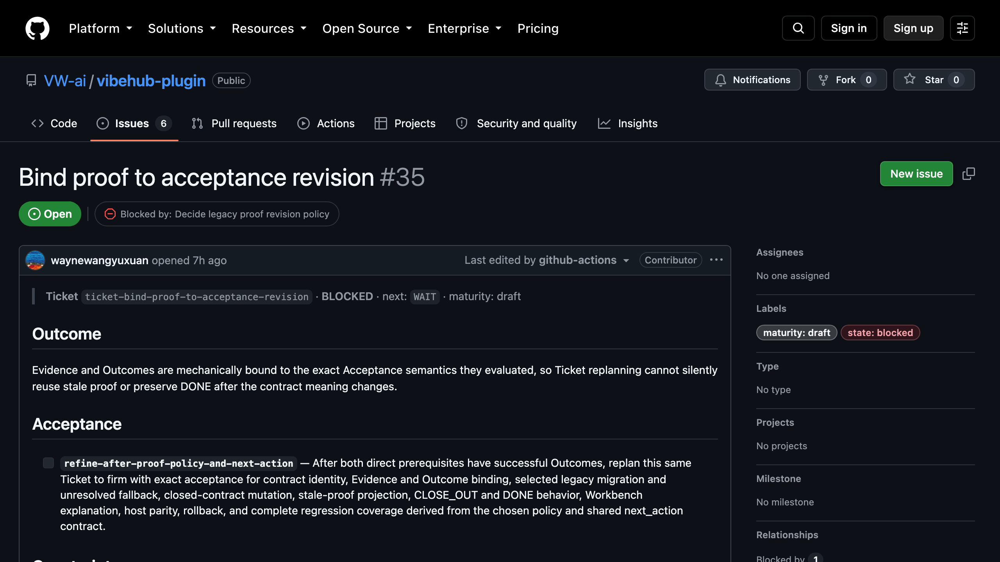

<p align="center">
  <picture>
    <source media="(prefers-color-scheme: dark)" srcset="assets/brand/vibehub-logo-dark.svg">
    <source media="(prefers-color-scheme: light)" srcset="assets/brand/vibehub-logo.svg">
    
  </picture>
</p>
<p align="center"><strong>Stop managing chats. Manage the work.</strong><br>Turn one coding request into a Git-native Ticket with the exact Context needed to plan, execute, prove, and close it.</p>
<p align="center"><a href="https://vibehub.team"><strong>vibehub.team</strong></a> · <em>Memory tools preserve the conversation; VibeHub preserves the development cycle.</em></p>

## Install

One line for any skills-capable agent — Claude Code, Codex, Cursor, and more. Choose **Select all** in the picker.

```bash
npx skills add VW-ai/vibehub-plugin
```

Update later with `npx skills update`. This is the only supported install path; host marketplace distribution was retired.

Then open the repository in a fresh Agent session, describe one concrete deliverable, and say:

<h3 align="center"><code>Start this with VibeHub.</code></h3>

**What you get**

- **One Ticket per request, in Git.** Acceptance, Evidence, and Outcome live as ordinary files next to the code, so any Agent can resume from repository truth and any human can review or revert it.
- **A graph of the work, not a list.** The local Workbench shows DRAFT, READY, RUNNING, and DONE Tickets with their real prerequisites and unlocks, and tells you the next action.
- **Your team sees it on GitHub.** Every Ticket on `main` mirrors one-way to a GitHub Issue — checklist, Evidence comments, native *Blocked by* links — with no Agent in the loop.


## How it works

Describe one coding request and say the line above. The request and exact Context shape one Ticket; work produces acceptance-linked Evidence; a separate Agent decides the Outcome; accepted learning returns to Context. Tickets, Context, Evidence, and Outcomes remain ordinary Git files, so another Agent can resume from repository truth while Git keeps the history reviewable and reversible.

1. **Plan** — the request plus checked-in Context becomes one Ticket with explicit acceptance criteria, dependencies, and constraints.
2. **Run** — an Agent executes from that contract and appends Evidence linked to each criterion.
3. **Close** — a *separate* Agent adjudicates every criterion and writes the Outcome; a criterion can name a human as its decision owner.
4. **Learn** — durable decisions return to Rooms of Context that the next Ticket reads.

## See what matters now


**Take the next action from the Ticket.** Recommended action stays primary, its explanation appears on demand, and Contract plus Log keep acceptance, Evidence, and Outcome traceable to exact Git source.


**Bring repository context in only when useful.** Rooms expose durable Context, consuming Tickets, and drift state on demand; the same read-only graph remains usable at a real narrow viewport.

## Work with your team on GitHub



Git stays the source of truth; GitHub Issues are its read-only projection. A workflow runs on every push to `main`, upserts one Issue per Ticket with the acceptance checklist, one comment per Evidence record, `state:` and `maturity:` labels, and native *Blocked by / Blocking* relationships, and closes the Issue when the Outcome is successful. Nobody — human or Agent — runs a sync. Project setup offers it once; [docs/GITHUB_ISSUES.md](docs/GITHUB_ISSUES.md) explains the mirror and which views to use.

## Learn more

[Product concept](docs/CONCEPT.md) · [Installation, upgrades, and coexistence](docs/INSTALL.md) · [Local graph design](docs/LOCAL_GRAPH_DESIGN.md) · [GitHub Issues mirror](docs/GITHUB_ISSUES.md) · [Release procedure](docs/RELEASE.md)

Apache-2.0
