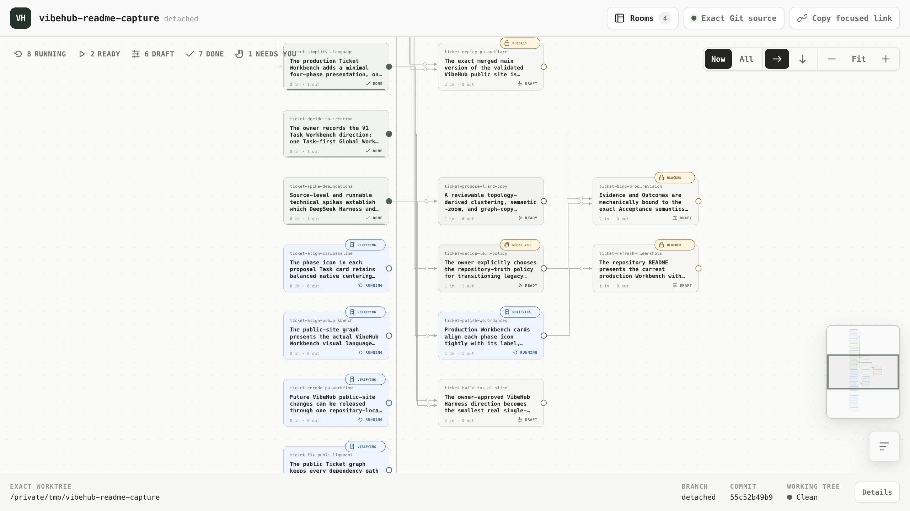
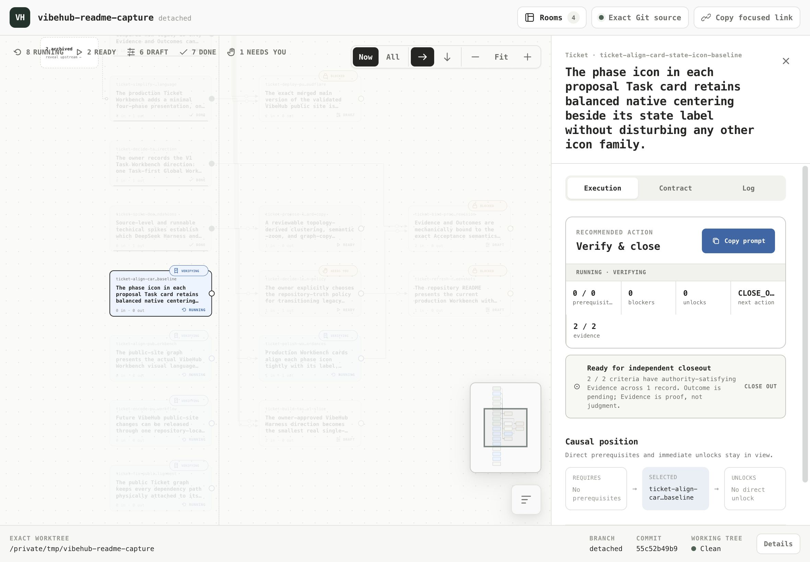
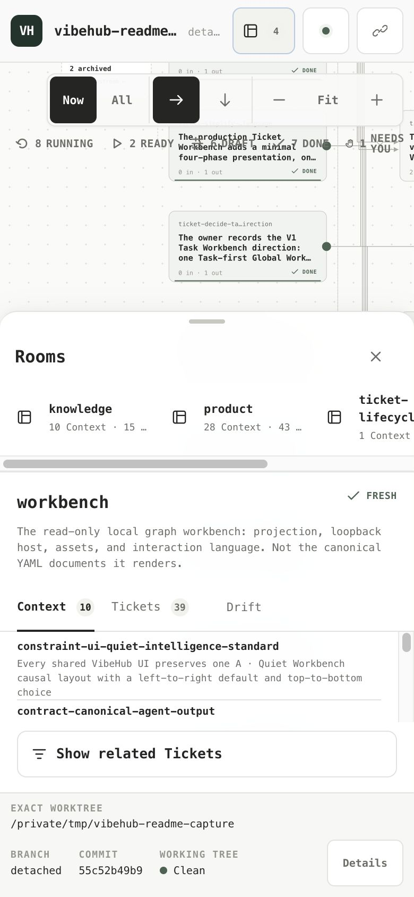

<p align="center">
  <picture>
    <source media="(prefers-color-scheme: dark)" srcset="assets/brand/vibehub-logo-dark.svg">
    <source media="(prefers-color-scheme: light)" srcset="assets/brand/vibehub-logo.svg">
    
  </picture>
</p>
<p align="center"><strong>VibeHub turns a development request into a Git-native Ticket cycle your coding agent can plan, execute, prove, and close.</strong></p>

<h3 align="center"><code>Start this with VibeHub.</code></h3>

<p align="center"><em>Memory tools preserve the conversation; VibeHub preserves the development cycle.</em></p>



**See what matters now.** The canvas distinguishes DRAFT, READY, RUNNING, and DONE work, then keeps direct prerequisites and unlocks visible instead of flattening the repository into a task list.



**Take the next action from the Ticket.** Recommended action stays primary, its explanation appears on demand, and Contract plus Log keep acceptance, Evidence, and Outcome traceable to exact Git source.



**Bring repository context in only when useful.** Rooms expose durable Context, consuming Tickets, and drift state on demand; the same read-only graph remains usable at a real narrow viewport.

Describe the work and say the line above. VibeHub plans the smallest honest Git-native Tickets, keeps human decisions explicit, and records acceptance-linked Evidence before independent closeout. Tickets, Context, Evidence, and Outcomes remain ordinary Git files, so another Agent can resume from repository truth without reconstructing the conversation.

## Installation

**Codex**

```bash
codex plugin marketplace add VW-ai/vibehub-plugin
codex plugin add vibehub@vibehub
```

Then start a new task and use the single entry above.

**Claude Code**

```text
/plugin marketplace add VW-ai/vibehub-plugin
/plugin install vibehub@vibehub
/reload-plugins
```

## Upgrades

The host updates the plugin bundle; VibeHub never updates itself in the
background and never rewrites checked-in project data during installation.
In Codex, run `codex plugin marketplace upgrade vibehub` followed by
`codex plugin add vibehub@vibehub`, then start a new task. In Claude Code, run
`claude plugin update vibehub@vibehub --scope user`, then restart Claude Code
(or use `/reload-plugins` after a marketplace refresh). If project data needs
migration, the new session previews that separate Git change through the
migrate Skill; installing a plugin never rewrites `.vibehub/`.
Read the [product concept](docs/CONCEPT.md), [installation and coexistence](docs/INSTALL.md),
[local graph design](docs/LOCAL_GRAPH_DESIGN.md), or [release procedure](docs/RELEASE.md).
Apache-2.0
