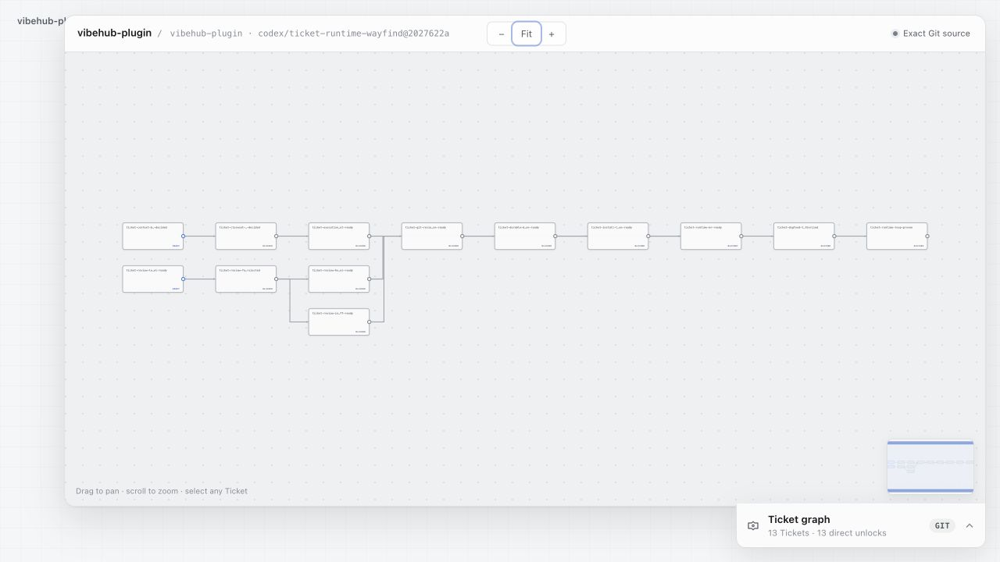
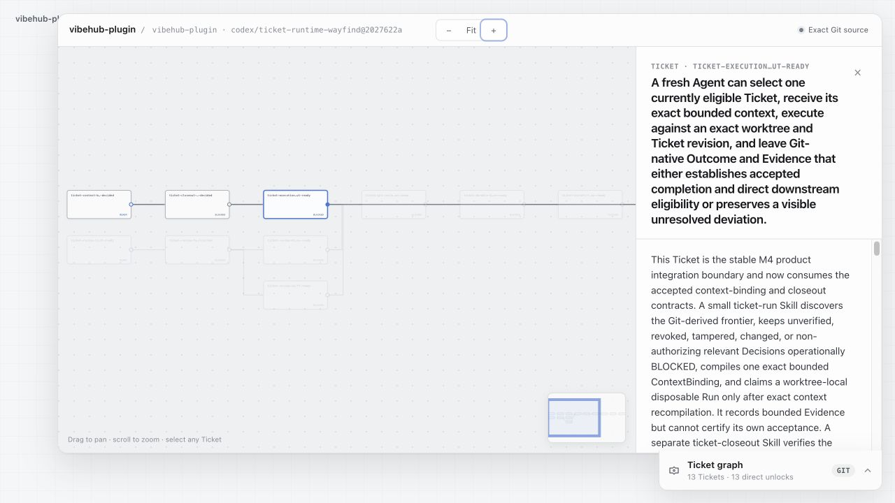

# VibeHub

> Turn development intent into executable Ticket graphs for Claude Code and OpenAI Codex.

[](https://github.com/VW-ai/vibehub-plugin/releases/latest)
[](https://github.com/VW-ai/vibehub-plugin/actions/workflows/release.yml)
[](https://github.com/VW-ai/vibehub-plugin/actions/workflows/npm-publish.yml)
[](LICENSE)

**[English](#vibehub)** · **[中文](#中文)**

VibeHub turns a deliverable into a Git-native graph that coding agents can
plan, execute, and independently verify. A human sees the whole path—what is
ready, what is blocked, and what each completed Ticket unlocks—without reading
the planning conversation.

Each Ticket is an executable context package. A fresh Agent can recover the
exact promise, acceptance, dependencies, protected decisions, and bounded
repository context from the worktree itself.

<p align="center">
  
</p>

<p align="center"><sub>A complete Git-derived Ticket graph. Pan, zoom, inspect any node, and read execution from left to right.</sub></p>

## Ticket System

The loop is deliberately small:

**Plan → independently validate → review when needed → run → independently
close out → unlock direct dependents.**

- Planning backchains from observable outcomes, then reads forward to remove
  unnecessary or speculative work.
- Tickets have no hierarchy. Direct dependency relations express the graph,
  including parallel paths and joins.
- The executor records acceptance-linked Evidence but cannot certify its own
  completion. A separate Agent adjudicates the Outcome.
- Only a current successful Outcome derives `DONE`. Partial, failed, stale, or
  deviated work unlocks nothing and remains visible.
- Human attention is reserved for product, experience, design, permission, and
  risk boundaries—not objectively adjudicable implementation choices.

<p align="center">
  
</p>

<p align="center"><sub>Select a Ticket to inspect its promise, current state, acceptance, context references, evidence, and direct relations.</sub></p>

## Install

Requires Node.js 20 or newer and GitHub CLI access to this private repository.
No global npm install, platform target, or API key is required.

```bash
gh auth login --hostname github.com
npx -y @vw-ai/vibehub-cli@latest host install
```

The installer detects Claude Code and Codex. Use `--hosts all` to require both.
It downloads and verifies the matching immutable GitHub Release rather than
following a moving branch. By default, it selects the latest published
release; use `--version X.Y.Z` to pin one.

### CLI only

```bash
npx @vw-ai/vibehub-cli doctor --repo /path/to/repository --json
```

Public packages:
[`@vw-ai/vibehub-cli`](https://www.npmjs.com/package/@vw-ai/vibehub-cli) ·
[`@vw-ai/vibehub-core`](https://www.npmjs.com/package/@vw-ai/vibehub-core) ·
[`@vw-ai/vibehub-workbench-mcp`](https://www.npmjs.com/package/@vw-ai/vibehub-workbench-mcp)

On first use, the plugin downloads its version-matched npm runtime into
`~/.vibehub/runtime/npm/vVERSION/`. Later starts reuse that local cache. The
public packages are released through npm Trusted Publishing with registry
signatures and SLSA provenance attestations.

See [installation and update details](docs/INSTALL.md).

## Start with Tickets

Open a new session in the repository you want to connect. In Claude Code, run:

```text
/vibehub:vibehub-setup
```

In Codex, ask:

```text
Use $vibehub-setup for this repository.
```

In Codex, review and trust the packaged hooks through `/hooks` when prompted.

Turn one concrete deliverable into an executable graph, then review it:

```text
Use $vibehub-ticket-plan to turn this deliverable into an executable Ticket graph.
Use $vibehub-ticket-review to open the graph for review.
```

Planning writes machine-valid Tickets directly to the worktree after
independent validation. Human plan review is optional; protected product or
experience decisions still stop the affected path.

To execute the frontier:

```text
Use $vibehub-ticket-run to execute the next ready Ticket.
```

The executor leaves Evidence, not a success claim. Hand the Run to a fresh
Agent for independent closeout:

```text
Use $vibehub-ticket-closeout to independently adjudicate the completed Ticket.
```

## Context Layer underneath

The Ticket System is the product surface. The local-first Context Layer is the
foundation that makes each Ticket executable and traceable across sessions,
branches, and worktrees.

| Layer | What it owns |
| --- | --- |
| Git | Ticket definitions and relations, Reviews, Decisions, ContextBindings, Evidence, and Outcomes |
| Context runtime | Governed project knowledge, exact checkout identity, and bounded context retrieval |
| Disposable runtime | Run claims, generations, heartbeats, and local coordination |
| CLI + MCP + hooks | Deterministic mechanics and lifecycle evidence for Claude Code and Codex |

The runtime needs no API key and does not embed an LLM. Intelligence stays in
the Skills and the host Agent; scripts enforce exact reads, validation,
staleness, and bounded writes.

## Skills

| Cluster | Skills | Role |
| --- | --- | --- |
| Ticket loop | `$vibehub-ticket-plan`, `$vibehub-ticket-validate`, `$vibehub-ticket-review`, `$vibehub-ticket-run`, `$vibehub-ticket-closeout` | Plan, challenge, inspect, execute, and independently close work |
| Context | `$vibehub-setup`, `$vibehub-query`, `$vibehub-ingest`, `$vibehub-distill`, `$vibehub-update`, `$vibehub-review` | Connect a checkout and maintain governed project knowledge |
| Delivery | `$vibehub-pr` | Prepare semantic checkpoints and pull requests |

## Local data

Durable Ticket truth follows Git in:

```text
.vibehub/tickets/
```

Machine-local context and runtime coordination stay at:

```text
~/.vibehub/workbench.db
```

This split keeps branch and worktree collaboration aligned with Git while
allowing disposable execution state to be rebuilt. Repository identity and
exact checkout bindings keep local projects and worktrees separate.

## Develop

```bash
git clone https://github.com/VW-ai/vibehub-plugin.git
cd vibehub-plugin
pnpm install --frozen-lockfile
pnpm verify
```

Source builds use pnpm 10.8.1. The full verification
gate builds and tests the CLI, MCP server, skills, real host installations, and
the headless dogfood flow.

See the [release policy](docs/RELEASE.md), [changelog](CHANGELOG.md), and
[published releases](https://github.com/VW-ai/vibehub-plugin/releases).

## 中文

VibeHub 的主线产品是面向 Claude Code 和 OpenAI Codex 的 Git-native Ticket
System。它把一个 deliverable 编排成可执行关系图：人一眼看到现在能做什么、
完成后解锁什么；fresh Agent 只读 Ticket 就能获得正确的目标、acceptance、
依赖、决策边界和上下文，不依赖原始 planning 对话。

Ticket 没有层级，只有直接依赖关系。执行 Agent 留下与 acceptance 对应的
Evidence，但不能自证完成；另一个 Agent 独立 closeout 后，只有 current
successful Outcome 才会将 Ticket 标记为 `DONE` 并解锁直接下游。偏离产品、
体验、设计、权限或风险边界的工作会停下来让人处理。

Context Layer 是这套系统的基础设施：Ticket、Review、Decision、ContextBinding、
Evidence 和 Outcome 跟着 Git branch/worktree；本地 SQLite 保存 governed
project knowledge 与可丢弃的运行协调状态。系统不需要 API key，也不会在运行
时内置调用 LLM。

安装时先用 GitHub CLI 登录有权访问本私有仓库的账号，再运行上面的一行
installer。安装完成后，在目标仓库的新会话中，Claude Code 使用
`/vibehub:vibehub-setup`，Codex 使用 `$vibehub-setup`。然后用
`$vibehub-ticket-plan` 生成可执行 Ticket 图、用 `$vibehub-ticket-review`
查看全图，再让 `$vibehub-ticket-run` 执行下一个 READY Ticket。执行结束后由
另一个 Agent 使用 `$vibehub-ticket-closeout` 独立验证。Context Layer 仍可通过
`$vibehub-query`、`$vibehub-ingest` 和 `$vibehub-distill` 直接使用。

安装需要 Node.js 20 或更新版本，不需要 `npm -g`，也不用选择系统或 CPU
对应的 branch。首次使用会将与插件同版本的 npm runtime 缓存到
`~/.vibehub/runtime/npm/vVERSION/`。npm 包通过 Trusted Publishing 的 OIDC
自动发布，带有 registry signature 和 SLSA provenance，GitHub 中不保存长期
npm token。

## License

[Apache-2.0](LICENSE)
