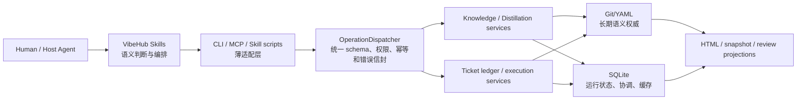
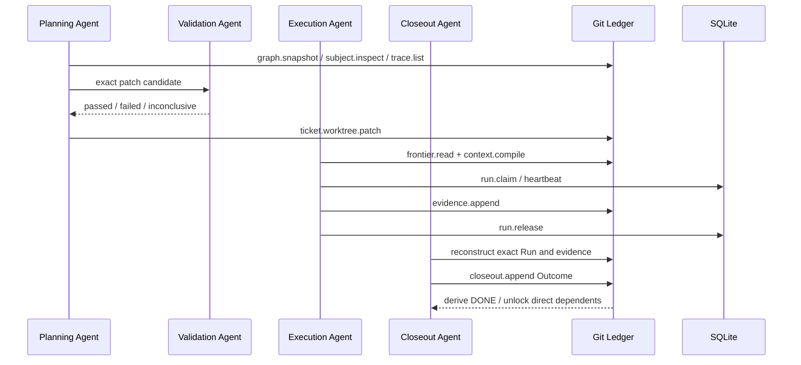

# VibeHub Plugin 0.3.0 历史代码库理解指南

> **历史快照，不代表当前 0.8.0 架构。** 本文只用于理解 0.3.0 到当前版本的设计演进；文中的“当前”均指提交 `db9f744`（2026-07-31，合并 PR #9）当时。所有源码链接都固定到该提交，避免误导读者进入已经删除或迁移的路径。
>
> 要理解当前 Personal Ticket Hub 方向，请先读 [`PERSONAL_TICKET_HUB_SOLUTION.zh-CN.md`](./PERSONAL_TICKET_HUB_SOLUTION.zh-CN.md)；要理解当前 VibeHub，请从仓库根目录的 `README.md` 与 `.vibehub/rooms/` 开始。

## 0. 先给结论

VibeHub 不是一个“在后台替 Agent 做规划”的工作流引擎。它更准确的定位是：

> 一个运行在 Claude Code、Codex 等宿主里的本地优先协作协议：让 Skills 负责语义判断，让 Core/CLI/MCP 负责确定性读写，把长期语义放进 Git，把短期协调放进 SQLite。

当前代码库有两层能力：

1. **Knowledge / Context 层**：保存和检索 intent、decision、constraint、contract、context、change 等长期知识，并支持冷启动提炼、增量更新、上下文注入、团队可见性。
2. **Ticket Runtime 层**：把交付目标变成 Git-native 的扁平 Ticket 依赖图，由一个 Agent 执行、另一个 Agent 独立 closeout，只有当前有效且成功的 Outcome 才能把 Ticket 推导为 `DONE`。

当前产品与架构主线已经转向 **Ticket Runtime**。Workbench、hook、context、team sync 等旧能力仍在仓库中并且仍有作用，但理解新开发时应从 Ticket Runtime 开始，而不是从旧的 Task/Workbench 模型开始。

最重要的四条设计原则是：

- **Git/YAML 是 durable semantic truth**：Ticket、Decision、Evidence、Outcome 和已切换仓库的知识语义都以 Git 文件为准。
- **SQLite 是 disposable operational state**：Run lease、heartbeat、session、hook event、cache、projection 等可以放 SQLite；删掉数据库不能改变长期语义。
- **Skills 拥有 intelligence**：场景识别、规划、语义验证、执行策略和 closeout 判断在 Skills 中；脚本与 Core 只提供确定性“手”。
- **执行者不能自证完成**：执行 Agent 写 Evidence，独立 Agent 写 Outcome；测试通过本身不等于 Ticket 完成。

---

## 1. 仓库快照与阅读边界

本次梳理对应：

| 项目 | 当前值 |
|---|---|
| 分支 | `main`，与 `origin/main` 一致 |
| 提交 | `db9f7448e2b7a585eab0bc72a76dacab48ba6dc2` |
| 根包版本 | `0.3.0` |
| Node 要求 | `>=20` |
| 包管理器 | `pnpm@10.8.1` |
| Git 跟踪文件 | 487 |
| TypeScript 文件 | 132 |
| MJS 文件 | 44 |
| Markdown 文件 | 85 |
| YAML 文件 | 181 |
| Core 源码 | 约 29,017 行 |
| 测试源码 | 约 24,820 行 |
| Skills | 12 个 |
| META 文件 | 205 个 |

测试源码中有至少 565 个直接的 `it(...)` / `test(...)` 声明，另有参数化测试，因此实际 runner case 数会不同。`META/09-ticket-runtime/progress.yaml` 记录 M4 完成时 Core 450、CLI 105、MCP 25，共 580 个用例通过。本次导读没有重新安装依赖和重跑完整 suite，代码事实来自当前源码，历史验证结果明确标为 META 证据。

一个值得注意的小偏差：

- 根 `package.json` 和插件 manifests 的当前版本是 `0.3.0`。
- `META/project.yaml` 仍写着更早的 `0.1.0-beta`。

因此，**发布版本以 package/plugin manifests 为准，不要以 `META/project.yaml` 的版本字段为准**。

---

## 2. 十分钟理解路线

如果只想最快建立正确心智模型，按这个顺序读：

1. [`README.md`](https://github.com/VW-ai/vibehub-plugin/blob/db9f7448e2b7a585eab0bc72a76dacab48ba6dc2/README.md)：产品入口、安装方式和用户侧主循环。
2. [`META/00-project-room/spec.md`](https://github.com/VW-ai/vibehub-plugin/blob/db9f7448e2b7a585eab0bc72a76dacab48ba6dc2/META/00-project-room/spec.md)：整个项目的当前架构与产品边界。
3. [`META/09-ticket-runtime/spec.md`](https://github.com/VW-ai/vibehub-plugin/blob/db9f7448e2b7a585eab0bc72a76dacab48ba6dc2/META/09-ticket-runtime/spec.md)：当前主线及 canonical decisions。
4. [`packages/core/src/operation-dispatcher.ts`](https://github.com/VW-ai/vibehub-plugin/blob/db9f7448e2b7a585eab0bc72a76dacab48ba6dc2/packages/core/src/operation-dispatcher.ts)：所有 CLI/MCP 操作共享的边界。
5. [`packages/core/src/ticket-ledger/contract.ts`](https://github.com/VW-ai/vibehub-plugin/blob/db9f7448e2b7a585eab0bc72a76dacab48ba6dc2/packages/core/src/ticket-ledger/contract.ts) 与 [`codec.ts`](https://github.com/VW-ai/vibehub-plugin/blob/db9f7448e2b7a585eab0bc72a76dacab48ba6dc2/packages/core/src/ticket-ledger/codec.ts)：Ticket 数据模型、校验和状态推导。
6. [`packages/core/src/ticket-execution-service.ts`](https://github.com/VW-ai/vibehub-plugin/blob/db9f7448e2b7a585eab0bc72a76dacab48ba6dc2/packages/core/src/ticket-execution-service.ts)：frontier、context、Run、Evidence、closeout 的完整执行面。
7. [`skills/vibehub-ticket-plan/SKILL.md`](https://github.com/VW-ai/vibehub-plugin/blob/db9f7448e2b7a585eab0bc72a76dacab48ba6dc2/skills/vibehub-ticket-plan/SKILL.md)、[`vibehub-ticket-run/SKILL.md`](https://github.com/VW-ai/vibehub-plugin/blob/db9f7448e2b7a585eab0bc72a76dacab48ba6dc2/skills/vibehub-ticket-run/SKILL.md)、[`vibehub-ticket-closeout/SKILL.md`](https://github.com/VW-ai/vibehub-plugin/blob/db9f7448e2b7a585eab0bc72a76dacab48ba6dc2/skills/vibehub-ticket-closeout/SKILL.md)：Agent 侧真正的智能流程。
8. [`META/09-ticket-runtime/artifacts/2026-07-30-ticket-m4-execution-closeout.md`](https://github.com/VW-ai/vibehub-plugin/blob/db9f7448e2b7a585eab0bc72a76dacab48ba6dc2/META/09-ticket-runtime/artifacts/2026-07-30-ticket-m4-execution-closeout.md)：当前实现与测试证据的最佳索引。

读完这八项，已经足够参与 Ticket Runtime 的大部分设计与代码讨论。

---

## 3. 核心心智模型



这张图里最关键的不是模块名，而是责任方向：

- 上层 Skills 决定“为什么做、应该怎么理解、是否语义成立”。
- 下层 Core 决定“输入是否合法、源是否过期、写入是否安全、事实是否真的落盘”。
- CLI、MCP、HTML 不应再发明自己的业务生命周期。
- Git 和 SQLite 不是两份相同数据：它们承载不同类型的 truth。

### 3.1 权威矩阵

| 信息 | 权威位置 | 可以丢失吗 | 典型实现 |
|---|---|---:|---|
| Ticket 定义与依赖 | Git `.vibehub/tickets/` | 不可以 | Ticket ledger |
| Review、Decision | Git `.vibehub/tickets/` | 不可以 | Review/Decision writers |
| ContextBinding、Evidence、Outcome | Git `.vibehub/tickets/` | 不可以 | Execution service |
| 已切换仓库的 KB 语义 | Git `.vibehub/semantic-store/` | 不可以 | Git semantic store |
| Run lease、heartbeat、generation | SQLite | 可以重建/重新领取 | `ticket_runs` |
| session、hook、event、scope | SQLite | 可丢运行历史，不应改变项目语义 | legacy runtime services |
| Git 语义查询 cache | SQLite | 可以 | commit/digest keyed cache |
| 本机 Decision 私钥和信任注册表 | `~/.vibehub/trust/`，不在 Git/SQLite | 丢失会失去本机验证能力 | local decision authority |
| 短期 host capability | 进程内存 | 可以 | review host / dispatcher context |

### 3.2 为什么这样分

Git 擅长版本、分支、diff、review、merge 和协作历史；SQLite 擅长本机高频协调与查询。VibeHub 的原则不是“所有东西都放 Git”，而是：

> 任何丢失后会改变项目含义、授权原因或完成证明的事实，都必须跟 Git 走；只影响活跃进程协调的事实可以留在 SQLite。

---

## 4. 顶层目录地图

| 路径 | 作用 | 当前重要性 |
|---|---|---|
| `packages/core/` | 所有真实业务和安全逻辑，library-first | 最高 |
| `packages/cli/` | CLI 适配、host installer、本地 review host | 高 |
| `packages/mcp/` | MCP server 与稳定 capability adapter | 高 |
| `skills/` | Agent intelligence、操作手册和薄脚本 | 最高 |
| `.vibehub/tickets/` | 本仓库自己的 Git-native Ticket ledger | 最高 |
| `.vibehub/semantic-store/` | 本仓库的 Git semantic knowledge store marker/data | 高 |
| `META/` | Feature Room 设计、决策、进度与历史证据 | 最高，但要分当前/历史 |
| `runtime/` | 薄插件启动器，按版本安装 npm runtime | 中高 |
| `scripts/` | 构建、打包、发布和隔离验证 | 中高 |
| `hooks/` | 宿主 hook 配置 | 中 |
| `.claude-plugin/`、`.codex-plugin/` | 两种宿主的插件 manifest | 中高 |
| `codex/` | Codex 配置/集成资产 | 中 |
| `docs/` | 安装、发布、npm 发布与架构导读 | 中 |
| `assets/` | 品牌与静态资产 | 低 |

---

## 5. Core：真正的系统

`packages/core/src/index.ts` 是公共 API 总出口。Core 内部可以分成五组。

### 5.1 统一操作层

关键文件：

- [`operation-contracts.ts`](https://github.com/VW-ai/vibehub-plugin/blob/db9f7448e2b7a585eab0bc72a76dacab48ba6dc2/packages/core/src/operation-contracts.ts)
- [`operation-dispatcher.ts`](https://github.com/VW-ai/vibehub-plugin/blob/db9f7448e2b7a585eab0bc72a76dacab48ba6dc2/packages/core/src/operation-dispatcher.ts)

系统暴露 54 个 canonical operations：

- `kb.*`：16 个。
- `distill.*`：25 个。
- `ticket.*`：13 个。

`operation-contracts.ts` 用 Zod 定义严格输入、大小上限和操作名。生成脚本会把这些合同同步到 Skills 包，避免 CLI、MCP 和 Skills 各自漂移。

`OperationDispatcher` 是最重要的横向边界：

1. 验证 operation name 和 input。
2. 绑定 repo、actor、task、request 等 context。
3. 选择 Git semantic store 或 legacy SQLite knowledge path。
4. 调用 KB、Distillation 或 Ticket service。
5. 统一返回：

   ```json
   { "ok": true, "data": {}, "meta": {} }
   ```

   或：

   ```json
   { "ok": false, "error": { "code": "...", "message": "..." } }
   ```

6. 对需要的操作处理幂等 receipt。

Git-native Ticket 操作是一个刻意的例外：它们直接重新读取当前 Git 源，不依赖 SQLite semantic receipt，也不会用旧 receipt 回放一个已经变化的 worktree。

### 5.2 SQLite 运行层

关键文件：

- [`db.ts`](https://github.com/VW-ai/vibehub-plugin/blob/db9f7448e2b7a585eab0bc72a76dacab48ba6dc2/packages/core/src/db.ts)
- [`runtime-lifecycle.ts`](https://github.com/VW-ai/vibehub-plugin/blob/db9f7448e2b7a585eab0bc72a76dacab48ba6dc2/packages/core/src/runtime-lifecycle.ts)
- [`project-activation.ts`](https://github.com/VW-ai/vibehub-plugin/blob/db9f7448e2b7a585eab0bc72a76dacab48ba6dc2/packages/core/src/project-activation.ts)
- [`activity-store.ts`](https://github.com/VW-ai/vibehub-plugin/blob/db9f7448e2b7a585eab0bc72a76dacab48ba6dc2/packages/core/src/activity-store.ts)
- [`hook-ingest.ts`](https://github.com/VW-ai/vibehub-plugin/blob/db9f7448e2b7a585eab0bc72a76dacab48ba6dc2/packages/core/src/hook-ingest.ts)
- [`scope-registry.ts`](https://github.com/VW-ai/vibehub-plugin/blob/db9f7448e2b7a585eab0bc72a76dacab48ba6dc2/packages/core/src/scope-registry.ts)
- [`intervention-service.ts`](https://github.com/VW-ai/vibehub-plugin/blob/db9f7448e2b7a585eab0bc72a76dacab48ba6dc2/packages/core/src/intervention-service.ts)
- [`team-sync.ts`](https://github.com/VW-ai/vibehub-plugin/blob/db9f7448e2b7a585eab0bc72a76dacab48ba6dc2/packages/core/src/team-sync.ts)

默认数据库是 `~/.vibehub/workbench.db`，使用 SQLite WAL。当前 schema version 为 22。

它包含：

- repository、team branch、task、session；
- hook events、file footprints、scope；
- injection / pause / conflict facts；
- legacy KB 与 Git semantic query cache；
- distillation runs、scopes、candidates、versions；
- operation receipts、prompt cadence；
- repository semantic authority；
- disposable Ticket Run leases。

迁移 17–21 是清理旧实现后保留的空 clean-cut 槽位；迁移 22 添加当前的 `ticket_runs`。

#### Runtime 生命周期

`runtime-lifecycle.ts` 负责：

- 初始化和 doctor；
- managed assets 的 ownership/checksum；
- 安全 staging、原子 rename、失败回滚；
- 防止 symlink 越界。

`project-activation.ts` 会在 `AGENTS.md` / `CLAUDE.md` 中维护带 marker/version 的受管 instruction slice，并生成 Installed / Connected / Activated 的机器证据。

#### Hook 与 Context

Claude Code 和 Codex 的事件先被转换为统一 hook protocol，再由状态机与 activity store 记录：

```text
host event
  -> hook adapter
  -> canonical hook event
  -> SQLite event / footprint / task state
  -> intervention claim
  -> host-specific delivery
```

Hook 设计为 fail-open：VibeHub 失败不应阻断宿主 Agent 的正常工作；错误写 stderr/日志，hook 命令仍安全退出。

`knowledge-checkpoint.ts` 默认每 8 个用户 prompt 提醒 Agent 把值得长期保留的发现写入知识层。只有 proven KB write 才会重置 cadence。

#### Team 与 Workbench projection

`team-sync.ts` 组合：

- `git fetch` 与 branch facts；
- branch diff；
- `git merge-tree` 的两两冲突预测；
- 可用时的 `gh` PR 信息。

`snapshot-export.ts`、`live-read-models.ts` 和 treemap 相关代码把 SQLite 运行事实、Git/team facts 投影给旧 Workbench UI。它们是 read model，不是新的 source of truth。

### 5.3 Governed Knowledge 与 Distillation

关键文件：

- [`knowledge-service.ts`](https://github.com/VW-ai/vibehub-plugin/blob/db9f7448e2b7a585eab0bc72a76dacab48ba6dc2/packages/core/src/knowledge-service.ts)
- [`distillation-service.ts`](https://github.com/VW-ai/vibehub-plugin/blob/db9f7448e2b7a585eab0bc72a76dacab48ba6dc2/packages/core/src/distillation-service.ts)
- [`git-semantic-store.ts`](https://github.com/VW-ai/vibehub-plugin/blob/db9f7448e2b7a585eab0bc72a76dacab48ba6dc2/packages/core/src/git-semantic-store.ts)
- [`experimental/git-semantic-store/`](https://github.com/VW-ai/vibehub-plugin/blob/db9f7448e2b7a585eab0bc72a76dacab48ba6dc2/packages/core/src/experimental/git-semantic-store/)

Knowledge 类型包括：

- `intent`
- `decision`
- `constraint`
- `contract`
- `convention`
- `context`
- `change`

一个 spec 有不可变 revision、evidence、anchor、typed relation 和 lifecycle。常用查询支持：

- topic/path ranked search；
- spec 详情；
- feature placement；
- anchor 的 code ↔ spec 双向查找；
- supersession lineage；
- relation traversal；
- low-confidence / conflict / stale / unplaced review。

当仓库存在 `.vibehub/semantic-store/protocol.yaml` 时：

- Git 是 durable knowledge authority。
- 精确 Git tree/commit 会物化成隔离的 SQLite query cache。
- mutation 先在 candidate cache 验证，再做 semantic digest compare-and-swap。
- 不允许 Git 与 SQLite semantic dual-write。

没有 marker 的旧仓库暂时走 legacy SQLite knowledge path，直到自己完成显式 migration。

`DistillationService` 负责冷启动/刷新时的确定性状态机：

```text
start/resume
  -> inventory put + seal
  -> scopes plan/claim/complete
  -> candidates put
  -> reconcile
  -> validate
  -> finalize
  -> activate
```

Agent/Skill 决定候选知识“意味着什么”；service 只保证 inventory、lease、candidate、version 和 activation 的机械正确性。

### 5.4 Ticket Ledger：当前主线的语义内核

关键目录：

- [`packages/core/src/ticket-ledger/`](https://github.com/VW-ai/vibehub-plugin/blob/db9f7448e2b7a585eab0bc72a76dacab48ba6dc2/packages/core/src/ticket-ledger/)

Git 目录结构：

```text
.vibehub/tickets/
  protocol.yaml
  tickets/
  reviews/
  decisions/
  attestations/
  context-bindings/
  evidence/
  outcomes/
```

#### 合同与容量限制

`contract.ts` 使用严格 Zod schemas，并设置明确预算：

- 总 ledger 最大 8 MiB；
- Ticket 最多 1,000；
- Review、Evidence、relation 最多 5,000；
- Decision、attestation、ContextBinding、Outcome 最多 2,000；
- 每种文件还有独立大小上限。

Ticket 图是扁平图，不保留第二套 Scenario/Task/parent 生命周期。当前执行关系只有直接 `depends_on`；Scenario 是人类理解计划的 lens，不是第二种 canonical node。

#### Canonical codec

`codec.ts` 只接受规范化 YAML 1.2 子集，并拒绝：

- YAML alias；
- merge key；
- custom tag；
- duplicate key；
- 非 canonical 路径；
- 超出容量；
- 缺失 relation endpoint；
- dependency cycle；
- 互相矛盾的 ledger facts。

它还负责从当前 Git facts 推导 Ticket 状态：

- `READY`
- `DONE`
- `BLOCKED`
- `DEVIATED`

运行投影再叠加：

- `RUNNING`
- `STALE`

`DONE` 不是一个随手写进 Ticket 的布尔值。只有成功 Outcome 同时绑定当前：

- Ticket revision；
- 被接受且仍有效的 ContextBinding；
- 每个直接前置 Ticket 的精确成功 Outcome；
- 当前有效的 protected Decisions；

它才会被推导出来。任何绑定变旧或 Decision authority 被撤销，都可能让 operational `DONE` 消失，但历史 Outcome 文件仍保留。

#### 安全读取

`reader.ts`：

- 支持当前 worktree 或任意 Git ref；
- 拒绝 symlink、特殊文件和 unmerged path；
- 连续读取两次完整 snapshot，最多重试三轮，防止读到变化中的混合状态；
- 计算 `graphDigest`、`semanticLedgerDigest`、raw inventory `sourceToken`；
- 记录 repository/worktree identity、HEAD 和 dirty paths。

`sourceToken` 不只绑定语义内容，也绑定 ledger path、mode 和 raw bytes。因此即便只改了注释、格式或文件 mode，旧写请求也会 stale，避免覆盖用户刚做的本地改动。

#### 精确写入

`writer.ts` 实现 `ticket.worktree.patch` 和 append-only semantic writers：

- 对 `sourceToken`、worktree、HEAD、digest、目标 Ticket revision 做 compare-and-swap；
- 在写前验证完整 prospective graph；
- 持有 per-worktree writer lock；
- staged temp file + no-replace atomic rename；
- 写后完整 reload 校验；
- 同步部分失败时尝试条件回滚。

它**不声称多文件 crash atomicity**。Git commit 才是持久的多文件语义边界。patch 只返回精确 `checkpointSelection`，不会偷偷 commit。

`checkpoint.ts` / `git-checkpoint.ts` 提供独立两阶段 checkpoint：

1. prepare 固定 branch、HEAD、digest 和精确路径。
2. commit 用临时 Git index 构造只包含目标路径的 tree，再 compare-and-swap 推进 branch。

因此用户工作区中无关的 staged/unstaged 文件不会被混进 VibeHub checkpoint。

### 5.5 Ticket Execution：从 READY 到 DONE

关键文件：

- [`ticket-context-compiler.ts`](https://github.com/VW-ai/vibehub-plugin/blob/db9f7448e2b7a585eab0bc72a76dacab48ba6dc2/packages/core/src/ticket-context-compiler.ts)
- [`ticket-run-store.ts`](https://github.com/VW-ai/vibehub-plugin/blob/db9f7448e2b7a585eab0bc72a76dacab48ba6dc2/packages/core/src/ticket-run-store.ts)
- [`ticket-execution-service.ts`](https://github.com/VW-ai/vibehub-plugin/blob/db9f7448e2b7a585eab0bc72a76dacab48ba6dc2/packages/core/src/ticket-execution-service.ts)
- [`ticket-decision-attestation.ts`](https://github.com/VW-ai/vibehub-plugin/blob/db9f7448e2b7a585eab0bc72a76dacab48ba6dc2/packages/core/src/ticket-decision-attestation.ts)
- [`ticket-decision-trust-store.ts`](https://github.com/VW-ai/vibehub-plugin/blob/db9f7448e2b7a585eab0bc72a76dacab48ba6dc2/packages/core/src/ticket-decision-trust-store.ts)

完整调用链：



#### Context compile

Context compiler 按 Ticket 的 `context_refs` 读取精确执行包：

- 最多 256 个文件；
- 单文件最大 256 KiB；
- 总量最大 2 MiB；
- 拒绝 traversal、symlink、binary；
- 拒绝 `.git` 和 `.vibehub/tickets`；
- 拒绝目录覆盖造成的越权扩张。

ContextBinding 绑定：

- repo/worktree/branch/HEAD；
- staged index identity；
- non-ledger source digest；
- Ticket revision 与 acceptance；
- prerequisite Outcomes；
- 已验证 Decisions；
- 精确文件内容。

claim 时会再次编译并比较，包括 ignored context 文件；旧 packet 不能被静默复用。

#### Run lease

`ticket-run-store.ts` 把 Run lease 放在 SQLite：

- lease 15 秒到 1 小时；
- bearer token 只存 hash；
- 支持 generation、takeover、heartbeat、release；
- 不保存 Ticket 的 durable meaning。

SQLite 被删除后当前 lease 会丢失，但 Git 中 Ticket、Evidence、Outcome 仍是完整事实。

#### Evidence 与 independent closeout

执行 Agent：

1. 只从 `frontier.read` 选择 READY Ticket。
2. 编译并 claim 精确 context。
3. 在 delegated boundary 内修改代码。
4. 为每个 acceptance append Evidence。
5. release Run。
6. **绝不能调用 `ticket.closeout.append` 给自己判成功。**

Closeout Agent 必须在独立 Agent context 中：

1. 重建 Ticket、Run、ContextBinding、Decision、Evidence 和 prerequisites。
2. 逐个 acceptance 标记 `accepted` / `rejected` / `unresolved`。
3. 按优先顺序选择一个 terminal form：
   - `stale`
   - `deviated`
   - `successful`
   - `partial`
   - `failed`
4. append 一个 Outcome。
5. 重新读取 frontier，确认是否真的解锁直接 dependent。

terminal Outcome 不是“测试结果的别名”。测试只是 Evidence 的一种；verifier 仍需要判断它是否覆盖 Ticket 的完整 promise。

#### Decision authority

当前 durable Decision authority 是：

- repository-scoped；
- installation-local Ed25519 key；
- 私钥和 registry 位于 Git/SQLite 之外；
- receipt 精确绑定 Decision、repo、worktree、named branch 和 scope；
- 每次验证动态读取 trust registry，因此撤销会即时生效；
- fail closed。

一个本地 UI 点击证明的是“受信任插件 host 做了这次 assertion”，不是：

- WebAuthn；
- 生物识别；
- named-human identity；
- repository owner identity；
- 对任意 same-UID 恶意进程的防护。

这是一条必须诚实描述的安全边界。

### 5.6 Ticket Review Projection

关键文件：

- [`ticket-review-source.ts`](https://github.com/VW-ai/vibehub-plugin/blob/db9f7448e2b7a585eab0bc72a76dacab48ba6dc2/packages/core/src/ticket-review-source.ts)
- [`ticket-ledger/projection.ts`](https://github.com/VW-ai/vibehub-plugin/blob/db9f7448e2b7a585eab0bc72a76dacab48ba6dc2/packages/core/src/ticket-ledger/projection.ts)
- [`ticket-review-projector.ts`](https://github.com/VW-ai/vibehub-plugin/blob/db9f7448e2b7a585eab0bc72a76dacab48ba6dc2/packages/core/src/ticket-review-projector.ts)
- [`ticket-review-read-service.ts`](https://github.com/VW-ai/vibehub-plugin/blob/db9f7448e2b7a585eab0bc72a76dacab48ba6dc2/packages/core/src/ticket-review-read-service.ts)
- [`contract/ticket-review.ts`](https://github.com/VW-ai/vibehub-plugin/blob/db9f7448e2b7a585eab0bc72a76dacab48ba6dc2/packages/core/src/contract/ticket-review.ts)

它们把 Git ledger 投影为稳定分页接口：

- `ticket.graph.snapshot`
- `ticket.subject.inspect`
- `ticket.trace.list`

分页 cursor 绑定 snapshot，不能把不同 snapshot 的页拼接。Review/Decision trace 会标明 current、historical、unverified 等状态；摘要不是权威，Skill 需要沿 repository path 读取完整 durable document。

---

## 6. CLI：薄适配器，但承担本机安全边界

关键文件：

- [`packages/cli/src/main.ts`](https://github.com/VW-ai/vibehub-plugin/blob/db9f7448e2b7a585eab0bc72a76dacab48ba6dc2/packages/cli/src/main.ts)
- [`host-installer.ts`](https://github.com/VW-ai/vibehub-plugin/blob/db9f7448e2b7a585eab0bc72a76dacab48ba6dc2/packages/cli/src/host-installer.ts)
- [`ticket-review-host.ts`](https://github.com/VW-ai/vibehub-plugin/blob/db9f7448e2b7a585eab0bc72a76dacab48ba6dc2/packages/cli/src/ticket-review-host.ts)
- [`ticket-local-decision-authority.ts`](https://github.com/VW-ai/vibehub-plugin/blob/db9f7448e2b7a585eab0bc72a76dacab48ba6dc2/packages/cli/src/ticket-local-decision-authority.ts)
- [`hook-adapters.ts`](https://github.com/VW-ai/vibehub-plugin/blob/db9f7448e2b7a585eab0bc72a76dacab48ba6dc2/packages/cli/src/hook-adapters.ts)

### 6.1 CLI 命令族

主要命令包括：

- `vibehub host install`
- `vibehub setup inspect|apply|status`
- `vibehub init`
- `vibehub doctor`
- `vibehub kb ...`
- `vibehub kb migrate-store`
- `vibehub distill ...`
- `vibehub ticket ...`
- `vibehub ticket review`
- `vibehub checkpoint prepare|commit`
- `vibehub hook ...`
- `vibehub inject ...`
- `vibehub team sync|snapshot`
- `vibehub snapshot|inspect`

CLI 不复制 Core 逻辑。它解析参数、建立 context、调用 dispatcher/service、打印 text 或 JSON receipt。

纯 Git Ticket read/write 可以用内存 SQLite 启动；只有 Run 等 operational operations 才需要真正建立 repo identity 和运行状态。

### 6.2 Host installer

`host-installer.ts` 可以从 GitHub release 或本地 marketplace 安装到 Claude/Codex，并防护：

- checksum/tree/manifest 不一致；
- tar/path traversal；
- symlink；
- 外来 marketplace 内容；
- 部分安装；
- 并发安装；
- 敏感 GH token 泄露到错误信息。

它采用 lock、staging、previous release 与 recovery 机制。安装操作是本仓库安全面里很重要的一部分，不只是复制文件。

### 6.3 本地 Ticket Review Host

`ticket-review-host.ts` 启动短生命周期、只绑定 loopback 的 HTTP UI：

- bearer token；
- 精确 Host 检查；
- 写请求检查 Origin；
- body size 上限；
- CSP 与安全 headers；
- 固定静态资源白名单；
- 默认只读；
- 只有 host 注入明确 capability 后才开放 Review/Decision 写入。

它是 Git graph 的投影和 intervention surface，不是第二套数据库。

---

## 7. MCP：7 个稳定工具

关键文件：

- [`packages/mcp/src/server.ts`](https://github.com/VW-ai/vibehub-plugin/blob/db9f7448e2b7a585eab0bc72a76dacab48ba6dc2/packages/mcp/src/server.ts)
- [`capabilities.ts`](https://github.com/VW-ai/vibehub-plugin/blob/db9f7448e2b7a585eab0bc72a76dacab48ba6dc2/packages/mcp/src/capabilities.ts)
- [`runtime.ts`](https://github.com/VW-ai/vibehub-plugin/blob/db9f7448e2b7a585eab0bc72a76dacab48ba6dc2/packages/mcp/src/runtime.ts)
- [`bounded-stdio.ts`](https://github.com/VW-ai/vibehub-plugin/blob/db9f7448e2b7a585eab0bc72a76dacab48ba6dc2/packages/mcp/src/bounded-stdio.ts)

MCP 暴露：

1. `register_scope`
2. `self_report`
3. `kb_retrieve`
4. `kb_operation`
5. `distill_operation`
6. `ticket_operation`
7. `get_manual`

关键边界：

- 每个 MCP connection 只解析一次 capability，保持 actor/session 稳定。
- 优先使用 MCP `roots/list` 绑定一个 Git workspace；只有旧 client 明确返回 MethodNotFound 才 fallback 到 cwd。
- Ticket semantics 永远来自受信 workspace 的 Git 路径，不来自 SQLite。
- generic MCP runtime 不自动提供人类 Decision authority。
- stdio frame 总上限 64 MiB，每个 operation 还有更小的 wire budget。
- write 支持 backpressure（下游写不动时暂停继续发送），避免大 JSON 直接冲垮通道。

---

## 8. Skills：系统的“智能层”

共有 12 个 Skills。

### 8.1 Ticket Skills

| Skill | 责任 | 绝不能做 |
|---|---|---|
| `vibehub-ticket-plan` | 从 deliverable/scenario/outcome 规划或修订扁平 Ticket 图 | 跳过独立验证、直接改 YAML、自行扩大人类边界 |
| `vibehub-ticket-validate` | 独立检查 promise、依赖、acceptance、Planning Fog、authority | 修改或应用 candidate |
| `vibehub-ticket-review` | 打开本地结构化 review surface | 把 UI 当第二 source of truth |
| `vibehub-ticket-run` | 选择 READY Ticket、claim、执行、写 Evidence | 调度全队列、执行 blocked Ticket、自我 closeout |
| `vibehub-ticket-closeout` | 独立验证 Evidence 并 append terminal Outcome | 验证自己执行的 Run、把 passing tests 直接等同 success |

Planning 的核心方法是：

1. 从可观察 outcome **Backchain** 到必要前提。
2. 再从现有事实向前 **Forward Normalize**。
3. 去掉重复、死路、孤儿和虚假串行。
4. 只有独立 scheduling/blocking/retry/authority/verification 边界才值得单独成为 Ticket。

Validation 必须在另一个 Agent context 中完成。同一 context 可以给观察，但不能产生可用于 apply 的独立通过结论。

### 8.2 Knowledge Skills

| Skill | 用途 |
|---|---|
| `vibehub-setup` | 安装、连接、激活、修复项目 |
| `vibehub-query` | 分层检索 current/history/candidate/conflict context |
| `vibehub-ingest` | 把讨论、交接、评审、需求和证据变成 durable knowledge |
| `vibehub-distill` | 冷启动或显式刷新 repo → feature/spec map |
| `vibehub-update` | 代码变化后的局部映射更新 |
| `vibehub-review` | 审核低置信、冲突、过期、未放置或 candidate knowledge |
| `vibehub-pr` | 语义感知的 branch sync、checkpoint、PR 准备与 review |

`vibehub-query` 按成本分四层：

- L0：status/count/feature list。
- L1：topic/path/spec focused facts。
- L2：lineage/relation/placement/conflict。
- L3：少量命名 spec 的 immutable evidence。

它明确禁止把 App snapshot 当完整 canonical KB，也禁止一次 dump 整个知识库。

### 8.3 Skills 与脚本的关系

`skills/scripts/` 和各 Skill 自带脚本负责：

- exact read；
- schema validation；
- stale check；
- bounded write；
- checkpoint handoff；
- contract formatting。

它们不应该回答“这个产品选择是否正确”或“下一步该生成哪个 Ticket”。这正是“Skill-driven，而非 workflow-engine-driven”的含义。

---

## 9. 三条最重要的运行链路

### 9.1 安装与激活

```text
host install
  -> 验证 release / marketplace / checksums
  -> 安装 Claude 和/或 Codex 资产
  -> runtime launcher 确保版本匹配的 npm packages
  -> setup inspect/apply/status
  -> 安装受管 instructions / hooks / MCP config
  -> doctor 证明 Installed + Connected + Activated
```

### 9.2 Knowledge 查询/写入

```text
Skill 选择 query/ingest/distill/update/review 场景
  -> CLI/MCP canonical operation
  -> OperationDispatcher
  -> 检查仓库 semantic-store marker
     -> 有 marker: 精确 Git tree -> SQLite query cache -> Git CAS mutation
     -> 无 marker: legacy SQLite KB path
  -> 统一 operation envelope
  -> Skill 解释事实、冲突、missing 和下一步
```

### 9.3 Ticket 规划/执行/完成

```text
deliverable
  -> Planning Agent 生成 exact candidate
  -> independent Validation Agent
  -> ticket.worktree.patch
  -> optional exact checkpoint
  -> human review/delegation（仅真正的 protected boundary）
  -> Execution Agent: frontier -> context -> claim -> code -> evidence -> release
  -> independent Closeout Agent
  -> Outcome
  -> derive DONE
  -> unlock direct dependents
```

---

## 10. 状态、生命周期与几个常见误区

### 10.1 Ticket 不是 Task 的下一级

Ticket 是唯一 canonical durable work unit。代码里还存在旧 `task` table/API，是宿主和 legacy Workbench 的运行兼容，不代表产品还有第二套正式 Task ontology。

### 10.2 Scenario 不是持久化节点

Scenario 是人类评审计划时的视角。一个 Scenario 可以由多个 Tickets 实现，一个 coarse integration Ticket 也可以证明 Scenario，但 graph node 仍只有 Ticket。

### 10.3 Review comment 不等于授权

- `comment`：非 mutation 的输入。
- `ticket_edit`：完整 replacement proposal，不是批准过的 patch。
- `gate_decision`：只有带当前有效 authority receipt，且精确绑定 graph digest / Ticket revision / boundary 时，才提供人类 authority。

历史 Decision 可以解释因果，但不能给当前执行授权。

### 10.4 Evidence 不等于 Outcome

Evidence 证明执行过程中观察到了什么；Outcome 是独立 verifier 对整个 promise 的裁决。只有 Outcome 能参与 `DONE` 推导。

### 10.5 Git dirty state 是合法语义

未提交 Ticket 文件表示当前 worktree 的 pending semantic change。commit 是 branch durable truth；push/PR 是协作 proposal；merge 后的历史是共享 truth。

### 10.6 没有强制的 draft → active Ticket 阶段

通过机械和独立语义验证的 graph definition 可以进入当前图。Review/Decision gate 控制的是执行 authority，不是另造一套 proposal promotion lifecycle。

---

## 11. 安全与一致性设计

这个仓库的大量代码并非“业务功能”，而是防止本地 Agent/文件系统/Git 并发造成静默破坏。

重点不变量：

- 路径必须 repo-relative，不能 traversal。
- 受保护读写拒绝 symlink、hardlink 异常、special file、unmerged path。
- 所有重要 mutation 绑定精确 source token/digest/revision。
- 写前验证 prospective state，写后 reload 验证。
- writer lock 按 worktree 隔离。
- branch/ref/worktree facts 不可静默混合。
- operation input 有严格大小与数量上限。
- review host 仅 loopback，写请求需要 token + Host + Origin。
- Decision verification 动态检查 revocation，并 fail closed。
- Run token 只保存 hash，generation 变化后旧 token 不可复用。
- checkpoint 使用临时 Git index，排除无关用户改动。
- hook 失败不阻断宿主 Agent。

要理解安全模型，最值得看的是：

1. `ticket-ledger/reader.ts`
2. `ticket-ledger/writer.ts`
3. `ticket-context-compiler.ts`
4. `ticket-run-store.ts`
5. `ticket-local-decision-authority.ts`
6. `host-installer.ts`
7. `ticket-review-host.ts`

---

## 12. 测试策略

测试并不只验证 happy path。主要覆盖：

### Git 与文件系统

- 真实 Git worktree 和 linked worktree；
- SHA-1 / SHA-256 repo；
- ignored 文件；
- staged index；
- unmerged path；
- dirty branch/ref 读取；
- source token stale；
- branch switch；
- hardlink/symlink/special file；
- writer race；
- no-replace rename；
- 部分失败回滚；
- unrelated staged/unstaged 文件隔离。

### Ticket 语义

- cycle、missing endpoint、contradiction；
- READY/BLOCKED/DONE/DEVIATED 推导；
- direct unlock 与 join blocking；
- stale ContextBinding；
- claim takeover、heartbeat、bearer；
- independent closeout；
- SQLite 删除后的恢复；
- Evidence/Outcome/acceptance 一致性。

### Decision 与 Host

- 签名篡改；
- registry mismatch；
- revocation；
- detached checkout；
- host token/Host/Origin；
- body budgets；
- capability scope；
- installer traversal/symlink/recovery；
- GH token redaction。

### 打包与发布

- generated operation contracts；
- Skill 资产完整性；
- npm tarball 内容；
- Claude/Codex marketplace；
- isolated install；
- runtime 并发安装；
- MCP startup；
- 本地 dogfood fixture。

本地标准验证命令：

```bash
pnpm install --frozen-lockfile
pnpm build
pnpm typecheck
pnpm test
pnpm verify
```

`pnpm verify` 是最高成本门槛，它还会打包、隔离安装、验证 artifacts、host installer、runtime concurrency 和 dogfood。

---

## 13. 发布与安装架构

源码仓库本身不是最终安装产物。

### 13.1 Thin plugin runtime

[`runtime/vibehub-runtime.mjs`](https://github.com/VW-ai/vibehub-plugin/blob/db9f7448e2b7a585eab0bc72a76dacab48ba6dc2/runtime/vibehub-runtime.mjs) 会：

1. 从 plugin manifest 读取版本。
2. 检查 `~/.vibehub/runtime/npm/v<version>` 下三个 npm package 是否版本一致。
3. 用目录锁协调并发安装。
4. 在 staging 目录执行生产依赖安装。
5. 对 Core 做 SQLite smoke test。
6. 原子切换 runtime 目录。
7. 启动 CLI 或 MCP entrypoint。

如果 runtime 安装失败且当前调用是 hook，它会 fail-open 并退出 0；其他命令会明确失败。

### 13.2 三个 npm 包

- `@vw-ai/vibehub-core`
- `@vw-ai/vibehub-cli`
- `@vw-ai/vibehub-workbench-mcp`

### 13.3 发布脚本

`scripts/` 主要负责：

- 构建 Claude marketplace；
- 构建 Codex marketplace；
- 合并 release marketplace；
- 构建 thin plugin artifact；
- 验证 release metadata；
- pack/publish npm；
- 验证 npm tarball 与真实安装；
- 验证 host installer；
- 验证 runtime concurrency；
- 验证 isolated workbench / local dogfood。

[`META/07-release-engineering/spec.md`](https://github.com/VW-ai/vibehub-plugin/blob/db9f7448e2b7a585eab0bc72a76dacab48ba6dc2/META/07-release-engineering/spec.md) 是发布约束的当前设计入口。

---

## 14. META 文档优先级

META 是这个仓库最有价值、也最容易误读的部分。下面按“今天理解代码”的价值排序。

### P0：先读，代表当前主线

| 文档 | 为什么重要 |
|---|---|
| [`META/00-project-room/spec.md`](https://github.com/VW-ai/vibehub-plugin/blob/db9f7448e2b7a585eab0bc72a76dacab48ba6dc2/META/00-project-room/spec.md) | 全局产品定位、Git/SQLite/Skills/App 权威边界 |
| [`META/09-ticket-runtime/spec.md`](https://github.com/VW-ai/vibehub-plugin/blob/db9f7448e2b7a585eab0bc72a76dacab48ba6dc2/META/09-ticket-runtime/spec.md) | 当前开发主线、canonical decisions、已 supersede 的历史方案 |
| [`META/09-ticket-runtime/progress.yaml`](https://github.com/VW-ai/vibehub-plugin/blob/db9f7448e2b7a585eab0bc72a76dacab48ba6dc2/META/09-ticket-runtime/progress.yaml) | M0–M4 完成证据、当前唯一 planned 的 M5 dogfood |
| [`META/09-ticket-runtime/artifacts/2026-07-30-ticket-m4-execution-closeout.md`](https://github.com/VW-ai/vibehub-plugin/blob/db9f7448e2b7a585eab0bc72a76dacab48ba6dc2/META/09-ticket-runtime/artifacts/2026-07-30-ticket-m4-execution-closeout.md) | 当前执行/closeout 实现、测试和 reviewer map 的最佳索引 |
| [`META/08-git-semantic-store/spec.md`](https://github.com/VW-ai/vibehub-plugin/blob/db9f7448e2b7a585eab0bc72a76dacab48ba6dc2/META/08-git-semantic-store/spec.md) | durable knowledge 为什么从 SQLite 切到 Git、当前 marker/cutover 规则 |

如果时间只够看三份：读 `00-project-room/spec.md`、`09-ticket-runtime/spec.md`、M4 execution closeout artifact。

### P1：按专题深入

| 文档 | 适合谁/解决什么问题 |
|---|---|
| [`META/09-ticket-runtime/artifacts/2026-07-29-ticket-git-native-skill-driven-pivot-plan.md`](https://github.com/VW-ai/vibehub-plugin/blob/db9f7448e2b7a585eab0bc72a76dacab48ba6dc2/META/09-ticket-runtime/artifacts/2026-07-29-ticket-git-native-skill-driven-pivot-plan.md) | 理解为什么放弃 SQLite Ticket authority 和 Core workflow engine |
| [`META/09-ticket-runtime/artifacts/2026-07-30-ticket-install-local-decision-authority-pivot.md`](https://github.com/VW-ai/vibehub-plugin/blob/db9f7448e2b7a585eab0bc72a76dacab48ba6dc2/META/09-ticket-runtime/artifacts/2026-07-30-ticket-install-local-decision-authority-pivot.md) | 理解当前 Ed25519 Decision authority 和威胁模型 |
| [`META/08-git-semantic-store/technical-review.md`](https://github.com/VW-ai/vibehub-plugin/blob/db9f7448e2b7a585eab0bc72a76dacab48ba6dc2/META/08-git-semantic-store/technical-review.md) | 架构评审：Git/YAML layout、cache、merge、provenance |
| [`META/08-git-semantic-store/semantic-checkpoint-pr-slice.md`](https://github.com/VW-ai/vibehub-plugin/blob/db9f7448e2b7a585eab0bc72a76dacab48ba6dc2/META/08-git-semantic-store/semantic-checkpoint-pr-slice.md) | 两阶段 checkpoint 和语义 PR procedure |
| [`META/07-release-engineering/spec.md`](https://github.com/VW-ai/vibehub-plugin/blob/db9f7448e2b7a585eab0bc72a76dacab48ba6dc2/META/07-release-engineering/spec.md) | Claude/Codex 安装产物与 release gates |

### P1：精确合同，改代码前查

这些不是最适合从头阅读的叙事文档，但改对应代码前应把它们视为规范：

- [`decision-ticket-work-unit-001`](https://github.com/VW-ai/vibehub-plugin/blob/db9f7448e2b7a585eab0bc72a76dacab48ba6dc2/META/09-ticket-runtime/specs/decision-ticket-work-unit-001.yaml)
- [`decision-ticket-contract-002`](https://github.com/VW-ai/vibehub-plugin/blob/db9f7448e2b7a585eab0bc72a76dacab48ba6dc2/META/09-ticket-runtime/specs/decision-ticket-contract-002.yaml)
- [`decision-ticket-intelligence-loop-001`](https://github.com/VW-ai/vibehub-plugin/blob/db9f7448e2b7a585eab0bc72a76dacab48ba6dc2/META/09-ticket-runtime/specs/decision-ticket-intelligence-loop-001.yaml)
- [`decision-ticket-git-native-ledger-001`](https://github.com/VW-ai/vibehub-plugin/blob/db9f7448e2b7a585eab0bc72a76dacab48ba6dc2/META/09-ticket-runtime/specs/decision-ticket-git-native-ledger-001.yaml)
- [`decision-ticket-skill-driven-boundary-001`](https://github.com/VW-ai/vibehub-plugin/blob/db9f7448e2b7a585eab0bc72a76dacab48ba6dc2/META/09-ticket-runtime/specs/decision-ticket-skill-driven-boundary-001.yaml)
- [`contract-ticket-git-worktree-patch-001`](https://github.com/VW-ai/vibehub-plugin/blob/db9f7448e2b7a585eab0bc72a76dacab48ba6dc2/META/09-ticket-runtime/specs/contract-ticket-git-worktree-patch-001.yaml)
- [`contract-ticket-context-binding-001`](https://github.com/VW-ai/vibehub-plugin/blob/db9f7448e2b7a585eab0bc72a76dacab48ba6dc2/META/09-ticket-runtime/specs/contract-ticket-context-binding-001.yaml)
- [`contract-ticket-closeout-001`](https://github.com/VW-ai/vibehub-plugin/blob/db9f7448e2b7a585eab0bc72a76dacab48ba6dc2/META/09-ticket-runtime/specs/contract-ticket-closeout-001.yaml)
- [`contract-ticket-install-local-decision-attestation-001`](https://github.com/VW-ai/vibehub-plugin/blob/db9f7448e2b7a585eab0bc72a76dacab48ba6dc2/META/09-ticket-runtime/specs/contract-ticket-install-local-decision-attestation-001.yaml)
- [`decision-project-028`](https://github.com/VW-ai/vibehub-plugin/blob/db9f7448e2b7a585eab0bc72a76dacab48ba6dc2/META/08-git-semantic-store/specs/decision-project-028.yaml)
- [`decision-project-029`](https://github.com/VW-ai/vibehub-plugin/blob/db9f7448e2b7a585eab0bc72a76dacab48ba6dc2/META/08-git-semantic-store/specs/decision-project-029.yaml)

### P2：理解旧能力和完整产品

需要修改 Context/Workbench/host 集成时再读：

| Room | 主题 |
|---|---|
| `META/01-runtime-foundation/` | SQLite runtime、repo identity、基础约束 |
| `META/02-01-claude-code/` | Claude Code integration |
| `META/02-02-codex/` | Codex integration |
| `META/02-host-integrations/` | 两宿主共享边界 |
| `META/03-01-context-cru/` | context query/ingest/update |
| `META/03-02-cold-start-distillation/` | repository distillation |
| `META/03-knowledge-lifecycle/` | durable knowledge lifecycle |
| `META/04-project-activation/` | setup 与 activation |
| `META/05-01-task-run-authority/` | legacy Task/Run authority 背景 |
| `META/05-02-scope-conflict-intervention/` | scope、conflict、inject/pause |
| `META/05-03-git-team-visibility/` | branch/PR/team projection |
| `META/05-context-to-action/` | context 到行动的产品方向 |
| `META/06-01-live-shell/` | live shell/UI |
| `META/06-02-territory-task-ux/` | Workbench territory/task UX |
| `META/06-workbench-app/` | optional App/read model |

这些房间不都是“废弃的”；它们描述当前仍存在的宿主、context 和 Workbench 能力。但涉及正式工作原语时，`09-ticket-runtime` 的 Ticket ontology 优先于旧 Task 表述。

### P3：历史证据，不要作为当前实现入口

#### 明确被当前 Ticket spec 标为 superseded

- `2026-07-28-ticket-generation-publisher-contract.md`
- `2026-07-29-proposal-query-validation-ledger.md`
- `2026-07-29-ticket-proposal-authority-contract.md`
- `2026-07-29-ticket-proposal-application-runtime.md`
- `2026-07-29-ticket-review-host-and-planning-entrypoint.md`

这些文件中的 SQLite proposal/validation/authority/application ledger、generation/latest 和跨存储 fenced application 路径已经不是当前实现。

#### WebAuthn M3.5

M3.5 durable WebAuthn 文档只适合研究设计演进。当前实现是 M3.6 installation-local Ed25519 authority。不要根据 M3.5 文档实现 passkey/WebAuthn。

#### Legacy room

`META/legacy-21-workbench/` 是迁仓前的完整历史，只用于 code archaeology 和 provenance。当前 canonical Room 从 `META/00-project-room/` 到 `META/09-ticket-runtime/`。

---

## 15. 按角色推荐阅读

### 产品/Founder

1. `README.md`
2. `META/00-project-room/spec.md`
3. `META/09-ticket-runtime/spec.md`
4. `decision-ticket-intelligence-loop-001.yaml`
5. Ticket review surface prototype v4

重点判断：人类在哪些 product/principle/permission/risk 边界必须介入，哪些工程问题应该继续授权给 Agent。

### 架构师

1. `operation-dispatcher.ts`
2. `META/08-git-semantic-store/spec.md`
3. `ticket-ledger/reader.ts`
4. `ticket-ledger/writer.ts`
5. `ticket-execution-service.ts`
6. `db.ts`

重点判断：durable/operational authority 是否被错误混合，是否出现 adapter-specific lifecycle。

### Ticket Runtime 工程师

1. `ticket-ledger/contract.ts`
2. `ticket-ledger/codec.ts`
3. `ticket-ledger/reader.ts`
4. `ticket-ledger/writer.ts`
5. `ticket-context-compiler.ts`
6. `ticket-run-store.ts`
7. `ticket-execution-service.ts`
8. 五个 Ticket Skills
9. M4 closeout artifact

### Security reviewer

1. `ticket-local-decision-authority.ts`
2. `ticket-decision-attestation.ts`
3. `ticket-decision-trust-store.ts`
4. `ticket-review-host.ts`
5. `host-installer.ts`
6. Ticket reader/writer/context compiler tests
7. M3.6 authority pivot artifact

### Knowledge/Context 工程师

1. `knowledge-service.ts`
2. `distillation-service.ts`
3. `git-semantic-store.ts`
4. `META/08-git-semantic-store/spec.md`
5. query/ingest/distill/update/review Skills

### Release 工程师

1. `META/07-release-engineering/spec.md`
2. `runtime/vibehub-runtime.mjs`
3. `host-installer.ts`
4. 根 `package.json` 的 verify scripts
5. `scripts/verify-*.mjs`

---

## 16. 修改代码时的检查清单

### 改 Ticket schema / ledger

- 是否保持 flat Ticket graph？
- 是否仍只有直接 `depends_on` 执行关系？
- 是否更新 Zod contract、canonical codec、projection 和 generated Skill contracts？
- 是否保留所有容量上限？
- 是否覆盖 dirty/ref/worktree/SHA-256/symlink/unmerged 测试？
- 是否改变 `DONE` 推导？

### 改 Ticket mutation

- 是否绑定 exact source token、HEAD、digest、target revision？
- 是否覆盖完整 prospective graph？
- 是否避免 SQLite semantic receipt replay？
- 是否写后 reload？
- 是否把 commit 保持为独立 checkpoint？
- 是否不会带入 unrelated user changes？

### 改执行/closeout

- ContextBinding 是否绑定完整执行源？
- ignored/staged 文件变化是否会 stale？
- Run lease 是否仍是 disposable operational state？
- executor 是否仍不能 self-close？
- non-success 是否保持 downstream blocked？
- Decision revocation 是否动态生效？

### 改 CLI/MCP/UI

- 是否只是 thin adapter/projection？
- 是否复用同一个 dispatcher/contract？
- 是否引入了第二份 lifecycle/storage truth？
- capability 是否连接级稳定且最小化？
- 错误信封和大小上限是否一致？

### 改 Knowledge

- marker 仓库是否只以 Git 为 durable authority？
- cache 是否绑定 repo + commit + semantic digest？
- 是否避免跨 ref union？
- mutation 是否 compare-and-swap？
- 没有 marker 的 legacy path 是否被无意破坏？

---

## 17. 术语表

| 术语 | 在本项目中的含义 |
|---|---|
| Ticket | 唯一 canonical durable work unit；一个稳定 outcome promise + context + acceptance |
| Scenario | 人类评审 outcome 的视角，不是第二种实体 |
| Ticket Graph | 扁平、Git-native、直接依赖组成的 DAG |
| Planning Fog | 当前证据不足，无法诚实确定下游细节 |
| Source Token | 绑定 worktree、HEAD、raw ledger inventory 与语义 digest 的不透明 CAS token |
| ContextBinding | 执行 Ticket 时冻结的精确 repo/worktree/source/context/acceptance/decision packet |
| Run | 一次有 lease generation 的执行尝试；运行态在 SQLite |
| Evidence | executor 对某个 acceptance 的有界证明引用 |
| Outcome | 独立 verifier 对整个 Ticket promise 的 terminal adjudication |
| Review | comment 或完整 Ticket edit proposal；本身不一定有 authority |
| Decision | 对 plan review 或 protected boundary 的 durable Git 事实 |
| Attestation | 让独立进程验证某个 Decision authority 的 detached receipt |
| Frontier | 当前可执行、运行中、阻塞等 Ticket 的推导集合 |
| Semantic ledger digest | Ticket definitions + review/decision/context/evidence/outcome 等 durable facts 的摘要 |
| Graph digest | 当前 Ticket definitions/relations 图的摘要 |
| Semantic store marker | `.vibehub/semantic-store/protocol.yaml`，表示该仓库的 KB durable authority 已切到 Git |
| Checkpoint | 只提交精确语义路径的两阶段 Git commit 边界 |

---

## 18. 最终判断

这个仓库的复杂度主要来自四件事：

1. 同时支持 Claude Code 与 Codex。
2. 同时保留 Context/Workbench 旧能力和 Ticket Runtime 新主线。
3. 把 Git 当语义协议，而不是简单文件存储。
4. 对 Agent 并发、本地 worktree、文件系统攻击面和“假成功”做了大量防护。

但它的架构主轴其实很稳定：

```text
Skills decide meaning
Core proves mechanics
Git remembers semantics
SQLite coordinates the present
Independent closeout proves completion
```

只要新增设计不破坏这五句话，通常就仍在 VibeHub 当前方向上；一旦某个 Core service、SQLite table、CLI adapter 或 HTML host 开始自己决定产品语义、保存第二份 durable truth，或者允许执行者自证完成，就很可能偏离了当前 canonical architecture。
