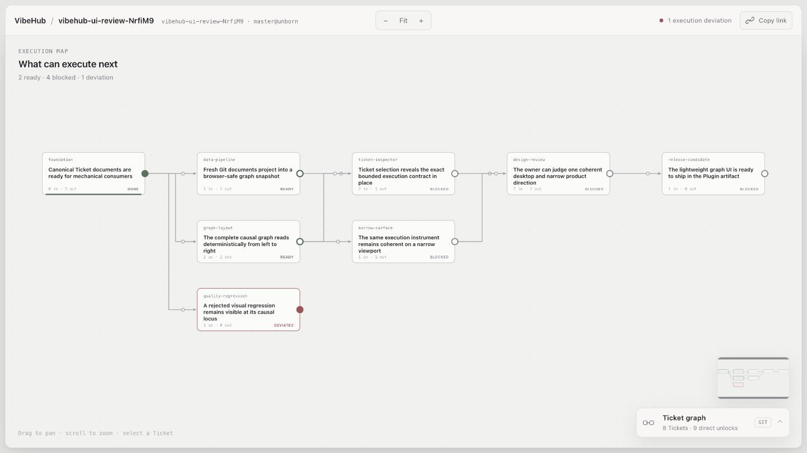
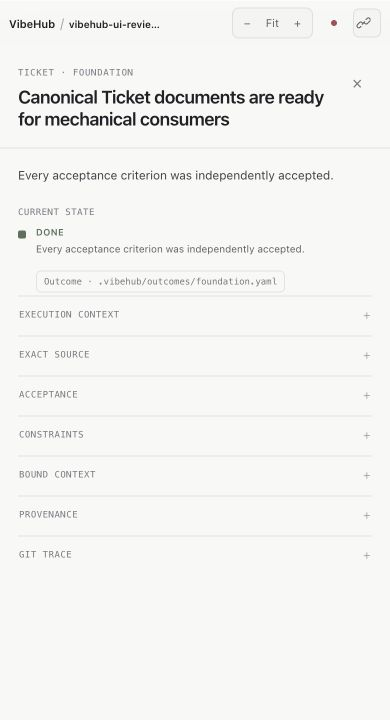

# Local graph design authority

The local graph is VibeHub's quiet execution instrument, not a generic YAML
viewer and not a small dashboard. Its first question is: **when this Ticket
finishes, what becomes executable next?**

## Retained product language

- One complete, deterministic, left-to-right direct-unlock graph is the primary
  object. Forks, joins, blockers, deviations, and proof stay at their owning
  graph locus.
- The healthy surface is quiet. Matte cool neutrals carry the base; semantic
  color is reserved for truthful execution state. Hover and selection remain
  neutral interaction states.
- Tickets are bounded execution objects. Their outcome, position, connectors,
  and readiness aperture carry the hierarchy before labels, borders, cards, or
  schema terminology.
- Inspection is progressive and in situ. Selecting a Ticket or relation keeps
  the graph visible; strict contract, Context, Evidence, Outcome, provenance,
  and Git trace remain one further disclosure away.
- Compact system typography, the 6/10/16px shape vocabulary, restrained
  elevation, visible keyboard focus, readable contrast, and reduced motion are
  part of the production contract.
- Every affordance is honest. The UI only presents facts and actions available
  from the current canonical documents and read-only loopback host.

This translates the approved `quiet intelligence`, v8 spatial-workbench, and
causal Ticket review decisions preserved in Git history at `9dee0f0`.

## Deliberately removed direction

The rejected surface used warm paper, serif display type, decorative forest
green, a persistent status legend, floating card treatment, and an always-open
schema-forward Inspector. Those choices made the graph feel like an internal
data viewer and contradicted the approved Workbench authority. They are not a
VibeHub brand direction.

## Architecture that does not return

The historical design does not authorize the historical runtime. This surface
does not restore SQLite, MCP, hooks, leases, a dispatcher, ContextBinding,
attestation, writable review operations, or hidden lifecycle state. It consumes
fresh schema-valid Context, Ticket, Evidence, and Outcome files mechanically.
Git remains the only durable truth; selection, layout, pan, and zoom are
disposable view state.

## Current review surfaces

These real-browser captures use one disposable canonical fork-and-join Ticket
fixture. The fixture itself is not product state; the two images are retained
so owner review and future design drift checks bind to exact visual evidence.

