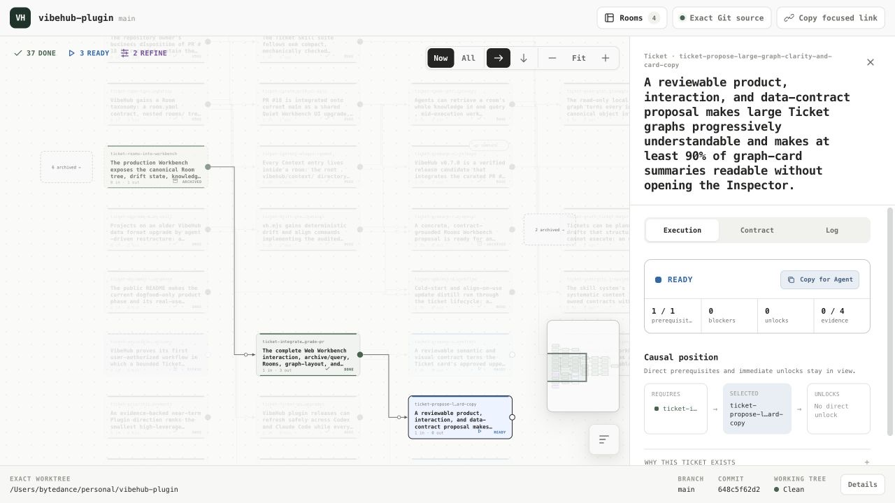
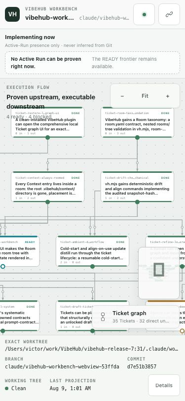

# Local graph design authority

The local graph presents tasks and their recorded dependencies. It shows what
is open, in progress, blocked, or done and which other tasks depend on each
one. The graph does not choose a development method or next action.

## Retained product language

- One deterministic dependency graph is the primary object.
  Left-to-right is the desktop default; top-to-bottom remains an explicit
  first-class choice over the same nodes, relations, and causal ranks. Forks,
  joins, blockers, and progress remain attached to their tasks.
  Dense ranks are ordered with long-edge waypoints, bounded source and target
  ports, and deterministic orthogonal lanes so routing does not cross through
  cards or achieve clarity by hiding canonical Tickets and relations.
- The default shell is canvas-first. Overview is a compact operational index
  that opens on request to answer what is open, in progress, blocked, or done,
  and which prerequisites remain unfinished. It is not a permanent
  navigation rail or a second Inspector.
- The healthy surface is quiet. Matte cool neutrals carry the base; semantic
  color is reserved for recorded task state. Hover and selection remain
  neutral interaction states.
- Tickets are task records. Their outcome, position, connectors,
  and state label carry the hierarchy before labels, borders, cards, or
  schema terminology.
- Inspection is progressive and in situ. Selecting a Ticket or relation keeps
  the graph visible; completion criteria, Context, updates, historical proof, provenance,
  and Git trace remain one further disclosure away.
- Compact system typography, the 6/10/16px shape vocabulary, restrained
  elevation, visible keyboard focus, readable contrast, and reduced motion are
  part of the production contract.
- Every affordance is honest. The UI only presents facts and actions available
  from the current canonical documents and read-only loopback host.
- Active-Run presence is never inferred. Until a trusted presence source
  exists, the default shell spends no space on an Implementing section or an
  empty presence explanation.
- A focused link is deliberately local and short-lived. Ticket selection and
  the Execution, Contract, or Log lens plus the selected graph direction travel
  in the URL while the bearer fragment remains intact, so the same live host
  can reopen that exact focus; it is not a remote share, durable permalink, or
  repository switch.
- The default graph is current work, not the repository's entire lifetime.
  OPEN, IN_PROGRESS, and BLOCKED Tickets seed that view. Only their nearest DONE
  causal boundary remains visible; deeper completed history appears as
  count-labelled one-hop expansion stubs, and `All` restores the complete
  graph. A delivered boundary also carries the explicit `ARCHIVED` label, but
  delivery metadata never decides whether unrelated DONE work occupies the
  current action surface. Scope, exact delivery, selected Room subtrees, and
  explicit history expansion live in the focused URL and use the same query
  semantics as CLI JSON.

This translates the approved `quiet intelligence`, v8 spatial-workbench, and
causal Ticket review decisions preserved in Git history at `9dee0f0`.

## Deliberately removed direction

The rejected surface used warm paper, serif display type, decorative forest
green, a persistent status legend, floating card treatment, and an always-open
schema-forward Inspector. Those choices made the graph feel like an internal
data viewer and contradicted the approved Workbench authority. They are not a
VibeHub brand direction.

## Architecture that does not return

The historical design does not authorize the historical runtime. This surface
does not restore SQLite, MCP, hooks, leases, a dispatcher, ContextBinding,
attestation, writable review operations, or hidden lifecycle state. It consumes
fresh schema-valid Context, Ticket, Evidence, and Outcome files mechanically.
Git remains the only durable truth; selection, layout, pan, and zoom are
disposable view state.

Project compatibility follows
`skills/vibehub-core/contracts/versions.json`. Format 6 stores Ticket schema 4
with explicit status and update history. Reading older formats does not migrate
the files. Writes require the declared migration first.

## Interaction depth

The surface borrows the calm, content-first interaction logic of a modern AI
workspace without copying another product's brand skin. Black, white, and gray
carry reading; VibeHub's cool wash and semantic state color appear only where
they communicate environment, execution, proof, or attention.

- The graph identifies the worktree, current tasks, dependency direction, and blockers.
- Selecting a Ticket shows its desired outcome, state, prerequisites, and dependent tasks.
- Further detail exposes completion criteria, Context, progress updates, and optional historical proof.

Different canonical objects do not collapse into one generic text list.
Tickets, dependencies, acceptance, constraints, Context, Evidence, and Outcome
each receive a presentation matching their role. The UI may request new
structured mechanical projection when the presentation needs existing canonical
facts, but it may not infer missing semantics or create a parallel state model.

## Historical visual references

These captures predate the task-memory status labels and use one disposable canonical fork-and-join Ticket
fixture. The fixture itself is not product state; the two images are retained
so owner review and future design drift checks bind to exact visual evidence.

