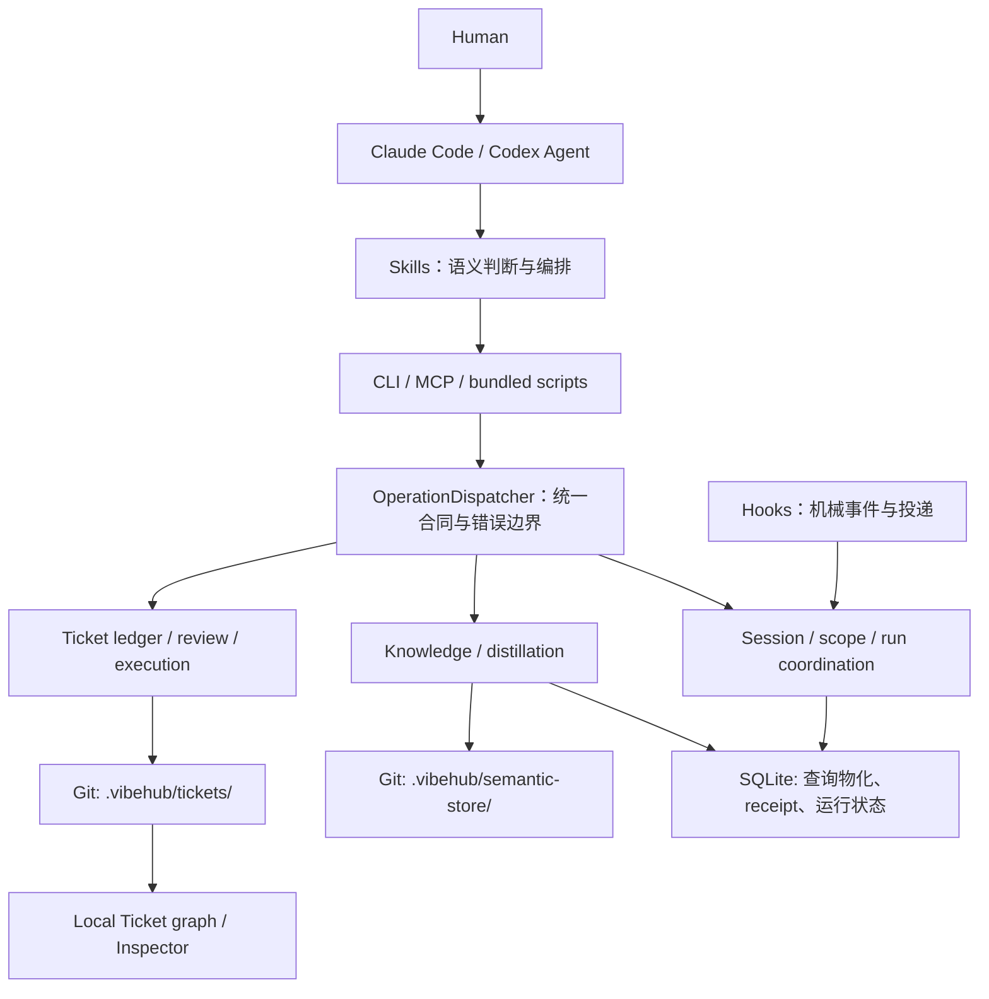
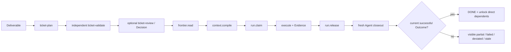
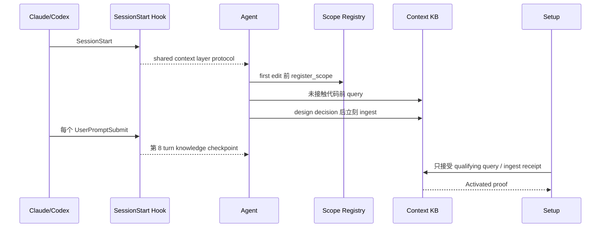

# VibeHub 0.3.0 Ticket-first Runtime 历史漂移分析

> **历史快照，不代表当前 0.8.0 运行行为或项目格式。** 本文基于 `main` 提交 `63043add51bf5d7f2596bf3c37adaab2b55ba7d0`（2026-07-31）整理；文中的“当前”和 `.vibehub/tickets/protocol.yaml` 均只描述当时的 0.3.0 代码。0.8.0 使用 `.vibehub/version.yaml` 与 `project compatibility` / `project validate`。
>
> 本文用于追溯当时的根因与迁移建议，不表示这些建议仍未实现，也不应作为当前实现入口。

## 0. 结论先行

当前判断成立：

> VibeHub 的产品入口和 Ticket 纵向能力已经 Ticket-first，但所有会话都会经过的横向运行策略仍然 Context-first。

这不是 Ticket 功能“不完整”，也不是 Git / SQLite 存储边界设计错误。真正的漂移发生在默认编排层：

- README、Ticket Skills、Git-native Ticket ledger 和 execution service 已经把 Ticket 定义为工作入口和 fresh Agent 的执行包。
- SessionStart、项目 managed instructions、8-turn knowledge checkpoint、Setup Activated 证明和 `register_scope` 仪式仍把每个会话当作一次 Context capture session。
- 两组规则都不是偶然残留：它们分别由仍为 `active` 的 canonical Specs 和测试保护，所以系统目前同时服从两套产品模型。

最准确的目标架构不是删除 Context，而是重新排主次：

| 层 | 建议定位 |
| --- | --- |
| Ticket System | 默认产品入口和开发控制面：计划、依赖、执行、Decision、Evidence、Closeout |
| Context Layer | 跨 Ticket 的项目知识基础设施：约束、语义地图、历史决策、精确检索 |
| Hooks | 机械传感和投递：连接证明、活动足迹、人工 intervention、生命周期事件 |
| Core / CLI / MCP | 确定性能力：校验、精确读取、stale 检查、有界写入和本机协调 |

建议将有效的 `.vibehub/tickets/protocol.yaml` 作为 Ticket mode 的显式标志。在 Ticket mode 中，默认会话应先进入 Ticket frontier / planning，而不是强制 query、ingest 和 scope ceremony。

## 1. 仓库和远端状态

本次检查后：

| 项目 | 状态 |
| --- | --- |
| 本地分支 | `main` |
| 本地 HEAD | `63043ad` |
| 远端 | `origin/main` |
| 同步状态 | 本地 HEAD 与 `origin/main` 完全一致 |
| 根包版本 | `0.3.0` |
| 本地既有文档修改 | 已在 pull 前临时保存并在 pull 后无冲突恢复 |

本次拉取的两个关键提交是：

- `029b0e3 feat: migrate META specs into canonical store`：把 META Specs 迁移到 `.vibehub/semantic-store/`，让 canonical state、revision、relations 和 provenance 可被统一查询。
- `63043ad docs: align setup and release guidance`：更新 Setup / release 文档，并在仓库根新增 `AGENTS.md`、`CLAUDE.md` 的 VibeHub managed block。

这两个提交没有修复本文讨论的运行行为。相反，canonical migration 让漂移变得更容易证明：Ticket-first 决策与旧 Context-first checkpoint、activation 和 SessionStart 决策现在同时可查且仍为 `active`。

## 2. 当前项目的整体架构

VibeHub 当前不是一个前端应用，也不是单一 CLI。它是由 Skills、确定性 runtime、Git-native semantic stores、本机 SQLite 和宿主 hooks 组成的本地优先插件系统。



### 2.1 Skills：智能和编排层

Skills 决定需要什么语义工作，而不是把判断硬编码进 Core：

- [`vibehub-ticket-plan`](https://github.com/VW-ai/vibehub-plugin/blob/63043add51bf5d7f2596bf3c37adaab2b55ba7d0/skills/vibehub-ticket-plan/SKILL.md) 把 deliverable 编译成可执行 Ticket 图。
- [`vibehub-ticket-validate`](https://github.com/VW-ai/vibehub-plugin/blob/63043add51bf5d7f2596bf3c37adaab2b55ba7d0/skills/vibehub-ticket-validate/SKILL.md) 在独立上下文中验证计划。
- [`vibehub-ticket-review`](https://github.com/VW-ai/vibehub-plugin/blob/63043add51bf5d7f2596bf3c37adaab2b55ba7d0/skills/vibehub-ticket-review/SKILL.md) 提供人类图形 review / Decision 表面。
- [`vibehub-ticket-run`](https://github.com/VW-ai/vibehub-plugin/blob/63043add51bf5d7f2596bf3c37adaab2b55ba7d0/skills/vibehub-ticket-run/SKILL.md) 只执行一个 READY Ticket。
- [`vibehub-ticket-closeout`](https://github.com/VW-ai/vibehub-plugin/blob/63043add51bf5d7f2596bf3c37adaab2b55ba7d0/skills/vibehub-ticket-closeout/SKILL.md) 由未参与执行的 Agent 独立判定 Outcome。
- Query、ingest、distill、update、review Skills 负责 governed project knowledge。

当前 active 架构决策 [`decision-ticket-skill-driven-boundary-001`](https://github.com/VW-ai/vibehub-plugin/blob/63043add51bf5d7f2596bf3c37adaab2b55ba7d0/META/09-ticket-runtime/specs/decision-ticket-skill-driven-boundary-001.yaml) 明确要求：Skills 拥有 scene recognition、orchestration 和 semantic judgment；Core、脚本、CLI、MCP 与 HTML 只拥有确定性机制。

### 2.2 Core：确定性合同和安全内核

三个包的边界很清晰：

| 包 | 责任 |
| --- | --- |
| `packages/core` | Ticket / knowledge / distillation / hook / setup 的真实实现和安全规则 |
| `packages/cli` | 命令行、宿主安装、本地 Ticket review host、hook adapter |
| `packages/mcp` | 7 个稳定 MCP 工具，把 Agent 请求转给 Core |

[`operation-dispatcher.ts`](https://github.com/VW-ai/vibehub-plugin/blob/63043add51bf5d7f2596bf3c37adaab2b55ba7d0/packages/core/src/operation-dispatcher.ts) 是横向入口。CLI 和 MCP 最终调用同一批 `kb.*`、`distill.*`、`ticket.*` operations，返回统一 success / error envelope。

但 Ticket operations 有一个重要特例：它们每次都重新读取当前 worktree，刻意不使用通用 SQLite operation replay receipt。这样本地 Ticket 编辑、branch switch 或 source drift 不会被旧 receipt 隐藏。

### 2.3 Durable truth 与 disposable state

当前权威边界如下：

| 信息 | 权威位置 | 原因 |
| --- | --- | --- |
| Ticket、relations | Git `.vibehub/tickets/` | 随 branch / worktree 协作和 review |
| Review、Decision、attestation | Git `.vibehub/tickets/`，authority key 在 repo 外 | 长期语义与本机可信授权分离 |
| ContextBinding、Evidence、Outcome | Git `.vibehub/tickets/` | 删除 SQLite 后仍能恢复完成语义 |
| 已切换仓库的 canonical knowledge | Git `.vibehub/semantic-store/` | 版本化、可 review、可重建 |
| Run claim、generation、heartbeat | SQLite | 活跃协调，可丢弃、可重领 |
| session、hook event、task、scope、checkpoint cadence | SQLite | 宿主活动和本机协作事实 |
| KB operation receipts / provenance | SQLite 与 Git semantic mutation 机制配合 | 幂等、审计和 activation 取证 |
| 本机 Decision 私钥 / trust registry | `~/.vibehub/trust/` | 不允许 Git 或 SQLite 自行伪造人类 authority |

因此，“Context Layer 退到基础设施”不等于“Context 数据都留在 SQLite”。项目知识也可以是 Git-native；这里的“基础设施”指产品角色，不是固定存储介质。

### 2.4 Hooks：机械传感和投递层

[`hook-ingest.ts`](https://github.com/VW-ai/vibehub-plugin/blob/63043add51bf5d7f2596bf3c37adaab2b55ba7d0/packages/core/src/hook-ingest.ts) 的机械能力本身仍然合理：

- `SessionStart` 建立 exact checkout 的 host handshake。
- `UserPromptSubmit` 记录用户活动和投递 pending intervention。
- `PostToolUse` 记录实际文件 footprint。
- Claude 的 `Stop`、`Notification` 等事件补充状态和人工消息投递。
- Hooks 不调用 LLM，不在后台启动 daemon，也不应该决定 Ticket READY / DONE。

问题不在“要不要 hooks”，而在 hooks 目前额外承载了一套 Context-first 语义协议。

## 3. Ticket-first 的正确执行模型

Ticket Runtime 当前已经实现下面这条完整链路：



### 3.1 Ticket 是 executable context package

[`vibehub-ticket-run`](https://github.com/VW-ai/vibehub-plugin/blob/63043add51bf5d7f2596bf3c37adaab2b55ba7d0/skills/vibehub-ticket-run/SKILL.md) 明确写着：

> Ticket is the executable context package; conversation history is optional context, never hidden authority.

[`ticket-execution-service.ts`](https://github.com/VW-ai/vibehub-plugin/blob/63043add51bf5d7f2596bf3c37adaab2b55ba7d0/packages/core/src/ticket-execution-service.ts) 编译的 packet 包含：

- exact Ticket revision 和完整 Ticket document；
- exact repository、worktree、branch、commit、graph digest；
- 已成功的直接依赖 Outcomes；
- 当前有效且可验证的 Decisions；
- Ticket `context_refs` 指向的有界仓库文件内容和 digest。

它不会自动把整个 SQLite knowledge base 注入执行。Planning Skill 只有在需要跨 Ticket 的项目知识、历史决策或约束时才调用 `$vibehub-query`。

### 3.2 `context_refs` 是读取上下文，不是写权限

Ticket schema 中：

- `context` 描述 fresh Agent 需要知道的事实和边界；
- `constraints` 保存 binding limits；
- `context_refs` 只描述“需要读取什么，以及为什么”；
- Decision 的 `delegated_boundaries` 才是被验证的语义授权边界之一。

[`ticket-context-compiler.ts`](https://github.com/VW-ai/vibehub-plugin/blob/63043add51bf5d7f2596bf3c37adaab2b55ba7d0/packages/core/src/ticket-context-compiler.ts) 对 `context_refs` 做的是安全读取、大小限制、digest 和 stale 检查。它没有把这些路径转换为 write scope。

所以不能为了保留旧 `register_scope` 行为，就自动把 `context_refs` 当作 Agent 可以写入的目录。这会把最小读取集误解成写权限，扩大而不是收紧执行边界。

## 4. 当前默认运行时实际做了什么

即使仓库已经有有效 Ticket protocol，一个新会话当前仍会走下面的默认路径：



具体有五个入口：

1. [`hook-ingest.ts`](https://github.com/VW-ai/vibehub-plugin/blob/63043add51bf5d7f2596bf3c37adaab2b55ba7d0/packages/core/src/hook-ingest.ts) 的 `SESSION_PROTOCOL` 把仓库称为 shared context layer，并要求 `register_scope → query → ingest`。
2. [`knowledge-checkpoint.ts`](https://github.com/VW-ai/vibehub-plugin/blob/63043add51bf5d7f2596bf3c37adaab2b55ba7d0/packages/core/src/knowledge-checkpoint.ts) 每 8 个有效 user turns 注入一次 knowledge review 提醒；只有同 task 的 canonical KB write 才会重置。
3. [`project-activation.ts`](https://github.com/VW-ai/vibehub-plugin/blob/63043add51bf5d7f2596bf3c37adaab2b55ba7d0/packages/core/src/project-activation.ts) 写入 AGENTS / CLAUDE 的默认 managed block，要求 non-trivial work 前 query、出现 durable knowledge 后 persist。
4. 同一文件的 `Activated` 只接受非空 KB query 或成功 `kb.spec.apply` 等 context-value receipt。
5. [`register_scope`](https://github.com/VW-ai/vibehub-plugin/blob/63043add51bf5d7f2596bf3c37adaab2b55ba7d0/packages/mcp/src/capabilities.ts) 要求非空 write patterns；PostToolUse 在第一次越界编辑后提示重新声明。

仓库根刚从远端新增的 [`AGENTS.md`](https://github.com/VW-ai/vibehub-plugin/blob/63043add51bf5d7f2596bf3c37adaab2b55ba7d0/AGENTS.md) 和 [`CLAUDE.md`](https://github.com/VW-ai/vibehub-plugin/blob/63043add51bf5d7f2596bf3c37adaab2b55ba7d0/CLAUDE.md) 正是第 3 项的当前输出，所以这不是只存在于旧安装里的问题。

## 5. 漂移矩阵

| Surface | Ticket-first 权威 | 当前默认行为 | 后果 |
| --- | --- | --- | --- |
| SessionStart | 进入 plan / frontier / READY Ticket；Context 按需 | 宣布 shared context layer，强制 scope、query、ingest | Agent 的第一心智模型仍是知识采集 |
| Execution context | 编译后的 ContextBinding 是执行权威 | 会话协议强调先查 KB；对 Ticket binding 不做引导 | 正确执行入口需要用户显式记住 Skill |
| Checkpoint | planning / closeout 才判断跨 Ticket 知识 | 每 8 turn 在任意工作中提醒 ingest | 长执行被周期性打断，鼓励“为了沉淀而沉淀” |
| Protected choice | Ticket Decision + authority receipt | 通用 session 文案要求普通 ingest | Decision 容易被误写成 context record |
| Activated | 用户已从 Ticket 或 Context 获得真实价值 | 只能由 KB query / ingest receipt 证明 | Ticket-only 用户永远无法完成 onboarding 证明 |
| Scope | Ticket outcome、constraints、Decision、binding 是语义边界 | 每 session 强制声明文件 write globs | 出现重复边界；`context_refs` 还有被误当写域的风险 |
| Hooks | 记录机械事实、投递人工 intervention | 同时拥有周期性知识工作流策略 | 传感层开始主导语义工作流 |
| Project instructions | Ticket mode 提示 Ticket loop，Context 条件调用 | 永久写入 Context-first managed block v1 | 即使 hook 文案改了，项目指令仍会把行为拉回去 |

## 6. 为什么会出现这个问题

### 6.1 时间顺序：先有 Workbench，再有 Ticket pivot

Git 历史非常直接：

| 日期 | 关键提交 | 建立的模型 |
| --- | --- | --- |
| 2026-07-12 | `128baa1` | SessionStart Context micro-protocol、scope 和 query / ingest 义务 |
| 2026-07-18 | `0c4f8fc` | Installed → Connected → Activated；Activated = context value |
| 2026-07-18 | `2121afa` | task-scoped periodic knowledge checkpoint |
| 2026-07-29 | Ticket M1 / M2 系列 | Git-native Ticket read、write、planning、validation |
| 2026-07-30 | `5da323c` | ContextBinding、Run、Evidence、independent closeout 完整落地 |
| 2026-07-30 | `71dcf6c` | README 改为 Ticket System 产品入口 |

也就是说，Ticket Runtime 是在一个已经能运行的 Context-first Plugin 上纵向新增的。Ticket 的核心链路被完整替换了，但所有会话都会经过的横向 onboarding / hook policy 没有进入同一个 cutover scope。

### 6.2 Pivot 的“删除旧路径”主要针对旧 Ticket Runtime

Git-native pivot 明确删除了早期 SQLite Ticket semantic ledgers、旧 proposal / receipt lifecycle 和 dual-write 兼容路径。这次 breaking replacement 在 Ticket 子系统内部执行得很彻底。

但旧的 SessionStart、Task activity、scope registry、knowledge checkpoint 和 context activation 属于 Workbench / Context 子系统，不属于被删除的“旧 Ticket DB runtime”。因此它们技术上没有成为 dead code，测试也仍然通过。

### 6.3 缺少一个显式的 repository operating mode

当前代码能读取 `.vibehub/tickets/protocol.yaml`，但 hook 和 setup 没有共享的模式分类器：

- SessionStart 不检查 Ticket protocol；
- checkpoint 不检查 Ticket protocol；
- managed instructions 没有 Ticket / Context 变体；
- Activated 不知道用户是在使用哪个产品面。

结果不是“判断错了”，而是根本没有做这个判断；全局默认只能继续沿用旧模型。

### 6.4 Canonical governance 中两套 active 规则同时存在

当前 canonical store 中，下面两组 Specs 同时 active：

Ticket-first：

- `decision-ticket-work-unit-001`：Ticket 是唯一 canonical durable work unit；旧 Task API 不构成迁移义务。
- `decision-ticket-git-native-ledger-001`：Git 是 Ticket semantic authority，SQLite 只做 disposable coordination。
- `decision-ticket-skill-driven-boundary-001`：Skills 编排；hooks / adapters 不拥有语义 workflow。
- `decision-ticket-intelligence-loop-001`：query / context 是 scene-specific 能力；hooks 可以提示 scene，但不拥有 orchestration。

Context-first：

- `decision-workbench-007`：SessionStart 指示 retrieve、settle durable context、task / scope 义务。
- `intent-workbench-003` 与 `change-2026-07-18-knowledge-checkpoint`：所有 task 的周期性知识提醒。
- `decision-workbench-015`：Activated 必须由 query / ingest 价值证明。

这些旧 Specs 没有被 Ticket mode 决策 supersede，也没有明确限定为“无 Ticket protocol 的 Context-only repository”。因此代码维护者如果只按当前 active rules 工作，保留旧行为反而是合规的。

### 6.5 测试在保护旧产品行为

现有测试不只验证实现细节，还把旧文案和行为当作合同：

- `hook-ingest.test.ts` 断言 SessionStart 包含 `use the vibehub-query skill`。
- 同一测试文件完整覆盖 checkpoint cadence、重复 prompt、KB write reset 和 intervention 优先级。
- `project-activation.test.ts` 断言 doctor、status、空 query 和失败都不能 Activated，只有 qualifying KB result 可以。
- `skill-package.test.ts` 断言 Codex 包含 checkpoint reminders，且 Activated 仍需 query / ingest。

因此只改 README 不会改变运行时；必须同时修改 policy、Specs 和测试预期。

## 7. Activated 的隐藏结构问题

这是本次分析中最容易被低估的技术点。

### 7.1 为什么不能只把 `ticket.*` 加入白名单

[`project-activation.ts`](https://github.com/VW-ai/vibehub-plugin/blob/63043add51bf5d7f2596bf3c37adaab2b55ba7d0/packages/core/src/project-activation.ts) 从 SQLite `operation_request_receipts` 中读取成功 operation，再用 per-operation validator 判断是否产生了 context value。

但 [`operation-dispatcher.ts`](https://github.com/VW-ai/vibehub-plugin/blob/63043add51bf5d7f2596bf3c37adaab2b55ba7d0/packages/core/src/operation-dispatcher.ts) 明确把全部 Git-native Ticket operations 定义为 receiptless：

- Ticket read 必须每次观察当前 worktree，不能 replay 旧响应；
- Ticket write 由 exact source / digest / stale check 保证安全，不能让 SQLite receipt 遮蔽 Git 变化；
- `ticket.run.claim` 返回一次性 lease token，不能通过通用 receipt 恢复或 replay。

所以即使把 `ticket.frontier.read`、`ticket.context.compile` 等名字加入 `qualifyingOperations`，数据库中也没有对应 row 可供 activation 查询。

### 7.2 建议：把“价值证明”与“请求 replay receipt”拆开

建议新增一个纯 operational 的 activation value evidence 通道，记录“某 exact checkout 在 host handshake 后成功使用了一个有价值能力”，而不是保存或 replay Ticket 结果。

最小记录可包含：

- repo ID 和 worktree identity；
- operation name；
- observed time；
- 非敏感 subject reference，例如 Ticket ID、graph digest 或 binding ID；
- value class，例如 `ticket_graph_read`、`ticket_graph_changed`、`ticket_context_compiled`、`ticket_run_started`、`ticket_closeout_recorded`；
- outcome digest 或 bounded evidence reference；
- task / session attribution（如果宿主能提供）。

它必须满足：

- 不缓存 Ticket operation response；
- 不参与 request replay；
- 不保存 lease token；
- 不成为 Ticket READY / DONE authority；
- 删除后只丢 onboarding proof，不改变 Ticket 语义；
- 只有 operation 已成功并通过 value validator 后才写入。

这样既能证明 Activated，也不会破坏 `decision-ticket-git-native-ledger-001` 的 Git authority。

### 7.3 哪些 Ticket 操作可算真实价值

建议候选如下，最终仍需产品 ratification：

| Operation | 最小 qualifying 条件 |
| --- | --- |
| `ticket.frontier.read` | 返回非空 Ticket frontier；空 protocol 不算价值 |
| `ticket.graph.snapshot` | 返回至少一个 Ticket，并完成真实图读取 |
| `ticket.worktree.patch` | `status=applied` 且有非空 changed paths |
| `ticket.review.append` | Git Review 文档成功写入并 readback |
| `ticket.decision.record` | 有可信 authority 的 Decision 成功写入并验证 |
| `ticket.context.compile` | 生成 current ContextBinding 和 packet digest |
| `ticket.run.claim` | exact current binding 被成功 claim；不得记录 token |
| `ticket.evidence.append` | Evidence 成功持久化并绑定 acceptance |
| `ticket.closeout.append` | independent Outcome 成功持久化并 readback |

Heartbeat 和 release 只是协调维护，单独不建议证明首次 Activated。

## 8. 建议的 Ticket-first 默认运行行为

### 8.1 先增加 fail-closed mode resolver

建议 Core 提供一个很小的 read-only resolver：

| 仓库状态 | 模式 |
| --- | --- |
| 有效 `.vibehub/tickets/protocol.yaml` | `ticket` |
| marker 不存在 | `context` |
| marker 存在但无效、不可读、是 symlink 或 source 不稳定 | `blocked`，不得静默回退 |

Hook、Setup、managed instruction renderer 和 activation validator 必须共享同一个结果，避免四处复制检测逻辑。

### 8.2 Ticket mode 的 SessionStart

建议 SessionStart 只说明最小协议：

```text
[VibeHub] This repository uses the Ticket System as its default work surface.
- For a new deliverable, use vibehub-ticket-plan.
- For existing work, read the current frontier and execute only a READY Ticket.
- Treat the compiled ContextBinding as execution authority.
- Use vibehub-query or vibehub-ingest only when cross-Ticket project knowledge is missing or genuinely emerges.
- Hooks record mechanical activity and deliver human interventions; they do not decide READY or DONE.
```

Context-only mode可以继续使用经过收敛的 query / ingest 提示，保证旧仓库不被突然切断。

### 8.3 Ticket mode 取消周期性 8-turn knowledge checkpoint

建议不是简单把 cadence 从 8 调大，而是由 mode policy 禁用：

- Ticket planning 阶段主动补足跨 Ticket 约束、provenance 和 context refs；
- Closeout 只能提出可复用 semantic knowledge 建议，不应顺手激活或修改 KB；
- 真正的 protected choice 写入 Ticket Decision，不写普通 context record；
- 日常执行中如果确实缺少跨 Ticket 知识，Agent 按需 query；如果产生新的 durable knowledge，再显式 ingest。

Context-only mode 可暂时保留 checkpoint，直到其产品价值被单独重新评估。

### 8.4 `register_scope` 降为可选协调能力

建议保留：

- PostToolUse 的真实 footprint capture；
- 用户或团队需要时的显式 write scope；
- 第一次越界的温和提醒。

建议取消：

- 每个 Ticket session 在第一次编辑前必须 `register_scope`；
- 从 `context_refs` 自动生成 write scope；
- scope 是否存在影响 Ticket claim、READY、DONE 或 ContextBinding validity。

Ticket 的 outcome、constraints、受验证 Decisions 和 compiled binding 已经是主要语义边界；scope registry 只应补充本机团队协调，不应成为第二套执行授权系统。

### 8.5 Setup 和 managed instructions 改为 mode-aware

Ticket mode 的 Setup 完成 Connected 后，默认 Next 应是：

```text
Use $vibehub-ticket-plan to turn one deliverable into an executable Ticket graph.
```

而不是要求制造一次 query / ingest 来完成 Activated。

实现时还必须把 `PROJECT_INSTRUCTION_VERSION` 从 `1` 升级。只改默认 body 而不 bump version，会导致已有 `AGENTS.md` / `CLAUDE.md` managed block 被判断为 current，旧 Context-first 文案不会自动升级。

## 9. 推荐迁移顺序

### Phase 0：先解决 canonical rule conflict

在改代码前，建议新增一个明确的 Ticket default-runtime decision，并处理旧 Specs：

- 把 `decision-workbench-007` 限定为 Context-only mode，或由新 mode-aware SessionStart decision supersede。
- 把 `intent-workbench-003` / knowledge checkpoint 限定为 Context-only mode。
- 修订 `decision-workbench-015`：Activated = post-handshake meaningful Ticket 或 Context value。
- 明确 `register_scope` 是 optional coordination，不是 Ticket execution prerequisite。
- 明确 hooks 不拥有 Ticket semantic orchestration。

否则代码改完后，canonical query 仍会返回互相冲突的 active obligations。

### Phase 1：统一 mode detection

- 新增一个安全、只读、fail-closed 的 repository mode resolver。
- Hook、Setup、project instructions 和 activation 共用它。
- 为 valid / missing / malformed / symlink / wrong-worktree 建测试。

### Phase 2：改默认提示和 checkpoint policy

- SessionStart 按 mode 输出不同 micro-protocol。
- Ticket mode 不创建或推进 knowledge cadence。
- Context mode 保持旧行为，防止 breaking change 扩散到无 Ticket 仓库。
- 更新 Claude / Codex hook adapter tests 和 packaged skill tests。

### Phase 3：泛化 Activated evidence

- 新增与 replay receipt 分离的 operational value evidence。
- 为每个 qualifying Ticket operation 写严格 validator。
- 保留 “空结果、失败、synthetic event、doctor green 都不算 Activated” 的诚实性原则。
- 明确删除 evidence DB 不影响 Ticket semantic truth。

### Phase 4：升级 Setup 指令和用户入口

- bump managed instruction version；
- Ticket mode 写入 Ticket-first body；
- Setup skill 选择 ticket-plan 或 context / distill 的下一步；
- 更新 onboarding contract、Codex 和 Claude host references；
- README、package description 和 manual 统一产品语言。

### Phase 5：收敛 scope 与 closeout knowledge handoff

- 从 SessionStart 强制义务中删除 `register_scope`；
- 保留 explicit scope capability 与 footprint telemetry；
- closeout 只输出 semantic knowledge proposals，由独立 ingest / review 决定是否进入 canonical Context。

## 10. 必须保护的系统不变量

迁移不能牺牲当前已经正确的安全边界：

1. Ticket durable semantics 仍然只来自 Git，不能重新 dual-write 到 SQLite。
2. Ticket operation 仍然每次重读 worktree；不能为了 Activated 恢复通用 response replay。
3. lease token 不得进入 operation receipt、activation evidence 或日志。
4. Hooks 继续 fail-open，不能阻断宿主开发会话。
5. Invalid Ticket protocol 必须显式 blocked，不能静默当成 Context-only。
6. `context_refs` 继续是有界读取清单，不是 write permission。
7. Executor 只能写 Evidence；独立 Agent 才能写 Outcome。
8. 只有 current authorized successful Outcome 推导 `DONE` 和下游 READY。
9. Setup 仍需区分 Installed、Connected、Activated，不能用文件存在或 doctor green 冒充更高证明。
10. 用户自有 `AGENTS.md` / `CLAUDE.md` 内容必须保留，只升级 VibeHub managed block。

## 11. 建议测试矩阵

| 维度 | 必测场景 |
| --- | --- |
| Mode | valid Ticket protocol、无 marker、malformed、symlink、wrong worktree |
| SessionStart | Ticket-first 文案、Context-only 文案、pending intervention 合并、pause 优先 |
| Checkpoint | Ticket mode 不计数；Context mode cadence、dedupe、KB reset 保持 |
| Activated | 非空 frontier、graph patch、context compile、run、evidence、closeout 的正例和空 / 失败反例 |
| Receipt isolation | Ticket operations 继续不写 / 不 replay `operation_request_receipts` |
| Scope | 没有 register_scope 也能运行 Ticket；显式 scope 仍能记录 off-scope footprint |
| Context refs | 编译读取和 stale 检查正常；永远不自动成为 write scope |
| Setup upgrade | managed block v1 → Ticket-aware 新版本；用户文本不变；重复 apply quiet |
| Host parity | Claude / Codex 使用同一 mode policy；只保留各自可观测事件差异 |
| Recovery | 删除 SQLite 后 Ticket 图、Evidence、Outcome、DONE 仍可由 Git 重建 |

## 12. 重要 canonical Specs 与 META 阅读顺序

### 12.1 先以 canonical query 为准

从 `029b0e3` 开始，Specs 已迁入 `.vibehub/semantic-store/`。判断当前 state、revision、lineage 和 relations 时，应优先使用 `$vibehub-query` 或 `kb.spec.get / kb.lineage`，不要只根据旧 META 文件路径或文件名猜 currentness。

这次问题最重要的 canonical IDs 是：

| 优先级 | Spec | 为什么重要 |
| --- | --- | --- |
| P0 | `decision-ticket-work-unit-001` | Ticket 是唯一 canonical durable work unit；直接挑战旧 Task-first 心智模型 |
| P0 | `decision-ticket-git-native-ledger-001` | 决定 Git / SQLite 权威边界和禁止 dual-write |
| P0 | `decision-ticket-skill-driven-boundary-001` | 决定 Skills 编排、Core / hooks 只做确定性机制 |
| P0 | `decision-ticket-intelligence-loop-001` | 定义 plan / query / validate / run / closeout 的 scene-driven 组合方式 |
| P0 | `contract-ticket-context-binding-001` | 定义 fresh Agent 真正执行的 exact bounded packet |
| P0 | `contract-ticket-closeout-001` | 定义 Evidence、独立 Outcome、DONE 和 direct unlock |
| P0 | `decision-workbench-007` | 当前 SessionStart Context-first 行为的 active 依据 |
| P0 | `intent-workbench-003` | 当前 periodic knowledge checkpoint 的 active 产品意图 |
| P0 | `change-2026-07-18-knowledge-checkpoint` | checkpoint 代码和 cadence 的 active implementation contract |
| P0 | `decision-workbench-015` | 当前 Activated 只能由 query / ingest 证明的依据 |
| 历史 | `decision-ticket-runtime-boundary-001` | 已 superseded；理解从 Core workflow writer 到 Skill-driven Git protocol 的 pivot |
| 历史 | `decision-ticket-mvp-002` | 已 superseded；其 MR / dogfood 边界被后续 decision 取代，不应当作当前 release gate |

### 12.2 META 文件的人工阅读顺序

如果要从人类可读文档理解背景，建议按下面顺序：

1. [`META/00-project-room/spec.md`](https://github.com/VW-ai/vibehub-plugin/blob/63043add51bf5d7f2596bf3c37adaab2b55ba7d0/META/00-project-room/spec.md)：项目级产品和架构总览。
2. [`META/09-ticket-runtime/spec.md`](https://github.com/VW-ai/vibehub-plugin/blob/63043add51bf5d7f2596bf3c37adaab2b55ba7d0/META/09-ticket-runtime/spec.md)：Ticket Runtime 当前主线和 decision index。
3. [`2026-07-29-ticket-git-native-skill-driven-pivot-plan.md`](https://github.com/VW-ai/vibehub-plugin/blob/63043add51bf5d7f2596bf3c37adaab2b55ba7d0/META/09-ticket-runtime/artifacts/2026-07-29-ticket-git-native-skill-driven-pivot-plan.md)：为什么从旧 Ticket Runtime 切到 Git documents + Skills。
4. [`2026-07-30-ticket-m4-execution-closeout.md`](https://github.com/VW-ai/vibehub-plugin/blob/63043add51bf5d7f2596bf3c37adaab2b55ba7d0/META/09-ticket-runtime/artifacts/2026-07-30-ticket-m4-execution-closeout.md)：ContextBinding、Run、Evidence、Outcome 的实现与验证证据。
5. [`META/03-01-context-cru/spec.md`](https://github.com/VW-ai/vibehub-plugin/blob/63043add51bf5d7f2596bf3c37adaab2b55ba7d0/META/03-01-context-cru/spec.md)：knowledge checkpoint 和 Context capture 的原始产品动机。
6. [`META/04-project-activation/spec.md`](https://github.com/VW-ai/vibehub-plugin/blob/63043add51bf5d7f2596bf3c37adaab2b55ba7d0/META/04-project-activation/spec.md)：Installed / Connected / Activated 的设计来源。
7. [`change-2026-07-18-knowledge-checkpoint.yaml`](https://github.com/VW-ai/vibehub-plugin/blob/63043add51bf5d7f2596bf3c37adaab2b55ba7d0/META/03-01-context-cru/specs/change-2026-07-18-knowledge-checkpoint.yaml)：旧 checkpoint 的精确约束。
8. [`change-2026-07-18-repo-activation.yaml`](https://github.com/VW-ai/vibehub-plugin/blob/63043add51bf5d7f2596bf3c37adaab2b55ba7d0/META/04-project-activation/specs/change-2026-07-18-repo-activation.yaml)：旧 Activated 证明的精确约束。

关于完整代码地图、包结构、安全边界和更多 META 优先级，可继续看 [`CODEBASE_GUIDE.zh-CN.md`](./CODEBASE_GUIDE.zh-CN.md)。

## 13. 用户现在应该如何使用 VibeHub

在运行行为迁移完成前，正确使用方式仍然需要显式告诉 Agent 进入 Ticket loop：

```text
Use $vibehub-setup for this repository.

Use $vibehub-ticket-plan to turn this deliverable into an executable Ticket graph.
Use $vibehub-ticket-review to inspect the graph when human review is useful.
Use $vibehub-ticket-run to execute the next READY Ticket.
```

执行结束后交给一个没有参与执行的 fresh Agent：

```text
Use $vibehub-ticket-closeout to independently adjudicate this Ticket Run.
```

执行中出现新工作、protected choice 或 deviation 时：

```text
记录 Evidence → release Run → independent closeout → ticket-plan 修改图
```

`$vibehub-query` 和 `$vibehub-ingest` 仍然有价值，但它们应当服务于缺失的跨 Ticket 项目知识，而不是成为每次开发对话的默认主角。

## 14. 最终判断

当前项目已经具备一个实质上的 Ticket-first vertical slice：产品入口、Git ledger、Review、Decision、ContextBinding、Run、Evidence、independent Closeout 和图形 Inspector 都存在，而且关键安全边界相互一致。

尚未完成的是 horizontal runtime cutover：SessionStart、checkpoint、Setup instructions、Activated proof 和 scope ceremony 仍代表 7 月中旬的 Context-first Workbench 产品。因为旧 Specs 和测试仍然 active，这个问题不会通过清理文案自然消失。

最稳妥的修复顺序是：

> 先 ratify mode-aware runtime policy，再建立共享 mode resolver，随后同步切换 SessionStart、checkpoint、Activated evidence 和 managed instructions；最后把 scope 降为可选协调能力。

Context Layer 应继续存在，但它的正确位置是 Ticket System 下面的项目知识基础设施，而不是每次会话和每段开发工作的默认控制面。
