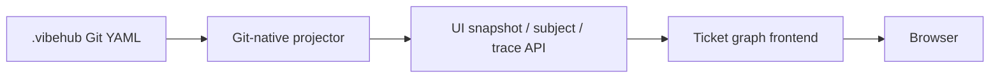
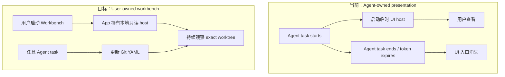
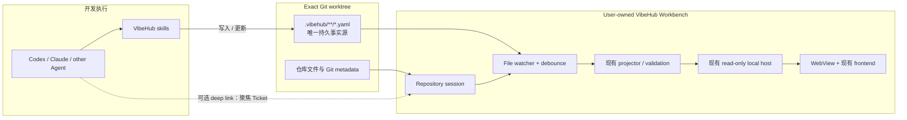

# VibeHub Workbench / WebView 设计说明

> 状态：产品与架构提案，不代表当前运行时已经实现  
> 基线：`origin/main` 的 VibeHub 0.4.0 代码与 Git-native Ticket UI 约束  
> Demo：[打开 Quiet Workbench + Inbox 单文件交互原型](./demos/vibehub-workbench-webview.html)

## 1. 结论

VibeHub 已经有 Ticket 图形界面，不需要重新做一套 Ticket UI。现在真正的问题是：**这套 UI 的生命周期属于 Agent task，而不是用户。**

当前 `vibehub-ticket-review` 会由 Agent 启动一个临时本地服务，生成短期 bearer URL，再打开浏览器。服务只允许在当前 Agent task 内复用，默认 30 分钟后关闭，也禁止跨 task 发现。因此用户每次想看 Ticket，都要再次要求 Agent 打开 UI。

建议新增一个可选的 **VibeHub Workbench**：

- 它是用户自己启动并长期停留的桌面 WebView / companion app；
- 它复用现有 Ticket 投影器、只读 HTTP host 和前端 assets；
- 它直接观察当前 worktree 的 `.vibehub/**/*.yaml`；
- Git YAML 仍然是唯一持久事实源；
- Agent 可以通过 deep link 帮用户定位某个 Ticket，但 Workbench 不依赖 Agent 存活；
- 产品视觉固定使用 **A · Quiet Workbench**，不再把风格选择器放进日常工作流；
- 顶层新增跨仓库 **Inbox**，只聚合需要用户 Review、Decision 或 intervention 的事项；
- MVP 保持只读，不在 UI 内修改 Ticket。

一句话定义：

> Agent 负责改变项目，Workbench 负责持续观察项目，Git YAML 负责保存事实。

## 2. 用户问题

用户需要的不是又一个一次性网页，而是一个稳定的项目工作台：

1. 打开 VibeHub Workbench；
2. 选择一次仓库或 worktree；
3. 开发过程中一直看到哪个 Ticket 正在被实现、由哪个 Agent / Run 执行，并能在多个进行中 Ticket 之间切换；
4. 同时有多个开发 Run 时，在一个 Inbox 中立即看到哪些结果等待 Review、哪些问题等待 Decision；
5. Agent 更新 `.vibehub` 后，界面自动刷新；
6. 切换 Codex task、关闭某段 Agent 对话，界面仍然存在；
7. 下次打开 Workbench，可以回到最近使用的仓库和视图。

现在的体验之所以麻烦，是因为入口、服务和授权都跟着 Agent task 结束，而不是因为图形界面能力不足。

## 3. 当前系统

### 3.1 已有能力

VibeHub 0.4 已有一条完整的只读 UI 链路：



它已经具备：

- 从 Ticket、Context、Evidence、Outcome YAML 直接生成 UI snapshot；
- READY、BLOCKED、DONE、DEVIATED 等 Git-native 状态投影；
- 图、因果路径、minimap、Ticket inspector；
- Execution、Contract、Log 三组详情；
- 每次读取前做 schema / 内容校验；
- 只允许 `GET` / `HEAD`，不提供写接口；
- loopback host、bearer token、CSP 和无 CORS；
- 刷新后看到新建或变更的 Ticket；
- UI 使用前后 Git YAML 不发生变化。

这意味着“Ticket UI 怎么画、数据怎么投影”基本不是新问题。

### 3.2 当前生命周期

现有 `vibehub-ticket-review` 的资源策略是：

| 项目 | 当前行为 |
|---|---|
| 所有者 | 当前 Agent task |
| 启动方式 | Agent 执行 `vh-ui.mjs` |
| 地址 | 临时 loopback 端口 + bearer URL |
| token 生命周期 | 默认 30 分钟 |
| task 内复用 | 允许 |
| 跨 task 发现 | 明确禁止 |
| 持久 daemon / registry | 明确禁止 |
| 数据修改 | 不允许，只读 |

这一设计对于“Agent 临时向用户展示一次图”是正确的，但不适合“用户每天把它当工作台使用”。

## 4. 为什么会出现这个问题

根因是两种产品表面的所有权不同：



当前生命周期限制不是 bug；它是为了防止插件偷偷创建长期 daemon、PID 文件、跨 task registry 或第二份隐藏状态。问题在于，我们随后把这个安全的临时展示机制当成了长期产品入口。

因此，修复方式不应是放宽 Agent task 的资源策略，也不应让插件偷偷常驻。应该新增一个**明确由用户启动、由用户拥有生命周期的 Workbench**。

## 5. 目标架构



### 5.1 三个明确角色

| 角色 | 职责 | 不负责 |
|---|---|---|
| Agent + skills | 计划、执行、记录 Evidence、Closeout、更新 Git YAML | 持有长期 UI 生命周期 |
| Workbench | 选择 worktree、持续观察、投影、浏览、定位 | 成为事实源、偷偷修改 Ticket |
| Git YAML | 保存 Ticket、Context、Evidence、Outcome 和历史 | 保存窗口位置、缩放等界面偏好 |

### 5.2 为什么不是“在插件里直接加一个长期 daemon”

那会重新引入当前架构刻意删除的问题：

- 隐藏的进程发现和清理；
- PID / port registry；
- 跨 Agent 生命周期的权限与身份；
- UI cache 与 Git 状态漂移；
- 用户不知道谁启动了服务、谁应该关闭它；
- 插件升级后旧 daemon 的兼容性。

Workbench 由用户显式打开和退出，资源所有权清楚，也不需要把 daemon 塞回插件语义运行时。

## 6. 推荐产品形态

### 6.1 推荐：独立桌面 WebView shell

Workbench 是一个很薄的桌面壳：

- 原生窗口负责选择目录、保存最近仓库、管理窗口生命周期；
- App 内部启动现有只读 host，或通过窄 native bridge 调用 projector；
- WebView 加载现有 Ticket frontend；
- 用户退出 App 时，内部 host 一起结束；
- App 运行期间 token 有效，token 不写入磁盘。

这比普通浏览器标签更像工具，也比重做一个原生图形界面成本低。

### 6.2 备选方案比较

| 方案 | 优点 | 问题 | 建议 |
|---|---|---|---|
| 长期浏览器 + 手工命令 | 实现最快 | 仍要管理命令、URL、token 和进程 | 可作过渡，不是最终体验 |
| 独立桌面 WebView | 用户拥有生命周期，能复用现有前端 | 需要很薄的桌面壳和发布流程 | **推荐 MVP** |
| Codex 内嵌 WebView | 看起来最紧密 | 当前本地插件能力检查未发现稳定公开的第三方 panel/WebView contribution point；也会绑定单一 Agent 宿主 | 延后，等待公开宿主能力 |
| 重写原生 UI | 原生体验完整 | 重复实现图布局、inspector 和交互，长期两套 UI | 不建议 |

桌面技术可以后定。macOS dogfood 可先用 `WKWebView`；需要跨平台时再评估 Tauri。更重要的是先稳定 host 与 WebView 之间的窄接口，不让桌面框架进入 Ticket 语义层。

## 7. MVP 用户流程

### 首次使用

1. 用户打开 VibeHub Workbench。
2. 点击“选择仓库”，选择一个 exact Git worktree。
3. Workbench 检查 `.vibehub/tickets/protocol.yaml` 和 YAML 有效性。
4. 加载 Ticket 图，并显示路径、worktree、branch、commit、dirty 状态。
5. 开始监听 `.vibehub/**/*.yaml`。

### 日常开发

1. Workbench 保持打开。
2. 用户让 Agent 修复问题或运行某个 Ticket。
3. Agent / skill 更新 Git YAML。
4. watcher 合并连续文件事件，重新校验并投影 snapshot。
5. UI 保留用户视角，更新节点状态、frontier 和非持久化的 Active Run overlay。
6. 如果 Agent 提供 deep link，Workbench 聚焦指定 Ticket 和 inspector tab。

### 再次打开

1. Workbench 显示最近仓库；
2. 用户选择后重新解析该 worktree；
3. 最近 Ticket、tab、pan / zoom 可以恢复；
4. 所有 Ticket 状态仍重新从 Git YAML 计算，不从 App 缓存恢复。

## 8. 数据与接口边界

### 8.1 读取模型

MVP 继续复用现有 API 语义：

| 接口 | 用途 |
|---|---|
| `/api/state` | 当前 repo 的完整 UI snapshot、frontier 和计数 |
| `/api/subject` | 选中 Ticket / Context 的详情 |
| `/api/trace` | 依赖、Evidence、Outcome 和因果链 |

当前 v0.4 Git-native projector 只能从 Ticket 依赖和 Outcome 推导 READY、BLOCKED、DONE 等状态，**不能仅靠 Git YAML 证明“Agent 此刻正在实现这个 Ticket”**。IMPLEMENTING 必须是一个单独的实时协调投影，不能伪装成 Ticket 的持久状态。

建议由用户启动的 Workbench 在内存中接收一个窄的 `ImplementationPresence`：

```ts
interface ImplementationPresence {
  repositoryRoot: string;
  worktreeRoot: string;
  ticketId: string;
  runId: string;
  agentLabel: string;
  state: "implementing";
  startedAt: string;
  lastHeartbeatAt: string;
}
```

来源可以是受信任宿主的 Agent task/run 事件，或后续独立设计的本地 IPC adapter。无论来源是什么，都必须满足：

- Workbench 关闭后该 presence 自动消失；
- 不写入 Ticket YAML，不进入 Git，不跨 App session 恢复；
- 不根据 dirty files、光标位置或普通聊天内容猜测；
- heartbeat 超时后显示为 stale / disconnected，而不是继续声称正在实现；
- presence 只影响“正在实现”显示和切换，不改变 READY / BLOCKED / DONE，不解锁下游；
- 没有受信任实时来源时，界面诚实显示“当前无法证明正在实现的 Ticket”。

Workbench 额外需要一个非语义性的 repository session：

```ts
interface RepositorySession {
  repoRoot: string;       // exact worktree absolute path
  branch: string | null;
  commit: string;
  dirty: boolean;
  selectedTicket?: string;
  selectedTab?: "execution" | "contract" | "log";
  viewport?: { x: number; y: number; zoom: number };
}
```

`branch`、`commit`、`dirty` 每次从 Git 读取；`selectedTicket`、tab 和 viewport 只是界面偏好。

### 8.2 允许持久化的 App 状态

| 数据 | 可持久化 | 是否权威 |
|---|---:|---:|
| 最近打开的仓库路径 | 是 | 否 |
| 窗口大小和位置 | 是 | 否 |
| 最近选中的 Ticket / tab | 是 | 否 |
| graph pan / zoom | 是 | 否 |
| bearer token | **否** | 否 |
| Ticket 状态、frontier、Outcome | **否** | Git YAML 才权威 |
| 投影后的完整 snapshot | MVP 不需要 | 否 |

### 8.3 文件监听

建议监听：

```text
.vibehub/**/*.yaml
.git/HEAD
.git/index
```

处理规则：

- 100–250ms debounce，合并一次 Agent 操作产生的多个事件；
- 先完整校验，再替换 UI snapshot；
- 校验失败时保留上一个有效视图，并显示明确错误；
- 不因临时半写入状态把所有节点清空；
- 不把 watcher 事件本身写回 Git；
- repo path 必须是用户明确选择或 deep link 明确携带的 exact worktree。

## 9. Deep link 合约

推荐 URI：

```text
vibehub://open?repo=<absolute-path>&ticket=<ticket-id>&view=execution
```

允许的 `view`：

- `execution`
- `contract`
- `log`

行为：

1. Workbench 已运行：聚焦窗口，验证 repo，再选择 Ticket；
2. Workbench 未运行：启动 App，要求用户确认首次出现的 repo；
3. repo 与当前 session 不同：明确提示切换，不静默换项目；
4. Ticket 不存在：仍打开仓库，并显示“该 Ticket 在当前 worktree 中不存在”；
5. URI 只负责导航，不能携带 Ticket 写操作。

Agent 调用 deep link 是增强能力，不是 Workbench 能否工作的前提。

## 10. 安全与事实源

MVP 保留当前 UI 的安全约束：

- 只监听 `127.0.0.1`；
- 仅接受 `GET` 和 `HEAD`；
- 每个 App session 生成随机 bearer token；
- token 只存在内存，不写入最近项目配置；
- WebView 使用限制性 CSP；
- 不启用 CORS；
- 每次重投影都验证 Git-native 文档；
- 不提供通用文件读取 API；
- 不执行 YAML 内的脚本、URL 或命令；
- 不允许 UI 修改 Ticket、Decision、Evidence 或 Outcome；
- App 关闭时清理内部 host 和 watcher。

特别重要：**WebView 本身不应该获得任意本地文件权限。** 目录选择、Git metadata 和 `.vibehub` 读取必须经过窄的 native / Node bridge，并限制在用户选择的 worktree。

## 11. 界面规范

当前 governed constraint 要求 Workbench 延续 Quiet Intelligence 方向：

- 图是主表面，不是指标卡 dashboard；
- 自上到下表达“上游完成后，下游什么会变为可执行”，顶部是已完成基础，中央是正在实现，底部是 READY / BLOCKED 下游；
- 画布上方固定显示 `Implementing now` 切换条，列出所有有新鲜 heartbeat 的 Active Runs；
- 左侧同时提供紧凑的进行中列表，两个入口选择同一个 Ticket，并同步更新图定位和 Inspector；
- 选择节点时图仍然可见，详情渐进披露；
- 使用系统字体、冷中性色、紧凑空间和克制阴影；
- 颜色只表达语义：IMPLEMENTING、DONE、READY、BLOCKED、DEVIATED；
- 选中状态用中性 outline，不新增一种“状态色”；
- 顶部固定显示 exact repo / worktree / branch / commit / dirty；
- 明确显示 watcher 是否正在观察、上次同步时间、校验错误；
- 支持键盘焦点、足够对比度和 reduced motion；
- 不变成聊天窗口、原始 YAML 编辑器或装饰性卡片墙。

> 方向变更说明：当前 `constraint-ui-quiet-intelligence-standard` 仍规定左到右因果流。本提案和 Demo 根据本轮用户反馈改为自上到下。正式实现前应 amend / supersede 对应 governed constraint；本文档本身不声称该 canonical Context 已被更新。

建议布局：

```text
┌──────────────────────────────────────────────────────────────────────┐
│ Repository / Worktree       [ Tickets ] [ Inbox 3 ]  Watching · Sync │
├──────────────┬─────────────────────────────┬─────────────────────────┤
│ Recent repos │                             │ Ticket inspector        │
│ Implementing │  Implementing now switcher  │ Execution / Contract /  │
│ Ready        │  Top-to-bottom causal graph │ Log                     │
├──────────────┴─────────────────────────────┴─────────────────────────┤
│ Source dock: exact path · Git state · validation · latest activity  │
└──────────────────────────────────────────────────────────────────────┘

Inbox:
┌──────────────┬─────────────────────────────┬─────────────────────────┐
│ Needs you    │ Review / Decision queue     │ Why · Context · Evidence│
│ Review       │ across recent repositories  │ Open exact Ticket       │
│ Decision     │                             │ Copy review prompt      │
└──────────────┴─────────────────────────────┴─────────────────────────┘
```

### 11.1 最终视觉方向：A · Quiet Workbench

用户已选择 A 作为产品方向。正式 Workbench 不再显示 A / B / C 风格选择器，也不把视觉偏好写入项目或 `localStorage`。B、C 只保留为设计探索历史，不属于日常产品表面。

A 的约束继续是：

- 系统字体、冷中性色、克制阴影和紧凑空间工具；
- 图、Inbox 事项和状态是视觉主角，装饰不能争夺注意力；
- `IMPLEMENTING`、`READY`、`DONE`、`BLOCKED`、`DEVIATED` 不能只靠颜色表达；
- 当前选择与业务状态分离，使用 outline、背景层级和结构表达；
- 不加载网络字体或第三方资源，单文件 `file://` 可直接运行；
- 375px 窄屏保持至少 44px 的关键点击区域；
- reduced motion、键盘焦点和只读事实边界不变。

### 11.2 Inbox 的信息架构

Inbox 是跨 recent repositories 的 **attention queue**，不是聊天通知流，也不是另一份 Ticket 状态数据库。它只回答一个问题：**多个 Agent 同时开发时，现在什么真的需要我处理？**

默认 `Needs you` 只包含：

| 类型 | 进入条件 | 默认动作 | 不允许做的事 |
|---|---|---|---|
| Review requested | Agent 明确请求人类检查阶段结果、契约或高风险边界 | 打开 exact Ticket / 复制 review prompt | 不能把“已读”当作批准或 closeout |
| Decision required | Agent 面临多个有效选项，缺少人类产品或架构选择 | 展示 bounded context 与选项，等待人类 Decision | 不能由 UI 或 Agent 静默代选 |
| Blocked intervention | 阻塞确实需要凭证、权限或外部协调 | 定位阻塞 Ticket 与所需动作 | 普通依赖等待不能制造红点 |

普通 heartbeat、百分比变化、Git watcher 刷新、READY frontier 变化和完成通知可以出现在 `All activity`，但不计入顶部红点。顶部 badge 表示“未读且需要用户行动”的数量，不是总消息数。

每个 Inbox item 必须携带：

1. exact repository / worktree 身份；
2. Ticket ID 与可选 Run ID；
3. 类型、请求者与时间；
4. 为什么需要人类；
5. Agent 已准备的有界 context 与 evidence 摘要；
6. 打开 exact Ticket 的 deep link；
7. `seen` 仅为本地 App UI 状态，不写入 Ticket，也不证明 review / decision / closeout。

Inbox 可以聚合 Git-native projection、active Run presence、review request、Decision request 和 lifecycle event，但必须保留来源标签。它不自行推导 READY / DONE，也不允许 unread badge 成为第二事实源。

### 11.3 IMPLEMENTING 的交互规则

1. `IMPLEMENTING` 是 Active Run overlay，不是 Ticket YAML status。
2. 同时存在多个 Active Runs 时，按 `lastHeartbeatAt` 新鲜度排列；不能擅自挑一个叫“当前唯一工作”。
3. 点击切换条或左侧进行中列表后：
   - 选中对应 Ticket；
   - 纵向图滚动到节点；
   - Inspector 显示 Run ID、Agent label、heartbeat、scope 和 progress；
   - 不改变其他 Active Run，也不释放或 claim Run。
4. 当前选中的 Active Ticket 使用中性 selection outline；所有正在实现节点都保留 IMPLEMENTING 蓝色语义。
5. heartbeat 过期时从 `IMPLEMENTING` 降为 `stale presence`，但 Ticket 的 Git-native READY / BLOCKED / DONE 状态保持不变。
6. “Copy for Agent” 对 Active Ticket 应要求聚焦已有 Run 并禁止重复 claim；对 READY Ticket 才生成新的 `ticket-run` 指令。

## 12. 模块拆分

建议不要复制现有 UI 代码，而是把生命周期适配层单独加在外面：

```text
packages/ui-projector/        # 现有 Git YAML -> snapshot 逻辑（复用/抽取）
skills/scripts/vh-ui.mjs      # 保留：Agent task 临时展示与自动化测试
apps/workbench/
  desktop/                    # 窗口、目录选择、deep link、session 生命周期
  repository-session/        # exact worktree、Git metadata、watcher、debounce
  webview-bridge/             # 启停只读 host，内存 token，窄消息接口
  frontend/                   # 复用现有 assets；只加 repo/session chrome
```

如果暂时不重构 package，也可以先让桌面壳直接调用已导出的 `startVibeHubUi()`。但应避免把实现长期依赖在 `skills/` 的相对路径上；稳定后再抽成内部 package。

## 13. 实施顺序

### Phase 0：浏览器过渡版

- 增加用户可手动运行的 `vibehub ui --repo <path>` 或同等窄 launcher；
- 生命周期由前台命令拥有，而不是 Agent task；
- 保持只读和 exact worktree；
- 作为桌面壳之前的 dogfood。

### Phase 1：macOS Workbench MVP

- 原生目录选择和最近仓库；
- WKWebView 加载现有 frontend；
- App session 内启动只读 host；
- watcher + debounce + 自动刷新；
- repo / branch / commit / dirty source dock；
- deep link 聚焦 Ticket；
- 签名、打包和升级路径。

### Phase 2：体验完善

- 多仓库最近列表；
- repo validation 错误恢复；
- 快捷键和 Command Palette；
- 更好的大型图性能；
- 可选跨平台壳。

### Phase 3：评估有限写能力

只有在产品明确授予写权限后才讨论，例如“批准 closeout”或“请求 replanning”。写能力必须有独立 authority、receipt、冲突处理和 Git diff 预览，不能顺手塞进只读 inspector。

## 14. 验收标准

### 生命周期

- 用户无需创建或继续某个 Agent task 就能打开 Workbench；
- 关闭 Codex task 不会关闭 Workbench；
- Workbench 退出后不留下 host、watcher 或 token；
- 下次启动能列出最近仓库，但所有 Ticket 状态重新从 Git 加载。

### 正确性

- UI 状态与现有 projector 的 snapshot 完全一致；
- Git-native Ticket 状态与 IMPLEMENTING overlay 分层展示，Active Run 不能覆盖或改写 Ticket 状态；
- 两个以上 Active Runs 可以从顶部切换条和左侧列表无歧义切换；
- 切换 Active Ticket 后，纵向图定位、Inspector、Run ID、Agent 和 heartbeat 同步更新；
- stale heartbeat 不再显示为正在实现，也不影响下游解锁；
- 只显示用户选中的 exact worktree；
- branch 切换、commit 变化、dirty 状态会更新；
- Agent 写入有效 YAML 后，界面无需手工重开即可刷新；
- 写入无效 YAML 时显示错误，并保留最后一个有效 snapshot；
- 大量连续文件事件只触发一次稳定刷新。

### 安全

- host 仅绑定 loopback；
- 没有写路由；
- token 不落盘；
- deep link 不能修改项目；
- WebView 无法读取用户未选择目录中的文件；
- 自动化测试证明 UI 使用前后 Git YAML byte-for-byte 不变。

### 体验

- 打开最近仓库到看到图不需要 Agent 参与；
- 节点点击、inspector tab、pan / zoom 可键盘操作；
- 1280px、1024px 和窄屏窗口无不可达控件；
- reduced motion 下没有强制动画；
- source dock 始终能回答“我现在看的是哪个 worktree”。

## 15. 非目标

MVP 不做：

- 跨分支聚合 Ticket；
- 云端同步或多人 presence；
- SQLite / MCP / daemon registry 恢复；
- Ticket 编辑器；
- Agent chat；
- 自动决定 READY / DONE；
- 用 IMPLEMENTING presence 解锁依赖或证明 Ticket 完成；
- 取代 Git history；
- 后台扫描所有本地仓库；
- 把 UI snapshot 变成第二事实源。

## 16. 风险与处理

| 风险 | 处理 |
|---|---|
| 用户误以为 UI 是实时 Agent 状态 | 明确标注“来自 Git YAML”，显示最后同步时间和 dirty 状态 |
| watcher 读到半完成写入 | debounce；校验成功后原子替换 snapshot；保留最后有效视图 |
| 打错 worktree | 路径、branch、commit 固定展示；deep link 切换前确认 |
| 桌面壳和浏览器 UI 分叉 | 共享 projector、API 和 frontend assets，只增加 lifecycle adapter |
| token 生命周期过长 | token 绑定 App session、只在内存、host 仅 loopback |
| 以后加入写操作破坏事实边界 | 写能力单独立项、独立 authority 与 receipt，不扩展现有 GET API |
| 大图刷新卡顿 | 先测量；必要时加一次性内存渲染 cache，但绝不持久化为真相 |

## 17. 与“小问题不应自动建 Ticket”的关系

Workbench 解决的是**查看入口和生命周期**，不是 Ticket 创建策略。它不应该因为自己常驻就鼓励所有工作 Ticket 化。

正确边界仍然是：

- 小而直接、无需跨会话协调的修改：直接开发，不创建 Ticket；
- 有依赖、风险、多人 / 多 Agent 交接、需要独立 closeout 的 deliverable：使用 Ticket；
- Workbench 只显示已经存在于 Git 中的 Ticket，不主动生成 Ticket；
- “打开 Workbench”与“创建 Ticket”必须是两件完全独立的事。

## 18. 重要 META 文档与代码

以下内容最值得实现者先读，按优先级排列：

1. `.vibehub/context/decision-local-graph-ui-first-class.yaml`  
   UI 的一等产品地位、Git 是唯一事实源、禁止恢复旧 runtime 的总决策。
2. `.vibehub/context/constraint-ui-quiet-intelligence-standard.yaml`  
   Ticket 图的信息架构、视觉语言、交互和无障碍标准。
3. `.vibehub/context/decision-speed-first-skill-plugin.yaml`  
   为什么语义判断属于 skills，为什么不能重建 Core / SQLite / daemon 等重型运行时。
4. `skills/vibehub-ticket-review/SKILL.md`  
   当前 UI 的用户流程与 task-owned 生命周期。
5. `skills/vibehub-ticket-review/references/ticket-lifecycle.json`  
   `current-agent-task`、禁止跨 task discovery 等直接导致当前体验的机械策略。
6. `skills/scripts/vh-ui.mjs`  
   loopback host、30 分钟 token、只读 API、每次请求重新投影和浏览器启动逻辑。
7. `test/ui-host.test.mjs`  
   现有 UI 的安全、只读、刷新、投影与 Git 不变性契约，Workbench 必须继续通过。
8. `docs/LOCAL_GRAPH_DESIGN.md`  
   当前本地因果图产品设计和 UI 结构。
9. `.vibehub/context/decision-dogfood-only-phase.yaml`  
   为什么应该只根据真实 dogfood gap 做聚焦重建，而不是追求旧系统功能平移。

## 19. 最终建议

先不要改 `vibehub-ticket-review` 的临时展示语义，也不要让插件跨 task 偷偷托管服务。保留它作为 Agent presentation、测试和 fallback。

新增一个边界清楚的 VibeHub Workbench：用户显式启动，App 拥有本地 host 和 watcher，复用现有 projector 与 frontend，只保存界面偏好，持续从 exact worktree 的 Git YAML 读取事实。这样既解决“每次都要让 AI 打开 UI”的摩擦，也不会破坏 VibeHub 0.4 最重要的 Git-native、无第二真相和轻运行时原则。
