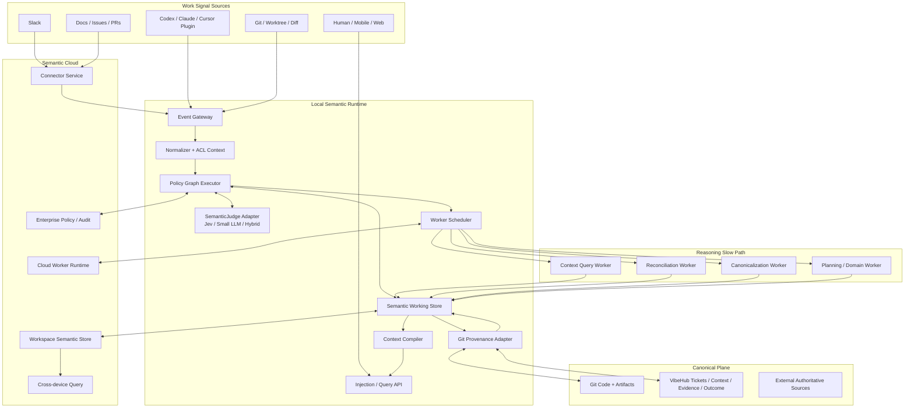
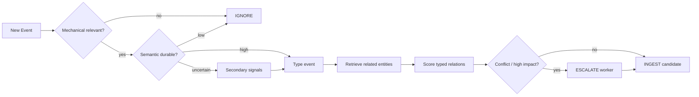
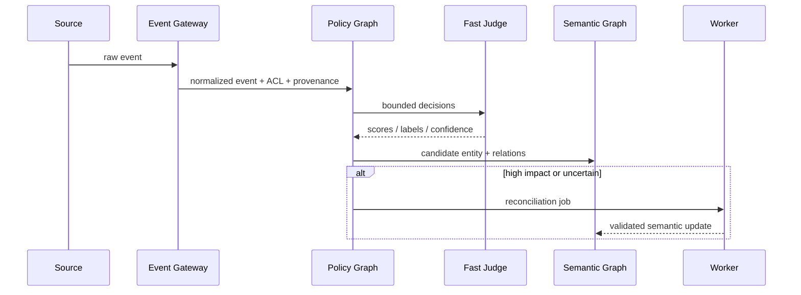
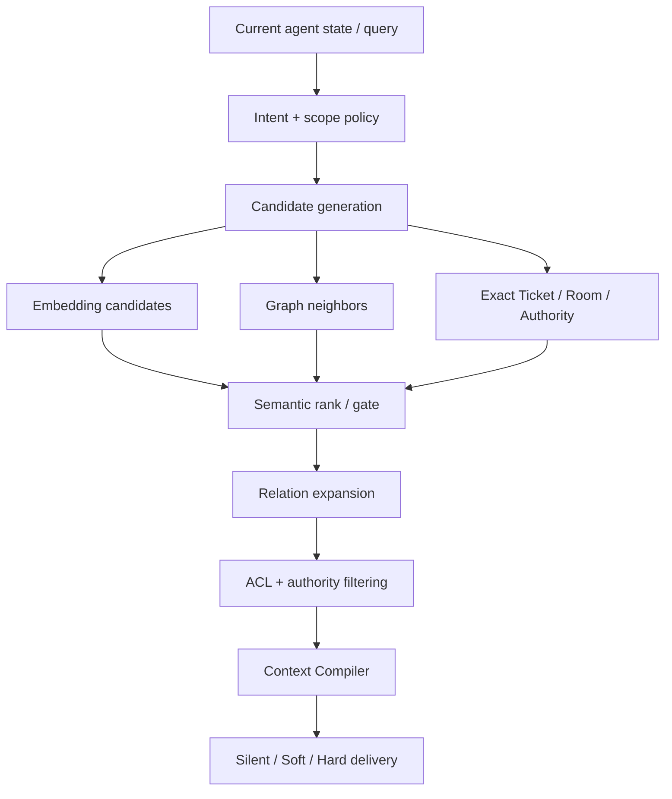
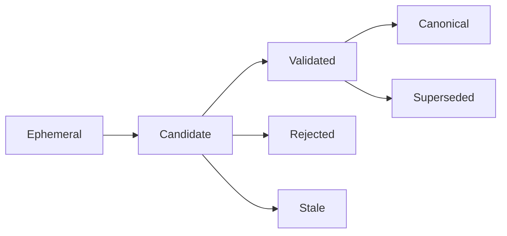

# Tech Design — VibeHub Semantic Runtime & Policy Graph

**Status:** Proposed / Architecture Draft
**Date:** 2026-09-19
**Audience:** Product engineering · Agent infrastructure · Applied AI · Security / Enterprise
**Primary goal:** Define the macro architecture for persistent semantic perception without turning VibeHub into a second Git or a second agent UI.

---

# 1. Design Summary

本设计提出一个新的 VibeHub 核心：**Semantic Runtime**。

它持续消费来自 coding-agent host、Git、Slack、Docs、Issues 等来源的事件，通过一个可组合的 **Policy Graph** 执行低延迟 semantic decisions，维护一个带 provenance 和 confidence 的 **Semantic Working Graph**，并按当前 Agent / task / phase 编译出最有价值的 Context。

核心系统原则：

1. **Git remains the development truth substrate.**
2. **Plugin becomes sensor + actuator, not product boundary.**
3. **Derived semantic state lives outside Git by default.**
4. **Fast semantic models have attention authority, not truth authority.**
5. **Score frequently, mutate rarely.**
6. **Most events terminate in L0/L1; only ambiguous/high-impact cases wake L2 workers.**
7. **Context is compiled from semantic state, not dumped from storage.**
8. **Runtime failure must degrade to normal agent work, not block it.**

Initial semantic-judge candidate: Jev. Architecture必须通过 `SemanticJudge` interface 与具体 provider 解耦。

---

# 2. Current-State Boundary and Proposed Pivot

当前 VibeHub plugin 的 architecture boundary 明确是：Skills + local YAML records；无 required database、daemon、hook cadence、background capture、hidden state；Git 负责 shared history / concurrency / rollback / review；semantic judgment 由 Skills 中的 Agent 完成。

这个边界在当前产品下是合理的，因为 Runtime 如果只是为了保存 Ticket / Context，会复制 Git。

本设计的 pivot 建立在新的 workload 上：

> **持续的 semantic perception、policy execution、cross-source association、retrieval、worker scheduling 与 context injection。**

这些职责不是 Git 的职责。因此引入 runtime 不再是为了“换一个地方存 YAML”，而是为了实现 Git 无法提供的 active semantic computation。

---

# 3. Goals

## G1. Continuous semantic perception

系统能够对 meaningful work events 低延迟地产生 semantic signals。

## G2. Reusable semantic state

同一次理解结果可以被 Context retrieval、planning、Evidence mapping、compaction、routing、worker escalation 等多个 subsystem 复用。

## G3. Safe eventual canonicalization

Fast path 可以概率化，但 canonical truth 必须经过明确 promotion boundary。

## G4. Cross-source world model

Agent session、Git、Slack、Docs 等进入同一 semantic namespace，但保留 source ACL 和 provenance。

## G5. Low-friction agent integration

用户不需要改变主 chat / coding UI，也不需要持续主动触发“记忆”和“查 Context”。

## G6. Cache-friendly context management

Runtime 可以高频更新 semantic state，但尽量低频改变 worker prompt structure。

## G7. Enterprise-grade control

支持 tenant isolation、policy versioning、audit、retention、model routing、local/cloud boundaries。

---

# 4. Non-goals

本设计不要求：

- 替代 Git；
- 自建 frontier model；
- 自建新的 coding chat UI；
- 强制所有项目使用 Ticket lifecycle；
- 把完整 conversation 永久保存；
- 使用 dedicated graph database；
- 所有 semantic events 立即 canonicalize；
- 每个 event 都 spawn Worker；
- MVP 即支持所有 external connectors；
- 一开始就实现全自动 multi-agent orchestration。

---

# 5. Macro Architecture



---

# 6. Logical Planes

系统明确分成三个 plane。

## 6.1 Raw Event Plane

原始输入：

- session event；
- user message pointer；
- tool call/result；
- file read/write；
- Git diff / commit；
- Slack message；
- Doc / Issue update；
- human decision。

Raw event 可以按 retention policy 删除，但必须在允许范围内保留足够 provenance。

## 6.2 Semantic Plane

Runtime-owned derived state：

- SemanticCandidate；
- semantic entity；
- candidate relation；
- relevance / salience；
- semantic type；
- task phase；
- confidence；
- unresolved conflict；
- policy decision；
- retrieval index；
- worker job state。

默认不进 Git。

## 6.3 Canonical Plane

具有 truth authority 的 state：

- code / artifact；
- Git commit / diff；
- canonical project contract；
- approved Decision / Constraint；
- authoritative Context；
- accepted Evidence / Outcome；
- external source-of-truth objects。

MVP 可以继续将现有 `.vibehub` Git-native records 作为 canonical plane；后续再评估 cloud-owned / hybrid identity。

---

# 7. Runtime Process Model

推荐支持三种 deployment mode，但保持相同核心 library：

## 7.1 Embedded Mode

Runtime 作为 host/plugin 进程内 library。

适合：

- MVP；
- offline replay；
- 简单 local-only integration。

缺点：host 生命周期结束后状态管理困难。

## 7.2 Local Sidecar / Daemon Mode

一个 user-scoped local process：

- 持有 Semantic Working Store；
- 接受多个 repo / host adapter；
- 管理 worker；
- 提供 local authenticated API；
- 可选 cloud sync。

这是长期推荐形态。

## 7.3 Cloud Runtime

用于：

- Slack / Docs connector；
- cross-device persistence；
- enterprise shared graph；
- managed workers；
- admin policies。

Local coding hot path 不应硬依赖 cloud availability。

---

# 8. Component Design

## 8.1 Event Gateway

统一接收所有 source event。

职责：

- authenticate source；
- assign event ID；
- attach tenant/project/session/worktree identity；
- deduplicate；
- attach ACL metadata；
- enqueue to Policy Graph。

### Event envelope

```json
{
  "event_id": "evt_01J...",
  "tenant_id": "org_123",
  "project_id": "proj_auth",
  "source": {
    "type": "agent_tool_result",
    "provider": "codex",
    "session_id": "sess_88",
    "worktree_id": "wt_a1"
  },
  "timestamp": "2026-09-19T02:00:00-07:00",
  "payload_ref": "local://events/evt_01J...",
  "provenance": {
    "repo": "VW-ai/example",
    "commit": "abc123",
    "path": null
  },
  "acl": {
    "visibility": "project",
    "sensitivity": "normal"
  }
}
```

Payload 可以存 pointer，而不是强制复制 full source。

---

## 8.2 Normalizer

把各 source 转成统一 event taxonomy。

初始 taxonomy：

```text
USER_INTENT
AGENT_MESSAGE
TOOL_CALL
TOOL_RESULT
FILE_READ
FILE_WRITE
GIT_DIFF
GIT_COMMIT
TICKET_STATE
EVIDENCE_CREATED
OUTCOME_CREATED
SLACK_MESSAGE
DOC_CHANGED
ISSUE_CHANGED
HUMAN_DECISION
SYSTEM_CHECKPOINT
```

Normalizer 不做 semantic truth 判断，只做机械标准化。

---

## 8.3 SemanticJudge Interface

```ts
interface SemanticJudge {
  evaluate<T extends DecisionSchema>(input: {
    stateRefs: SemanticRef[];
    eventRef?: EventRef;
    question: DecisionSchema<T>;
    budget?: DecisionBudget;
  }): Promise<DecisionResult<T>>;
}
```

### DecisionResult

```ts
interface DecisionResult<T> {
  value: T;
  confidence: number;
  latencyMs: number;
  provider: string;
  model: string;
  policyNodeId: string;
}
```

实现可以包括：

- `JevJudge`
- `SmallLLMJudge`
- `EmbeddingJudge`
- `HeuristicJudge`
- `HybridJudge`

Policy Graph 不允许依赖某个 provider-specific API contract。

---

# 9. Policy Graph

## 9.1 为什么不是一条 prompt

复杂 semantic behavior 需要：

- decomposition；
- independent signals；
- bounded failure domains；
- observability；
- replay；
- selective escalation。

因此使用 graph，而不是一个“万能 semantic prompt”。

## 9.2 Node Types

### DeterministicNode

路径、repo、schema、exact ID、ACL 等机械判断。

### JudgeNode

调用 SemanticJudge 做 bounded semantic decision。

### RetrieveNode

从 Semantic Store / Git / source 获取候选。

### AggregateNode

组合多个独立 signal。

### GuardNode

高影响 action 的安全边界。

### ActionNode

输出：IGNORE / INGEST / INJECT / DEFER / ESCALATE。

### WorkerNode

提交 L2 job。

## 9.3 Policy graph example — Ingress



## 9.4 Proposed policy representation

```yaml
policy_id: ingest-agent-observation-v1
entry: mechanical_scope
nodes:
  mechanical_scope:
    type: deterministic
    op: project_scope_match
    next:
      true: durability
      false: ignore

  durability:
    type: judge
    decision: durable_cross_task_value
    next:
      high: classify
      uncertain: corroborate
      low: ignore

  corroborate:
    type: aggregate
    inputs:
      - recoverability
      - state_change
      - future_utility
    next: classify

  classify:
    type: judge
    decision: semantic_type
    next: relate

  relate:
    type: retrieve_and_rank
    candidates:
      - ticket
      - acceptance
      - context
      - authority
      - room
    next: impact_guard

  impact_guard:
    type: guard
    if: conflict || high_consequence
    next:
      true: reconcile_worker
      false: ingest

  reconcile_worker:
    type: worker
    worker: semantic-reconciliation
    next: ingest

  ingest:
    type: action
    action: INGEST

  ignore:
    type: action
    action: IGNORE
```

Policy version 必须进入所有 decision audit records。

---

# 10. Semantic Working Graph

## 10.1 Entity model

```json
{
  "entity_id": "sem_123",
  "tenant_id": "org_123",
  "project_id": "proj_auth",
  "type": "constraint_candidate",
  "title": "Refresh-token schema remains unchanged",
  "state": "candidate",
  "confidence": 0.93,
  "source_refs": ["evt_slack_188"],
  "created_at": "...",
  "updated_at": "...",
  "canonical_ref": null
}
```

## 10.2 Relation model

```json
{
  "relation_id": "rel_77",
  "from": "sem_123",
  "type": "governs_or_constrains",
  "to": "ticket_AUTH_42",
  "confidence": 0.96,
  "source_refs": ["evt_slack_188"],
  "policy_version": "relate-v3"
}
```

## 10.3 Relation vocabulary

不要一开始无限扩展 ontology。

MVP 建议：

```text
RELEVANT_TO
BELONGS_TO
SUPPORTS
CONTRADICTS
SUPERSEDES
DERIVED_FROM
EVIDENCE_FOR
GOVERNS
BLOCKS
DEPENDS_ON
SAME_AS_CANDIDATE
```

## 10.4 State transitions

```text
EPHEMERAL
    ↓
CANDIDATE
    ↓
VALIDATED
    ↓
CANONICAL
```

可能的旁路：

```text
CANDIDATE → REJECTED
CANDIDATE → STALE
VALIDATED → SUPERSEDED
```

---

# 11. Ingress Pipeline



### Important behavior

- Fast path 不要求 immediate canonical write；
- raw payload 可 pointer-based；
- policy 可以只给 metadata；
- multiple related entities are allowed；
- source ACL 必须沿所有 derived edges 传播。

---

# 12. Egress / Retrieval Pipeline

Retrieval 目标不是“top-k 最像文本”，而是找到 **当前 consumer 应该知道什么**。



## 12.1 Candidate generation

候选来源：

- exact IDs；
- project / room / ticket scope；
- graph traversal；
- embedding similarity；
- recency；
- active lifecycle state。

## 12.2 Semantic ranking

Fast judge 判断：

- task relevance；
- consequence；
- novelty；
- canonical authority；
- redundancy；
- source freshness。

## 12.3 Injection modes

### Silent

只存在 query API / retrieval cache 中。

### Soft

只注入 pointer / short notice：

```text
Relevant project context available: AUTH-17, DEC-82.
```

### Hard

直接 materialize 内容，仅用于高 relevance × 高 consequence。

---

# 13. Context Compiler

Context Compiler 接收：

```text
Consumer state
+ semantic neighborhood
+ token budget
+ authority constraints
+ provenance requirements
+ host capabilities
```

输出：

```text
Agent-specific context package
```

## 13.1 Context package logical layers

建议固定顺序：

```text
1. Stable governing context
2. Current task contract / acceptance
3. Active decisions / constraints
4. Current working state
5. Relevant evidence / observations
6. Unresolved questions / conflicts
7. Source pointers
```

## 13.2 Compiler rules

- canonical > validated > candidate；
- governing authority 优先于 related prior art；
- unresolved conflict 不应被压成单一事实；
- deduplicate semantically equivalent items；
- source pointer 保留；
- token budget 是 hard constraint；
- output 应为 consumer-readable，而非 database dump。

---

# 14. Worker Slow Path

## 14.1 Worker types

### Semantic Reconciliation Worker

处理：

- contradiction；
- duplicate / merge；
- unclear semantic type；
- scope ambiguity；
- source disagreement。

### Context Query Worker

针对用户/Agent query：

- decompose query；
- traverse graph；
- retrieve raw provenance；
- synthesize answer。

### Canonicalization Worker

将 validated candidate 转换为 canonical Context / Decision / Evidence proposal。

### Planning Worker

当 fast path 判断发现 independently schedulable work 时生成 Ticket plan proposal。

## 14.2 Worker wake condition

推荐：

```text
worker_needed =
  (impact >= HIGH && confidence < threshold)
  || semantic_conflict
  || synthesis_required
  || canonical_promotion_required
```

避免把普通 semantic classification 升级为 worker。

---

# 15. Agent-to-Runtime Communication

不是 direct Agent A → Agent B。

推荐模式：

```text
Agent A produces event
      ↓
Semantic Runtime updates shared state
      ↓
Policy determines relevance to Agent B
      ↓
Agent B receives context / worker result
```

这样 producer 不需要知道 consumer identity。

## 15.1 Session Channel

Host adapter 维护 ephemeral session registration：

```json
{
  "session_id": "sess_42",
  "project_id": "auth",
  "ticket_id": "AUTH-42",
  "capabilities": ["soft_inject", "query", "callback"],
  "last_seen": "..."
}
```

Runtime 可以向 active session 发布：

```text
CONTEXT_AVAILABLE
CONTEXT_INJECT
WORKER_RESULT
CONFLICT_FOUND
HUMAN_DECISION_REQUIRED
```

必须允许 host 不支持 callback；此时结果留在 query/next-turn delivery。

---

# 16. Context Compaction Design

## 16.1 Core principle

> **Score frequently, mutate rarely.**

Runtime 持续维护 semantic utility，但不频繁重写主 prompt。

## 16.2 Suggested context regions

```text
┌────────────────────────────┐
│ Stable Prefix              │
│ governing rules / identity │
├────────────────────────────┤
│ Working Set                │
│ active plan / findings     │
├────────────────────────────┤
│ Ephemeral Tail             │
│ raw tool chatter / logs    │
└────────────────────────────┘
```

优先压缩 ephemeral / old working set，避免 middle-prefix surgery。

## 16.3 Trigger policy

不要只有 fixed token threshold。

输入可以包括：

- context utilization；
- estimated future turns；
- removable semantic mass；
- current task phase；
- prefix-cache rebuild cost proxy；
- phase boundary；
- host-provided compact signal。

近似决策：

```text
Compact if:
ExpectedFutureAttentionSavings
  > CacheRebuildCost + CompactionCost + RiskMargin
```

## 16.4 Hysteresis

避免连续小 compact：

```text
< 70%   no action
70–85%  prepare candidates
> 85%   compact at safe checkpoint
post    target 45–60%
```

数值只是初始实验策略，不是产品常量。

## 16.5 Output

Compact context 应保留：

- task goal；
- active contract；
- decisions；
- constraints；
- unresolved questions；
- critical evidence；
- current implementation state；
- source pointers / retrievable IDs。

---

# 17. KV / Prefix Cache Considerations

## 17.1 What hurts cache reuse

不是 fast judge 调用本身，而是频繁改变 worker prompt 的早期 prefix。

## 17.2 Design rules

- stable system/project context 尽量 immutable；
- append-only recent tail；
- semantic metadata 存 Runtime，不直接持续插入 prompt；
- soft pointer 优先于大块 injection；
- hard injection 尽量放在新 turn / checkpoint；
- batch context rewrite；
- 不为删除一个低价值 message 重排整个 history。

## 17.3 Measurement

如果 provider 不暴露真实 KV hit ratio，可使用 proxy：

- stable-prefix byte/token ratio；
- prompt prefix identity across calls；
- prefill latency；
- cached-input billing signals（若 provider 提供）；
- total input tokens processed。

---

# 18. Storage Design

## 18.1 Local Semantic Store

因为数据是 high-churn derived state，适合 embedded transactional store。

推荐 MVP：

- SQLite / equivalent embedded DB with WAL；
- relational entity/edge tables；
- FTS；
- optional vector extension / side index。

**不推荐 MVP 直接上 graph DB。**

原因：

- relation vocabulary 有限；
- traversal depth 浅；
- relational audit/versioning 更直接；
- operational complexity 更低。

这里使用 SQLite 不重复过去的错误，因为它不再是 canonical project truth，只是 recomputable runtime state。

## 18.2 Cloud Store

推荐：

- Postgres-compatible primary store；
- vector index optional；
- append-only event/audit log；
- object/blob store for permitted raw payloads；
- queue for workers/connectors。

同样不强制专用 graph DB。

---

# 19. Consistency Model

系统采用 **eventual semantic consistency + strict canonical boundaries**。

## 19.1 Fast semantic state

允许：

- temporary duplicate；
- candidate relation changes；
- confidence update；
- asynchronous worker correction。

## 19.2 Canonical state

要求：

- deterministic write contract；
- immutable provenance；
- explicit authority；
- schema validation；
- conflict surfaced, not silently overwritten。

## 19.3 Promotion



Promotion event 本身需要 audit record。

---

# 20. Git Integration

Git 继续承担：

- code truth；
- current diff；
- commit provenance；
- branch / worktree identity；
- artifact history；
- review / rollback。

Runtime Git Adapter 提供：

```text
resolve_repo_identity()
resolve_worktree()
current_diff()
commit_ref()
file_at_ref()
changed_paths()
provenance_pointer()
```

Runtime 不实现：

- 自己的 branch merge；
- 自己的 source history；
- 自己的 code version control。

---

# 21. External Connector Architecture

Connector 不直接写 semantic graph。

统一路径：

```text
Slack / Docs / Issues
      ↓
Connector Adapter
      ↓
Event Gateway
      ↓
Policy Graph
```

## 21.1 Connector requirements

- preserve source ID；
- preserve timestamp；
- preserve author identity where permitted；
- preserve source ACL；
- support deletion/update tombstone；
- avoid copying full content when pointer suffices；
- tenant-bound credentials。

## 21.2 ACL propagation

Derived entity 的可见性不能高于最敏感 supporting source，除非 worker 生成了经过授权的 sanitized canonical artifact。

---

# 22. Security & Privacy

## 22.1 Data classification

每个 event / semantic entity 至少带：

```text
PUBLIC
INTERNAL
CONFIDENTIAL
RESTRICTED
```

## 22.2 Model routing policy

Policy Graph 在调用外部 model 前必须判断：

- source sensitivity；
- tenant provider allowlist；
- local-only requirement；
- redaction availability。

## 22.3 Local-first mode

企业可配置：

- raw events local-only；
- only derived labels sync；
- no cloud worker；
- approved model endpoint only。

## 22.4 Secrets

- secret scanner before model submission；
- source adapters应优先 pointer化 secret-heavy payload；
- credentials never enter semantic graph content。

---

# 23. Observability

## 23.1 Runtime metrics

- events/sec；
- policy-node latency；
- judge latency / error；
- worker escalation rate；
- semantic-store writes；
- injection rate；
- false/dismissed injection；
- query success；
- context token savings；
- compaction frequency。

## 23.2 Decision audit

每个重要 decision：

```json
{
  "decision_id": "pd_123",
  "policy_id": "ingress-v4",
  "node_id": "durability",
  "input_refs": ["evt_188"],
  "result": {"label": "durable", "confidence": 0.92},
  "action": "INGEST",
  "provider": "jev",
  "latency_ms": 87,
  "timestamp": "..."
}
```

不保存隐藏 CoT。

---

# 24. Failure Handling

## 24.1 Judge unavailable

Fallback order 示例：

```text
Jev
 ↓ fail
small approved model
 ↓ fail
heuristic / defer
```

高影响 action 在 judge unavailable 时应 `DEFER`，而不是猜。

## 24.2 Local Runtime unavailable

Plugin 必须允许 Agent 正常继续；VibeHub semantic enrichment 暂停。

## 24.3 Cloud unavailable

Local graph / Git / cached semantic state 继续运行，connector sync later。

## 24.4 Worker timeout

Candidate 保持 unresolved；不得伪造 validated result。

## 24.5 Wrong association

用户/Agent 可以：

- dismiss；
- unlink；
- mark relation wrong；
- pin correct target。

这些 correction 应作为 policy training / evaluation signal，但不能直接做 online model update。

---

# 25. Enterprise Multi-tenancy

所有 primary keys 必须 tenant-scoped。

推荐 hierarchy：

```text
Tenant / Organization
  └─ Workspace
      └─ Project
          ├─ Repositories
          ├─ Rooms
          ├─ Tickets
          └─ Semantic Entities
```

Connector identity 与 workspace/project mapping 必须显式。

Cross-project retrieval：

- default off for enterprise；
- opt-in scope；
- related prior art 不能自动成为 governing context。

---

# 26. API Surface

## 26.1 Local Runtime API

示意：

```text
POST /events
POST /sessions/register
POST /sessions/:id/heartbeat
POST /query
POST /context/materialize
POST /feedback/relation
GET  /semantic/entities/:id
GET  /tickets/:id/attention
GET  /audit/decisions
```

## 26.2 Host adapter callbacks

```text
onContextAvailable
onContextInject
onWorkerResult
onHumanBoundary
onConflict
```

Host 不支持 callback 时转为 pull/query。

---

# 27. Policy Evaluation & Offline Replay

这是系统能否长期演进的关键。

每个历史 trajectory 应支持：

```text
same raw events
  ↓
Policy Graph v1
vs
Policy Graph v2
  ↓
compare decisions
```

## 27.1 Offline metrics

- admission precision / recall；
- relation accuracy；
- Evidence mapping accuracy；
- context relevance；
- worker escalation precision；
- injection precision；
- task downstream success。

## 27.2 Golden labels

优先从：

- canonical VibeHub outcomes；
- human corrections；
- accepted Context；
- closeout Evidence；
- known Ticket relations；

构造 evaluation set。

VibeHub 现有结构本身就是天然监督信号来源。

---

# 28. Migration from Current VibeHub Plugin

不建议重写。

## Phase A — Instrument existing lifecycle

当前 Ticket / Run / Closeout / Ingest 保持不变。

只增加：

- event emission；
- semantic judge abstraction；
- offline replay log。

没有 daemon 依赖。

## Phase B — Candidate semantic sidecar

增加 local store：

- event metadata；
- candidate entities；
- relation scores；
- Evidence suggestions。

Canonical `.vibehub` 文件仍然完全不变。

## Phase C — Context Query + Soft Injection

Host plugin 增加：

- query；
- semantic pointers；
- worker callback。

仍不自动 canonicalize。

## Phase D — Optional Local Runtime

把 store / policy / workers 从 host lifecycle 中拆出，支持多个 session / repo。

## Phase E — Cloud & Connectors

加入：

- workspace semantic graph；
- Slack / Docs；
- enterprise admin；
- mobile/web query。

## Phase F — Revisit canonical ownership

只有到这一阶段，才重新决定 Ticket / Context 是否继续 Git-only、cloud-only 或 hybrid。

不要把这个决定提前塞进 MVP。

---

# 29. Initial Prototype Architecture

第一版实现建议极小：

```text
Codex / Claude trajectory fixture
          ↓
      Event Normalizer
          ↓
      Policy Graph v0
          ↓
      SemanticJudge
          ↓
    SQLite candidate store
          ↓
  CLI / simple audit viewer
```

只实现四个 decision family：

1. `acceptance_relevance`
2. `durable_cross_ticket_value`
3. `context_relevance`
4. `independently_schedulable_work`

然后做 offline replay。

不要先做：

- Slack；
- Cloud；
- mobile；
- hard injection；
- graph DB；
- full ontology；
- auto canonicalization。

---

# 30. Prototype Success Gate

只有同时满足以下条件才进入 runtime productization：

1. Semantic Policy 在真实长任务里提高 downstream success 或显著减少 repeated work；
2. context precision 明显高于纯 embedding baseline；
3. Fast path latency 不成为主 agent loop 的显著瓶颈；
4. worker escalation rate 可控；
5. false hard-action 接近 0；
6. offline replay 能稳定解释和复现 policy change；
7. runtime outage 能完全 graceful degrade。

---

# 31. Open Technical Questions

## Model

1. Jev 的 determinism / calibration / batching 实际表现如何？
2. 同一 input 多次 judge 是否有价值，还是应该使用 orthogonal questions？
3. 哪些 decision 适合 embedding / heuristic 先筛？

## Runtime

4. Embedded → daemon 的切换点是什么？
5. 多 host 同时连接时 session identity 如何统一？
6. local store 是否需要 per-user global index？

## Context

7. Hard injection 是否可以由 Runtime 主动发起，还是必须等 host turn boundary？
8. 不同 host 的 prefix cache 特征如何抽象？
9. Context Compiler 如何针对不同 model context windows 调优？

## Canonical state

10. 哪些 VibeHub objects 长期必须 Git-native？
11. canonical identity 是否可以 cloud-owned、Git materialized？
12. offline / fork / worktree 场景如何 reconcile cloud identity？

## Enterprise

13. external connectors 的 ACL 如何完整投影到 derived semantic graph？
14. 企业是否接受云端 derived state，但 raw source local-only？
15. data residency 如何影响 worker/model routing？

---

# 32. Architecture Principles to Defend

这些原则在后续实现中比具体技术选型更重要。

### AP1 — The Runtime should understand work, not own source code.

### AP2 — Policy Graph is ours; model provider is replaceable.

### AP3 — Semantic candidates are cheap; canonical truth is expensive.

### AP4 — Every semantic claim must have provenance.

### AP5 — Retrieval is a semantic routing problem, not only similarity search.

### AP6 — Agent context is a compiled artifact.

### AP7 — Background cognition must be auditable and interrupt-sparse.

### AP8 — Local development must survive cloud failure.

### AP9 — Git and Runtime cooperate; neither impersonates the other.

### AP10 — Measure downstream behavior, not only semantic-score accuracy.

---

# 33. Final Architecture Thesis

VibeHub 第一代通过 Git-native protocol 把 development cycle 变成可追踪、可验证、可恢复的结构化工作。

下一代的核心变化，是把这些结构从“Agent 每次读取后重新理解的文档”变成“Runtime 持续维护的 semantic world model”。

这套架构的本质不是 memory，也不是 compaction，更不是 Jev wrapper。

它是一台持续运行的 Semantic Compiler：

```text
Raw Work
   ↓
Persistent Semantic Perception
   ↓
Policy Graph
   ↓
Semantic Working Graph
   ↓
Workers when needed
   ↓
Context Compiler
   ↓
Right Context / Right Action / Right Agent
```

最终系统应该做到：

> **Jev-like fast models continuously decide what deserves attention; workers resolve what deserves reasoning; Git and canonical sources preserve what deserves truth.**

这三层一旦分开，VibeHub 才真正有机会从一个优秀的 plugin workflow，成长为整个 agentic development environment 的 Semantic Runtime。
